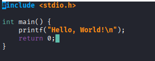
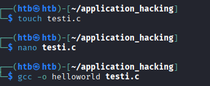
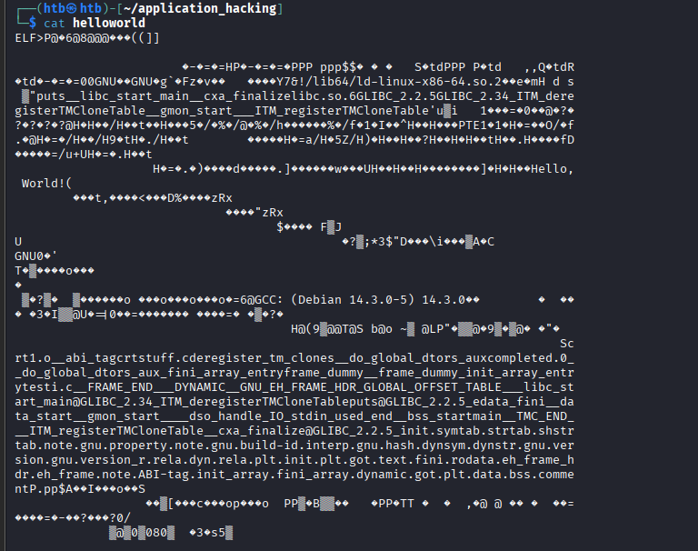

Tein perus c ohjelman eli hello world

Tämänjälkeen käänsin sen binääriksi gcc avulla

`gcc -o helloworld testi.c`

Tässä ohjelma kun sitä katsoo perus `cat`

Tässä vielä ohjelma käännetty hexdumpilla 

    └─$ hexdump helloworld 
    0000000 457f 464c 0102 0001 0000 0000 0000 0000
    0000010 0003 003e 0001 0000 1050 0000 0000 0000
    0000020 0040 0000 0000 0000 3690 0000 0000 0000
    0000030 0000 0000 0040 0038 000e 0040 001f 001e
    0000040 0006 0000 0004 0000 0040 0000 0000 0000
    0000050 0040 0000 0000 0000 0040 0000 0000 0000
    0000060 0310 0000 0000 0000 0310 0000 0000 0000
    0000070 0008 0000 0000 0000 0003 0000 0004 0000
    0000080 0394 0000 0000 0000 0394 0000 0000 0000
    0000090 0394 0000 0000 0000 001c 0000 0000 0000
    00000a0 001c 0000 0000 0000 0001 0000 0000 0000
    00000b0 0001 0000 0004 0000 0000 0000 0000 0000
    00000c0 0000 0000 0000 0000 0000 0000 0000 0000
    00000d0 0628 0000 0000 0000 0628 0000 0000 0000
    00000e0 1000 0000 0000 0000 0001 0000 0005 0000
    00000f0 1000 0000 0000 0000 1000 0000 0000 0000
    0000100 1000 0000 0000 0000 015d 0000 0000 0000
    0000110 015d 0000 0000 0000 1000 0000 0000 0000
    0000120 0001 0000 0004 0000 2000 0000 0000 0000
    0000130 2000 0000 0000 0000 2000 0000 0000 0000
    0000140 010c 0000 0000 0000 010c 0000 0000 0000
    0000150 1000 0000 0000 0000 0001 0000 0006 0000
    0000160 2dd0 0000 0000 0000 3dd0 0000 0000 0000
    0000170 3dd0 0000 0000 0000 0248 0000 0000 0000
    0000180 0250 0000 0000 0000 1000 0000 0000 0000
    0000190 0002 0000 0006 0000 2de0 0000 0000 0000
    00001a0 3de0 0000 0000 0000 3de0 0000 0000 0000
    00001b0 01e0 0000 0000 0000 01e0 0000 0000 0000
    00001c0 0008 0000 0000 0000 0004 0000 0004 0000
    00001d0 0350 0000 0000 0000 0350 0000 0000 0000
    00001e0 0350 0000 0000 0000 0020 0000 0000 0000
    00001f0 0020 0000 0000 0000 0008 0000 0000 0000
    0000200 0004 0000 0004 0000 0370 0000 0000 0000
    0000210 0370 0000 0000 0000 0370 0000 0000 0000
    0000220 0024 0000 0000 0000 0024 0000 0000 0000
    0000230 0004 0000 0000 0000 0004 0000 0004 0000
    0000240 20ec 0000 0000 0000 20ec 0000 0000 0000
    0000250 20ec 0000 0000 0000 0020 0000 0000 0000
    0000260 0020 0000 0000 0000 0004 0000 0000 0000
    0000270 e553 6474 0004 0000 0350 0000 0000 0000
    0000280 0350 0000 0000 0000 0350 0000 0000 0000
    0000290 0020 0000 0000 0000 0020 0000 0000 0000
    00002a0 0008 0000 0000 0000 e550 6474 0004 0000
    00002b0 2014 0000 0000 0000 2014 0000 0000 0000
    00002c0 2014 0000 0000 0000 002c 0000 0000 0000
    00002d0 002c 0000 0000 0000 0004 0000 0000 0000
    00002e0 e551 6474 0006 0000 0000 0000 0000 0000
    00002f0 0000 0000 0000 0000 0000 0000 0000 0000
    *
    0000310 0010 0000 0000 0000 e552 6474 0004 0000
    0000320 2dd0 0000 0000 0000 3dd0 0000 0000 0000
    0000330 3dd0 0000 0000 0000 0230 0000 0000 0000
    0000340 0230 0000 0000 0000 0001 0000 0000 0000
    0000350 0004 0000 0010 0000 0005 0000 4e47 0055
    0000360 8002 c000 0004 0000 0001 0000 0000 0000
    0000370 0004 0000 0014 0000 0003 0000 4e47 0055
    0000380 67ea 9360 7a46 19f7 c376 09d4 94e6 aced
    0000390 3759 2126 6c2f 6269 3436 6c2f 2d64 696c
    00003a0 756e 2d78 3878 2d36 3436 732e 2e6f 0032
    00003b0 0002 0000 0006 0000 0001 0000 0006 0000
    00003c0 0000 0081 0000 0000 0006 0000 0000 0000
    00003d0 65d1 6dce 0000 0000 0000 0000 0000 0000
    00003e0 0000 0000 0000 0000 0000 0000 0000 0000
    00003f0 0006 0000 0012 0000 0000 0000 0000 0000
    0000400 0000 0000 0000 0000 0048 0000 0020 0000
    0000410 0000 0000 0000 0000 0000 0000 0000 0000
    0000420 0001 0000 0012 0000 0000 0000 0000 0000
    0000430 0000 0000 0000 0000 0064 0000 0020 0000
    0000440 0000 0000 0000 0000 0000 0000 0000 0000
    0000450 0073 0000 0020 0000 0000 0000 0000 0000
    0000460 0000 0000 0000 0000 0018 0000 0022 0000
    0000470 0000 0000 0000 0000 0000 0000 0000 0000
    0000480 7000 7475 0073 5f5f 696c 6362 735f 6174
    0000490 7472 6d5f 6961 006e 5f5f 7863 5f61 6966
    00004a0 616e 696c 657a 6c00 6269 2e63 6f73 362e
    00004b0 4700 494c 4342 325f 322e 352e 4700 494c
    00004c0 4342 325f 332e 0034 495f 4d54 645f 7265
    00004d0 6765 7369 6574 5472 434d 6f6c 656e 6154
    00004e0 6c62 0065 5f5f 6d67 6e6f 735f 6174 7472
    00004f0 5f5f 5f00 5449 5f4d 6572 6967 7473 7265
    0000500 4d54 6c43 6e6f 5465 6261 656c 0000 0000
    0000510 0002 0001 0003 0001 0001 0003 0000 0000
    0000520 0001 0002 0027 0000 0010 0000 0000 0000
    0000530 1a75 0969 0000 0003 0031 0000 0010 0000
    0000540 91b4 0696 0000 0002 003d 0000 0000 0000
    0000550 3dd0 0000 0000 0000 0008 0000 0000 0000
    0000560 1130 0000 0000 0000 3dd8 0000 0000 0000
    0000570 0008 0000 0000 0000 10f0 0000 0000 0000
    0000580 4010 0000 0000 0000 0008 0000 0000 0000
    0000590 4010 0000 0000 0000 3fc0 0000 0000 0000
    00005a0 0006 0000 0001 0000 0000 0000 0000 0000
    00005b0 3fc8 0000 0000 0000 0006 0000 0002 0000
    00005c0 0000 0000 0000 0000 3fd0 0000 0000 0000
    00005d0 0006 0000 0004 0000 0000 0000 0000 0000
    00005e0 3fd8 0000 0000 0000 0006 0000 0005 0000
    00005f0 0000 0000 0000 0000 3fe0 0000 0000 0000
    0000600 0006 0000 0006 0000 0000 0000 0000 0000
    0000610 4000 0000 0000 0000 0007 0000 0003 0000
    0000620 0000 0000 0000 0000 0000 0000 0000 0000
    *
    0001000 8348 08ec 8b48 c505 002f 4800 c085 0274
    0001010 d0ff 8348 08c4 00c3 0000 0000 0000 0000
    0001020 35ff 2fca 0000 25ff 2fcc 0000 1f0f 0040
    0001030 25ff 2fca 0000 0068 0000 e900 ffe0 ffff
    0001040 25ff 2f9a 0000 9066 0000 0000 0000 0000
    0001050 ed31 8949 5ed1 8948 48e2 e483 50f0 4554
    0001060 c031 c931 8d48 ce3d 0000 ff00 4f15 002f
    0001070 f400 2e66 1f0f 0084 0000 0000 1f0f 0040
    0001080 8d48 913d 002f 4800 058d 2f8a 0000 3948
    0001090 74f8 4815 058b 2f2e 0000 8548 74c0 ff09
    00010a0 0fe0 801f 0000 0000 0fc3 801f 0000 0000
    00010b0 8d48 613d 002f 4800 358d 2f5a 0000 2948
    00010c0 48fe f089 c148 3fee c148 03f8 0148 48c6
    00010d0 fed1 1474 8b48 fd05 002e 4800 c085 0874
    00010e0 e0ff 0f66 441f 0000 0fc3 801f 0000 0000
    00010f0 0ff3 fa1e 3d80 2f1d 0000 7500 552b 8348
    0001100 da3d 002e 0000 8948 74e5 480c 3d8b 2efe
    0001110 0000 29e8 ffff e8ff ff64 ffff 05c6 2ef5
    0001120 0000 5d01 0fc3 001f 0fc3 801f 0000 0000
    0001130 0ff3 fa1e 77e9 ffff 55ff 8948 48e5 058d
    0001140 0ec0 0000 8948 e8c7 fee4 ffff 00b8 0000
    0001150 5d00 00c3 8348 08ec 8348 08c4 00c3 0000
    0001160 0000 0000 0000 0000 0000 0000 0000 0000
    *
    0002000 0001 0002 6548 6c6c 2c6f 5720 726f 646c
    0002010 0021 0000 1b01 3b03 0028 0000 0004 0000
    0002020 f00c ffff 0074 0000 f02c ffff 009c 0000
    0002030 f03c ffff 0044 0000 f125 ffff 00b4 0000
    0002040 0014 0000 0000 0000 7a01 0052 7801 0110
    0002050 0c1b 0807 0190 1007 0014 0000 001c 0000
    0002060 eff0 ffff 0022 0000 0000 0000 0000 0000
    0002070 0014 0000 0000 0000 7a01 0052 7801 0110
    0002080 0c1b 0807 0190 0000 0024 0000 001c 0000
    0002090 ef90 ffff 0020 0000 0e00 4610 180e 0f4a
    00020a0 770b 8008 3f00 3b1a 332a 2224 0000 0000
    00020b0 0014 0000 0044 0000 ef88 ffff 0008 0000
    00020c0 0000 0000 0000 0000 001c 0000 005c 0000
    00020d0 f069 ffff 001a 0000 4100 100e 0286 0d43
    00020e0 5506 070c 0008 0000 0000 0000 0004 0000
    00020f0 0010 0000 0001 0000 4e47 0055 0000 0000
    0002100 0003 0000 0002 0000 0000 0000 0000 0000
    0002110 0000 0000 0000 0000 0000 0000 0000 0000
    *
    0002dd0 1130 0000 0000 0000 10f0 0000 0000 0000
    0002de0 0001 0000 0000 0000 0027 0000 0000 0000
    0002df0 000c 0000 0000 0000 1000 0000 0000 0000
    0002e00 000d 0000 0000 0000 1154 0000 0000 0000
    0002e10 0019 0000 0000 0000 3dd0 0000 0000 0000
    0002e20 001b 0000 0000 0000 0008 0000 0000 0000
    0002e30 001a 0000 0000 0000 3dd8 0000 0000 0000
    0002e40 001c 0000 0000 0000 0008 0000 0000 0000
    0002e50 fef5 6fff 0000 0000 03b0 0000 0000 0000
    0002e60 0005 0000 0000 0000 0480 0000 0000 0000
    0002e70 0006 0000 0000 0000 03d8 0000 0000 0000
    0002e80 000a 0000 0000 0000 008d 0000 0000 0000
    0002e90 000b 0000 0000 0000 0018 0000 0000 0000
    0002ea0 0015 0000 0000 0000 0000 0000 0000 0000
    0002eb0 0003 0000 0000 0000 3fe8 0000 0000 0000
    0002ec0 0002 0000 0000 0000 0018 0000 0000 0000
    0002ed0 0014 0000 0000 0000 0007 0000 0000 0000
    0002ee0 0017 0000 0000 0000 0610 0000 0000 0000
    0002ef0 0007 0000 0000 0000 0550 0000 0000 0000
    0002f00 0008 0000 0000 0000 00c0 0000 0000 0000
    0002f10 0009 0000 0000 0000 0018 0000 0000 0000
    0002f20 fffb 6fff 0000 0000 0000 0800 0000 0000
    0002f30 fffe 6fff 0000 0000 0520 0000 0000 0000
    0002f40 ffff 6fff 0000 0000 0001 0000 0000 0000
    0002f50 fff0 6fff 0000 0000 050e 0000 0000 0000
    0002f60 fff9 6fff 0000 0000 0003 0000 0000 0000
    0002f70 0000 0000 0000 0000 0000 0000 0000 0000
    *
    0002fe0 0000 0000 0000 0000 3de0 0000 0000 0000
    0002ff0 0000 0000 0000 0000 0000 0000 0000 0000
    0003000 1036 0000 0000 0000 0000 0000 0000 0000
    0003010 4010 0000 0000 0000 4347 3a43 2820 6544
    0003020 6962 6e61 3120 2e34 2e33 2d30 2935 3120
    0003030 2e34 2e33 0030 0000 0000 0000 0000 0000
    0003040 0000 0000 0000 0000 0000 0000 0000 0000
    0003050 0001 0000 0004 fff1 0000 0000 0000 0000
    0003060 0000 0000 0000 0000 0009 0000 0001 0013
    0003070 20ec 0000 0000 0000 0020 0000 0000 0000
    0003080 0013 0000 0004 fff1 0000 0000 0000 0000
    0003090 0000 0000 0000 0000 001e 0000 0002 000e
    00030a0 1080 0000 0000 0000 0000 0000 0000 0000
    00030b0 0020 0000 0002 000e 10b0 0000 0000 0000
    00030c0 0000 0000 0000 0000 0033 0000 0002 000e
    00030d0 10f0 0000 0000 0000 0000 0000 0000 0000
    00030e0 0049 0000 0001 001a 4018 0000 0000 0000
    00030f0 0001 0000 0000 0000 0055 0000 0001 0015
    0003100 3dd8 0000 0000 0000 0000 0000 0000 0000
    0003110 007c 0000 0002 000e 1130 0000 0000 0000
    0003120 0000 0000 0000 0000 0088 0000 0001 0014
    0003130 3dd0 0000 0000 0000 0000 0000 0000 0000
    0003140 00a7 0000 0004 fff1 0000 0000 0000 0000
    0003150 0000 0000 0000 0000 0013 0000 0004 fff1
    0003160 0000 0000 0000 0000 0000 0000 0000 0000
    0003170 00af 0000 0001 0012 20e8 0000 0000 0000
    0003180 0000 0000 0000 0000 0000 0000 0004 fff1
    0003190 0000 0000 0000 0000 0000 0000 0000 0000
    00031a0 00bd 0000 0001 0016 3de0 0000 0000 0000
    00031b0 0000 0000 0000 0000 00c6 0000 0000 0011
    00031c0 2014 0000 0000 0000 0000 0000 0000 0000
    00031d0 00d9 0000 0001 0018 3fe8 0000 0000 0000
    00031e0 0000 0000 0000 0000 00ef 0000 0012 0000
    00031f0 0000 0000 0000 0000 0000 0000 0000 0000
    0003200 010c 0000 0020 0000 0000 0000 0000 0000
    0003210 0000 0000 0000 0000 0148 0000 0020 0019
    0003220 4008 0000 0000 0000 0000 0000 0000 0000
    0003230 0128 0000 0012 0000 0000 0000 0000 0000
    0003240 0000 0000 0000 0000 0139 0000 0010 0019
    0003250 4018 0000 0000 0000 0000 0000 0000 0000
    0003260 0140 0000 0212 000f 1154 0000 0000 0000
    0003270 0000 0000 0000 0000 0146 0000 0010 0019
    0003280 4008 0000 0000 0000 0000 0000 0000 0000
    0003290 0153 0000 0020 0000 0000 0000 0000 0000
    00032a0 0000 0000 0000 0000 0162 0000 0211 0019
    00032b0 4010 0000 0000 0000 0000 0000 0000 0000
    00032c0 016f 0000 0011 0010 2000 0000 0000 0000
    00032d0 0004 0000 0000 0000 017e 0000 0010 001a
    00032e0 4020 0000 0000 0000 0000 0000 0000 0000
    00032f0 014c 0000 0012 000e 1050 0000 0000 0000
    0003300 0022 0000 0000 0000 0183 0000 0010 001a
    0003310 4018 0000 0000 0000 0000 0000 0000 0000
    0003320 018f 0000 0012 000e 1139 0000 0000 0000
    0003330 001a 0000 0000 0000 0194 0000 0211 0019
    0003340 4018 0000 0000 0000 0000 0000 0000 0000
    0003350 01a0 0000 0020 0000 0000 0000 0000 0000
    0003360 0000 0000 0000 0000 01ba 0000 0022 0000
    0003370 0000 0000 0000 0000 0000 0000 0000 0000
    0003380 01d5 0000 0212 000b 1000 0000 0000 0000
    0003390 0000 0000 0000 0000 5300 7263 3174 6f2e
    00033a0 5f00 615f 6962 745f 6761 6300 7472 7473
    00033b0 6675 2e66 0063 6564 6572 6967 7473 7265
    00033c0 745f 5f6d 6c63 6e6f 7365 5f00 645f 5f6f
    00033d0 6c67 626f 6c61 645f 6f74 7372 615f 7875
    00033e0 6300 6d6f 6c70 7465 6465 302e 5f00 645f
    00033f0 5f6f 6c67 626f 6c61 645f 6f74 7372 615f
    0003400 7875 665f 6e69 5f69 7261 6172 5f79 6e65
    0003410 7274 0079 7266 6d61 5f65 7564 6d6d 0079
    0003420 5f5f 7266 6d61 5f65 7564 6d6d 5f79 6e69
    0003430 7469 615f 7272 7961 655f 746e 7972 7400
    0003440 7365 6974 632e 5f00 465f 4152 454d 455f
    0003450 444e 5f5f 5f00 5944 414e 494d 0043 5f5f
    0003460 4e47 5f55 4845 465f 4152 454d 485f 5244
    0003470 5f00 4c47 424f 4c41 4f5f 4646 4553 5f54
    0003480 4154 4c42 5f45 5f00 6c5f 6269 5f63 7473
    0003490 7261 5f74 616d 6e69 4740 494c 4342 325f
    00034a0 332e 0034 495f 4d54 645f 7265 6765 7369
    00034b0 6574 5472 434d 6f6c 656e 6154 6c62 0065
    00034c0 7570 7374 4740 494c 4342 325f 322e 352e
    00034d0 5f00 6465 7461 0061 665f 6e69 0069 5f5f
    00034e0 6164 6174 735f 6174 7472 5f00 675f 6f6d
    00034f0 5f6e 7473 7261 5f74 005f 5f5f 7364 5f6f
    0003500 6168 646e 656c 5f00 4f49 735f 6474 6e69
    0003510 755f 6573 0064 655f 646e 5f00 625f 7373
    0003520 735f 6174 7472 6d00 6961 006e 5f5f 4d54
    0003530 5f43 4e45 5f44 005f 495f 4d54 725f 6765
    0003540 7369 6574 5472 434d 6f6c 656e 6154 6c62
    0003550 0065 5f5f 7863 5f61 6966 616e 696c 657a
    0003560 4740 494c 4342 325f 322e 352e 5f00 6e69
    0003570 7469 0000 732e 6d79 6174 0062 732e 7274
    0003580 6174 0062 732e 7368 7274 6174 0062 6e2e
    0003590 746f 2e65 6e67 2e75 7270 706f 7265 7974
    00035a0 2e00 6f6e 6574 672e 756e 622e 6975 646c
    00035b0 692d 0064 692e 746e 7265 0070 672e 756e
    00035c0 682e 7361 0068 642e 6e79 7973 006d 642e
    00035d0 6e79 7473 0072 672e 756e 762e 7265 6973
    00035e0 6e6f 2e00 6e67 2e75 6576 7372 6f69 5f6e
    00035f0 0072 722e 6c65 2e61 7964 006e 722e 6c65
    0003600 2e61 6c70 0074 692e 696e 0074 702e 746c
    0003610 672e 746f 2e00 6574 7478 2e00 6966 696e
    0003620 2e00 6f72 6164 6174 2e00 6865 665f 6172
    0003630 656d 685f 7264 2e00 6865 665f 6172 656d
    0003640 2e00 6f6e 6574 412e 4942 742d 6761 2e00
    0003650 6e69 7469 615f 7272 7961 2e00 6966 696e
    0003660 615f 7272 7961 2e00 7964 616e 696d 0063
    0003670 672e 746f 702e 746c 2e00 6164 6174 2e00
    0003680 7362 0073 632e 6d6f 656d 746e 0000 0000
    0003690 0000 0000 0000 0000 0000 0000 0000 0000
    *
    00036d0 001b 0000 0007 0000 0002 0000 0000 0000
    00036e0 0350 0000 0000 0000 0350 0000 0000 0000
    00036f0 0020 0000 0000 0000 0000 0000 0000 0000
    0003700 0008 0000 0000 0000 0000 0000 0000 0000
    0003710 002e 0000 0007 0000 0002 0000 0000 0000
    0003720 0370 0000 0000 0000 0370 0000 0000 0000
    0003730 0024 0000 0000 0000 0000 0000 0000 0000
    0003740 0004 0000 0000 0000 0000 0000 0000 0000
    0003750 0041 0000 0001 0000 0002 0000 0000 0000
    0003760 0394 0000 0000 0000 0394 0000 0000 0000
    0003770 001c 0000 0000 0000 0000 0000 0000 0000
    0003780 0001 0000 0000 0000 0000 0000 0000 0000
    0003790 0049 0000 fff6 6fff 0002 0000 0000 0000
    00037a0 03b0 0000 0000 0000 03b0 0000 0000 0000
    00037b0 0024 0000 0000 0000 0005 0000 0000 0000
    00037c0 0008 0000 0000 0000 0000 0000 0000 0000
    00037d0 0053 0000 000b 0000 0002 0000 0000 0000
    00037e0 03d8 0000 0000 0000 03d8 0000 0000 0000
    00037f0 00a8 0000 0000 0000 0006 0000 0001 0000
    0003800 0008 0000 0000 0000 0018 0000 0000 0000
    0003810 005b 0000 0003 0000 0002 0000 0000 0000
    0003820 0480 0000 0000 0000 0480 0000 0000 0000
    0003830 008d 0000 0000 0000 0000 0000 0000 0000
    0003840 0001 0000 0000 0000 0000 0000 0000 0000
    0003850 0063 0000 ffff 6fff 0002 0000 0000 0000
    0003860 050e 0000 0000 0000 050e 0000 0000 0000
    0003870 000e 0000 0000 0000 0005 0000 0000 0000
    0003880 0002 0000 0000 0000 0002 0000 0000 0000
    0003890 0070 0000 fffe 6fff 0002 0000 0000 0000
    00038a0 0520 0000 0000 0000 0520 0000 0000 0000
    00038b0 0030 0000 0000 0000 0006 0000 0001 0000
    00038c0 0008 0000 0000 0000 0000 0000 0000 0000
    00038d0 007f 0000 0004 0000 0002 0000 0000 0000
    00038e0 0550 0000 0000 0000 0550 0000 0000 0000
    00038f0 00c0 0000 0000 0000 0005 0000 0000 0000
    0003900 0008 0000 0000 0000 0018 0000 0000 0000
    0003910 0089 0000 0004 0000 0042 0000 0000 0000
    0003920 0610 0000 0000 0000 0610 0000 0000 0000
    0003930 0018 0000 0000 0000 0005 0000 0018 0000
    0003940 0008 0000 0000 0000 0018 0000 0000 0000
    0003950 0093 0000 0001 0000 0006 0000 0000 0000
    0003960 1000 0000 0000 0000 1000 0000 0000 0000
    0003970 0017 0000 0000 0000 0000 0000 0000 0000
    0003980 0004 0000 0000 0000 0000 0000 0000 0000
    0003990 008e 0000 0001 0000 0006 0000 0000 0000
    00039a0 1020 0000 0000 0000 1020 0000 0000 0000
    00039b0 0020 0000 0000 0000 0000 0000 0000 0000
    00039c0 0010 0000 0000 0000 0010 0000 0000 0000
    00039d0 0099 0000 0001 0000 0006 0000 0000 0000
    00039e0 1040 0000 0000 0000 1040 0000 0000 0000
    00039f0 0008 0000 0000 0000 0000 0000 0000 0000
    0003a00 0008 0000 0000 0000 0008 0000 0000 0000
    0003a10 00a2 0000 0001 0000 0006 0000 0000 0000
    0003a20 1050 0000 0000 0000 1050 0000 0000 0000
    0003a30 0103 0000 0000 0000 0000 0000 0000 0000
    0003a40 0010 0000 0000 0000 0000 0000 0000 0000
    0003a50 00a8 0000 0001 0000 0006 0000 0000 0000
    0003a60 1154 0000 0000 0000 1154 0000 0000 0000
    0003a70 0009 0000 0000 0000 0000 0000 0000 0000
    0003a80 0004 0000 0000 0000 0000 0000 0000 0000
    0003a90 00ae 0000 0001 0000 0002 0000 0000 0000
    0003aa0 2000 0000 0000 0000 2000 0000 0000 0000
    0003ab0 0012 0000 0000 0000 0000 0000 0000 0000
    0003ac0 0004 0000 0000 0000 0000 0000 0000 0000
    0003ad0 00b6 0000 0001 0000 0002 0000 0000 0000
    0003ae0 2014 0000 0000 0000 2014 0000 0000 0000
    0003af0 002c 0000 0000 0000 0000 0000 0000 0000
    0003b00 0004 0000 0000 0000 0000 0000 0000 0000
    0003b10 00c4 0000 0001 0000 0002 0000 0000 0000
    0003b20 2040 0000 0000 0000 2040 0000 0000 0000
    0003b30 00ac 0000 0000 0000 0000 0000 0000 0000
    0003b40 0008 0000 0000 0000 0000 0000 0000 0000
    0003b50 00ce 0000 0007 0000 0002 0000 0000 0000
    0003b60 20ec 0000 0000 0000 20ec 0000 0000 0000
    0003b70 0020 0000 0000 0000 0000 0000 0000 0000
    0003b80 0004 0000 0000 0000 0000 0000 0000 0000
    0003b90 00dc 0000 000e 0000 0003 0000 0000 0000
    0003ba0 3dd0 0000 0000 0000 2dd0 0000 0000 0000
    0003bb0 0008 0000 0000 0000 0000 0000 0000 0000
    0003bc0 0008 0000 0000 0000 0008 0000 0000 0000
    0003bd0 00e8 0000 000f 0000 0003 0000 0000 0000
    0003be0 3dd8 0000 0000 0000 2dd8 0000 0000 0000
    0003bf0 0008 0000 0000 0000 0000 0000 0000 0000
    0003c00 0008 0000 0000 0000 0008 0000 0000 0000
    0003c10 00f4 0000 0006 0000 0003 0000 0000 0000
    0003c20 3de0 0000 0000 0000 2de0 0000 0000 0000
    0003c30 01e0 0000 0000 0000 0006 0000 0000 0000
    0003c40 0008 0000 0000 0000 0010 0000 0000 0000
    0003c50 009d 0000 0001 0000 0003 0000 0000 0000
    0003c60 3fc0 0000 0000 0000 2fc0 0000 0000 0000
    0003c70 0028 0000 0000 0000 0000 0000 0000 0000
    0003c80 0008 0000 0000 0000 0008 0000 0000 0000
    0003c90 00fd 0000 0001 0000 0003 0000 0000 0000
    0003ca0 3fe8 0000 0000 0000 2fe8 0000 0000 0000
    0003cb0 0020 0000 0000 0000 0000 0000 0000 0000
    0003cc0 0008 0000 0000 0000 0008 0000 0000 0000
    0003cd0 0106 0000 0001 0000 0003 0000 0000 0000
    0003ce0 4008 0000 0000 0000 3008 0000 0000 0000
    0003cf0 0010 0000 0000 0000 0000 0000 0000 0000
    0003d00 0008 0000 0000 0000 0000 0000 0000 0000
    0003d10 010c 0000 0008 0000 0003 0000 0000 0000
    0003d20 4018 0000 0000 0000 3018 0000 0000 0000
    0003d30 0008 0000 0000 0000 0000 0000 0000 0000
    0003d40 0001 0000 0000 0000 0000 0000 0000 0000
    0003d50 0111 0000 0001 0000 0030 0000 0000 0000
    0003d60 0000 0000 0000 0000 3018 0000 0000 0000
    0003d70 001e 0000 0000 0000 0000 0000 0000 0000
    0003d80 0001 0000 0000 0000 0001 0000 0000 0000
    0003d90 0001 0000 0002 0000 0000 0000 0000 0000
    0003da0 0000 0000 0000 0000 3038 0000 0000 0000
    0003db0 0360 0000 0000 0000 001d 0000 0012 0000
    0003dc0 0008 0000 0000 0000 0018 0000 0000 0000
    0003dd0 0009 0000 0003 0000 0000 0000 0000 0000
    0003de0 0000 0000 0000 0000 3398 0000 0000 0000
    0003df0 01db 0000 0000 0000 0000 0000 0000 0000
    0003e00 0001 0000 0000 0000 0000 0000 0000 0000
    0003e10 0011 0000 0003 0000 0000 0000 0000 0000
    0003e20 0000 0000 0000 0000 3573 0000 0000 0000
    0003e30 011a 0000 0000 0000 0000 0000 0000 0000
    0003e40 0001 0000 0000 0000 0000 0000 0000 0000
    0003e50

