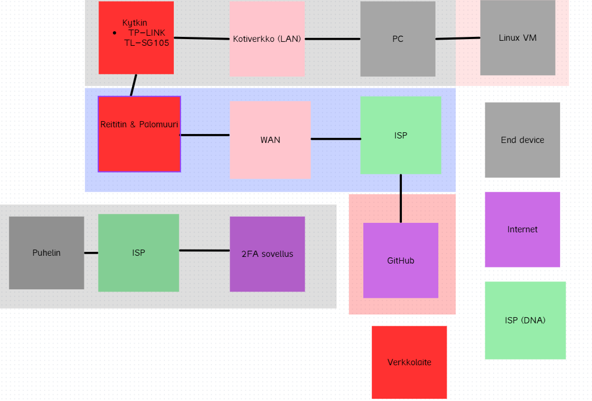

# h1 Scope First, Controls Later
Kotitehtävä h1 Scope First, Controls Later Tero Karvisen & Lari Iso-Anttilan Verkkoon tunkeutuminen ja tiedustelu - 2025 syksy kurssille. [Linkki kurssisivulle](https://terokarvinen.com/application-hacking/)
Jokaisessa kohdassa on alla olevalla "quote" tyylillä kerrottu tehtävänanto.
>Liirum laarum laa...

> Kohdeympäristö on oma kotiverkko, jossa teet kurssin harjoituksia. “Organisaatio” on käytännössä oma taloutesi + oma IT-ympäristö (laitteet, reititin/Wi-Fi, pilvipalvelut, harjoituskoneet, mahdollinen NAS, jne.).

Tavoite: määritellä järkevä ISMS-soveltamisala, tunnistaa rajapinnat ja tuottaa dokumentaatio, joka olisi periaatteessa auditoitavissa (paperilla).

## a) Perustaso

### 1. Mitä kuuluu soveltamisalaan)
>Kotiverkon perusinfra: reititin, Wi-Fi, mahdolliset verkkojaot/NAS, tulostin, IoT (jos relevantti).
Kurssiharjoituksiin käytettävät laitteet: läppäri/työasema, mahdolliset virtuaalikoneet, harjoituspalvelin (esim. Linux VM), puhelin (jos käytät MFA:ta).
Tiedot: kurssimateriaalit, omat muistiinpanot, repositoriot, harjoitusaineistot, mahdolliset tunnukset/avaimet.

Perusinfrana toimii:
- Reititin & Wifi 
  - Reititin ja Wifi tulevat samasta boksista
- Kytkin 
  - TP-LINK TL-SG105
- Kurssiharjoituksiin käytän omaa pöytätietokonetta, jossa pääkäyttöjärjestelmänä on Windows 11. Sen sisällä ajan Virutalboxin kautta Kali Linux (2025.4) virtuaalitietokonetta. Kalin voi ottaa helposti pois netistä virtualboxin asetuksista testien ajaksi. Käytän omaa Samsung S24 puhelinta MFA:n hoitamiseen.
- Kurssimateriaalina käytän internetistä hankittuja tietoja sekä kurssisivuilla annetut lähteet. Läksyt teen omalle koneelle GIT repositorioon, jonka jälkeen pusken ne githubiin.

### 2) Mitä rajaat ulos ja miksi
> Esimerkkejä ulosrajauksista: muiden perheenjäsenten laitteet, äly-TV, pelikonsoli, työnantajan hallinnoima kone, operaattorin verkko “internetin puolella”.
Perustele rajaukset: omistajuus, hallittavuus, merkityksettömyys kurssin näkökulmasta, riskien hyväksyntä.

Rajaan ulos muut verkkolaitteet kotiverkosta, kuten TV sekä IoT laitteeni, kuten Raspberry PI. En koe, että nämä ovat merkityksellisiä kurssin näkökulmasta.

### 3) Keskeiset rajapinnat

>Pilvipalvelut (esim. GitHub/GitLab, Google Drive/OneDrive, opiskelun LMS).
Etäyhteydet (VPN, SSH, RDP), kotiverkon ja internetin välinen raja (reititin, palomuuri).
Toimittajat: ISP (operaattori), laitetoimittaja, pilvipalveluntarjoaja.

Tehtävien tallentamiseen käytän lähtökohtaisesti vain GitHubia. Käytän usein VPN sekä SSH esimerkiksi yhdistäessäni Raspberry Pi:n, mutta näitä tehtäviä tehdessä en tule käyttämään mitään etäyhteyksiä. Kotiverkon ja internetin välissä on reitin ja sen oma palomuuri. Minun ISP puhelimessa sekä kotiverkossa on DNA.

>Tuotos (palautus):
Scope-teksti (½–1 sivu)
1 yksinkertainen verkko- ja rajapintakaavio (laatikot + nuolet riittää), jossa näkyy:
“Kotiverkko / harjoituslab” -alue (in-scope)
“Ulkopuoli” (out-of-scope)
rajapinnat (internet/pilvi/etäyhteydet)

`Kaavion piirtämisessä käytetty apuna Canva verkkosivua`

> Evidence-lisä (1–3 riviä per kohta):
Kirjoita loppuun: “Mitä näyttöä voisin esittää?”
(esim. reitittimen asetussivu kuvakaappauksena, laitelista, VM-listaus, repo-linkki, varmuuskopiointiasetukset).

- Reitittimessä sekä kytkimessä voisin näyttää asetussivun ja siihen liitetyt laitteen. 
- Voisin näyttää testeillä että halutessani VM ei pääse käsiksi internettiin.
- Ottaa kuvan 2FA sovelluksesta kun koitan kirjautua esimerkiksi GitHubiin.
- Näyttää kuvalla Github Repo jonne palautan tehtävät.

## b) Sidotaan Standardiin
> Tehtävä: Tunnista vähintään 2 interested party -tahoa kotiverkkokontekstissa ja kirjoita kullekin:
tarve/odotus/vaatimus (security/privacy/availability tms.)
mihin ISO 27001 -vaatimusalueeseen se kytkeytyy (konteksti / johtajuus / suunnittelu / toiminta / arviointi / parantaminen)
miten osoittaisit sen täyttymisen (evidence)
Esimerkkisidosryhmiä (valitse sinulle relevantit):
Sinä itse – harjoitusten jatkuvuus, datan säilyminen
Perheenjäsenet / kämppikset – yksityisyys, ettei harjoituslab häiritse arkea
Internet-operaattori – sopimusehdot, laitteiden käyttöehdot
Pilvipalvelut (GitHub, Google, Microsoft) – tiliturva, MFA, ehtojen noudattaminen
Oppilaitos / kurssin järjestäjä – akateeminen rehellisyys, ei haitallista toimintaa verkossa
Mahdollinen työnantaja (jos käytät samaa konetta/verkkoa) – eriytys, tietojen suojaus
Viranomainen / sääntely (yleistasolla) – henkilötietojen käsittely, laillinen käyttö
Tuotos (palautus):
Taulukko:
Sidosryhmä → tarve/vaatimus → ISO 27001 -viite (vaatimusalue) → miten osoitat (evidence)
Vinkki: Kotikontekstissa “johtajuus” voidaan konkretisoida “sinä omistajana”: teet päätökset, hyväksyt riskit, ylläpidät pelisäännöt.

###

| |Sidosryhmä | Tarve/odotus/vaatimus | ISO 27001 vaatimusalue | Evidence |
|----------|:----------:|:----------:|:----------:|:----------:|
| 1.   |Kumppani|Kotiverkko toimii| Toiminta| Esimerkiksi TV:ssa käytettävät suoratoistopalvelut toimivat
| 2.  |Minä itse| Harjoitukset tehdään suljetussa ympäristössä | Vaatimus| Lataan tarvittavat lähdekoodit hallituun suljetuun ympäristöön

# Lähteet

- Moodlessa olevat .pdf tiedostot
- Canva verkko- ja rajapintakaavion tekemisessä (https://www.canva.com/)