# h2 Break & Unbreak 

Kotitehtävä h2 Break & Unbreak Tero Karvisen & Lari Iso-Anttilan Verkkoon tunkeutuminen ja tiedustelu - 2025 syksy kurssille. [Linkki kurssisivulle](https://terokarvinen.com/application-hacking/)
Jokaisessa kohdassa on alla olevalla "quote" tyylillä kerrottu tehtävänanto.
>Liirum laarum laa...

## x)
> OWASP: OWASP Top 10: A01 Broken Access Control
- Yli 94% aplikaatioista testattu joista 3,81% löytyi jokin haavoittovuus.
- Broken acces controllissa käyttäjät pääsevät tekemään asioita joita heidän ei pitäisi.
- Tuttu käytäntö principle of least privilege on tässäkin tärkeä.

> Karvinen 2023: Find Hidden Web Directories - Fuzz URLs with ffuf
- Ffuf:n avulla pystyy helposti löytää nettisivun eri polut, esim /admin /secretpage etc...
- Käyttäminen erittäin helppoa, tarvitsen vain sanalistan sekä hyökättävän kohteen.

> PortSwigger: Access control vulnerabilities and privilege escalation
- Vertical acces control rajoittaa tiettyjä käyttäjiä tekemään asioita, kuten lisäämällä rahaa tyhjästä omalle pankkitililleen.
- Horizontal acces control rajoittaa tiettyjä asioita tietyiltä käyttäjiltä. Esimerkiksi voit nähdä omat sähköpostisi gmailista, mutta et voi nähdä muiden käyttäjien sähköposteja.

>Karvinen 2006: Report Writing (in Finnish)
- Raportissa kannattaa kertoa myös  itselleen selvät asiat. Tämä siksi, koska raportin yksi tarkoitus on se, että se voidaan toistaa toisessa samanlaisessa ympäristössä. 
- Raportti voi olla rennompaa kieltä (finglish), mutta silti asiallinen ja huolellisesti kirjoitettu.
## a) 
> Break into 010-staff-only. See Karvinen 2024: [Hack'n Fix](https://terokarvinen.com/hack-n-fix/)

Aloitin tehtävän tekemisen seuraamalla Teron Hack'n Fix artikkelin ohjeita. Aluksi latasin tiedoston `wget https://terokarvinen.com/hack-n-fix/teros-challenges.zip` jonka jälkeen unzippasin sen `unzip teros-chalenges.zip`. Tämän jälkeen katsoin ladatun kansion sisällön, jotta se olisi latautunut kokonaan.

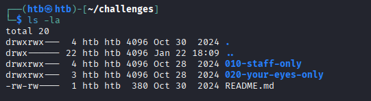

Kaikki näytti hyvältä. Seuraavaksi käynnistin kyseisen challengen, 

    cd 010-staff-only
    python3 staff-only.py

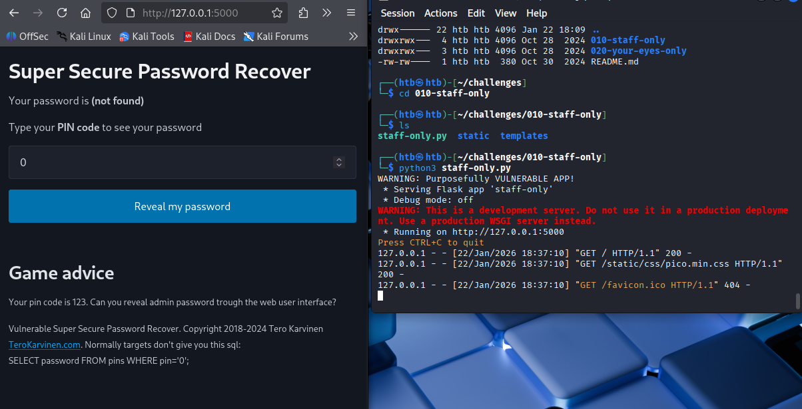

Sivun alareunassa oli annettu tehtäväksi paljastaa admin salasana nettiselaimen avulla. Samalla oltiin annettu vihje SQL lauseen muodossa `SELECT password FROM pins WHERE pin=''; `

Aluksi testasin minulle annettua pin koodia, eli 123.

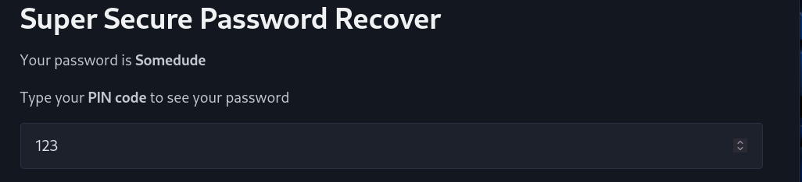

Sovellus antaa salasanaksi "Somedude". Seuraavaksi testasin vain random numeroa ja sovellus antoi vastaukseksi "not found"

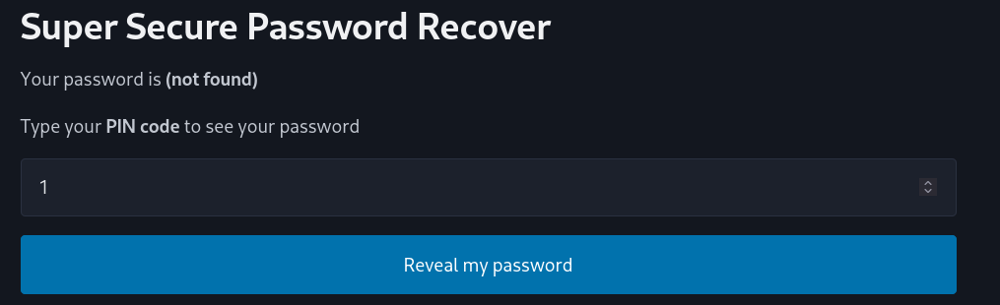

Koitin myös kirjoittaa jotain tekstiä pin koodin kohtaan, mutta sovellus hyväksyi vain numeroita.

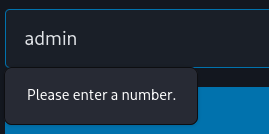

Koitin myös tunnilla tutuksi tullutta `admin'--` temppua, mutta sekään ei toiminut, koska sovellus hyväksyy vain numeroita. 

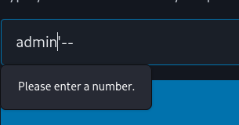

Pohdiskelin hetken ja muistin, että hyökkääjä voi myös itse muuttaa web developer tooleista, mitä tietoa html form hyväksyy. Tältä input form näyttää ilman käyttäjän muokkauksia. 

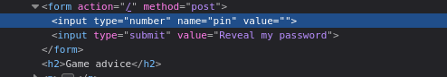

Kun käyttäjä syöttää inputin eli valuen.

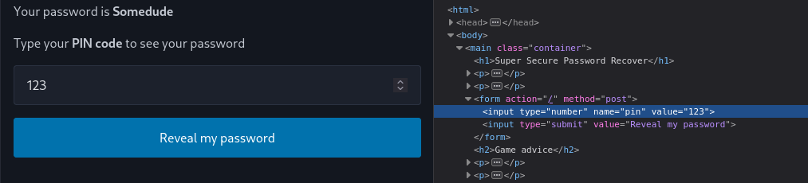

Lähdinkin testaamaan tätä muokkaamalla `ìnput type="number"` --> `input type="text"`. Samalla laitoin value kohtaan `' OR 1=1 --` joka on yleinen tapa testata, toimiiko SQL injektio. 

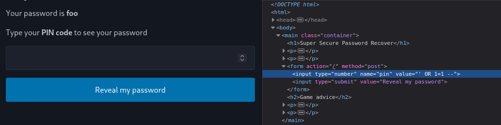

Selkeästi nyt tuli hieman edistystä, sillä ohjelma antoi salasanan `foo`. Selkeästi saimme haettua jotain tietoa, jota meidän ei olisi pitänyt saada.  

Selkeästi nyt pystyn kirjoittamaan SQL lauseita, mutta en tiennyt mitä tähän pitäisi kirjoittaa. Selaillin portswiggerin SQL injection sivua ja  siellä puhuttiin UNION hyökkäyksistä. Lähdinkin heti testaamaan tätä.

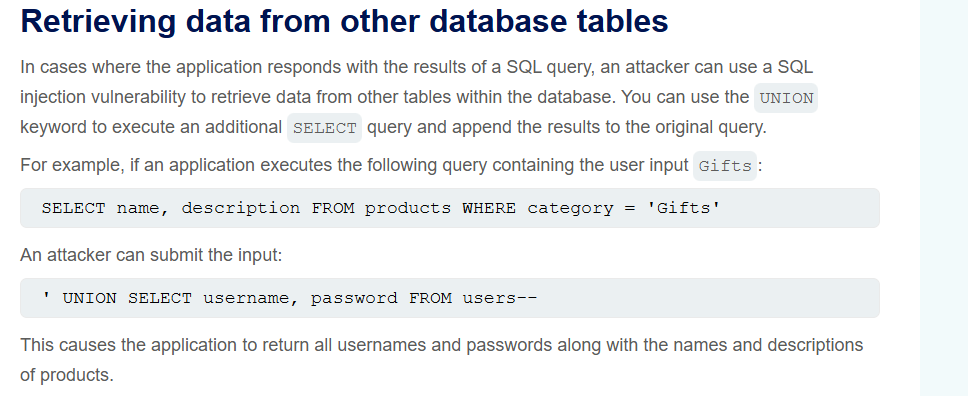

https://portswigger.net/web-security/sql-injection

Tätä sivulla annettua `' UNION SELECT username, password FROM users--` sql lausetta hieman muokkaamalla omaan käyttötarkoitukseemme saamme SQL lauseen `' UNION SELECT password FROM pins--`

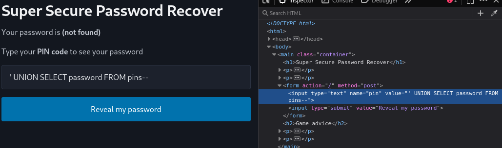

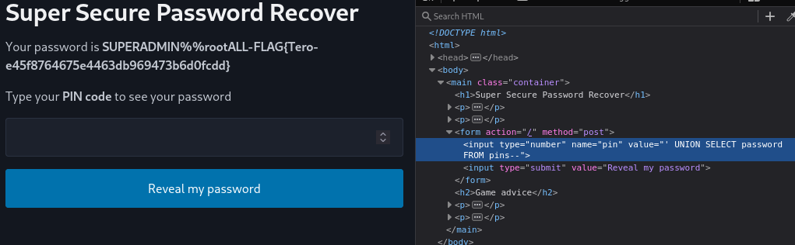

Homma toimi! Harvoin käy näin hyvä tuuri että palat naksahti kohdalleen yllättävän helposti.

## b)
> Fix the 010-staff-only vulnerability from source code. Demonstrate with a test that your solution works.

Katsoin hetken lähdekoodia ja tulin tällaiseen johtopäätökseen. 

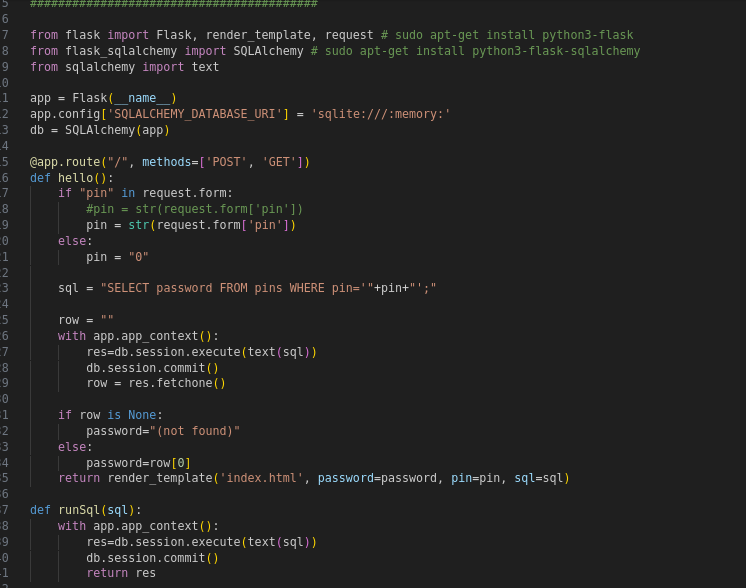

Tässä ohjelmassa ohjelma luottaa täysin, mitä käyttäjä antaa `pin = str(request.form['pin'])` ja ainut tapa millä tämä käyttäjän antama input tarkistetaan on htlm formsissa `input type="number"`

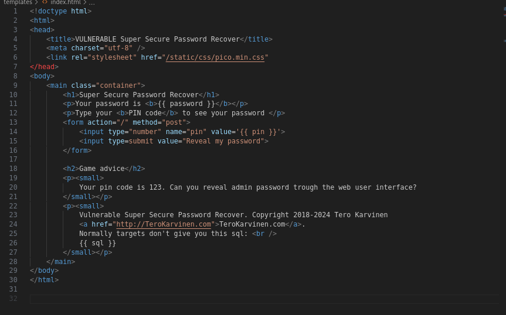

Myöskin tapa, millä SQL hakupyyntö tehdään näyttää oudolta omaan silmään. Siinä yhdistetään käyttäjän antama pin `+pin+` sql lausekkeeseen. En ole mikään expertti, mutta olen hieman koodannut ja tämä ei vain tunnu oikealta. Katsoin SQLAlchemy:n dokumentaatiota eikä siellä näkynyt samanlaista lähestymistapaa, https://docs.sqlalchemy.org/en/21/tutorial/data_select.html#the-where-clause

Koitinkin aluksi korjata ohjelmaa liian helpolla tavalla, muuttamalla `pin = str` --> `pin = int`. 

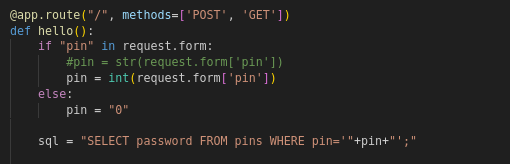

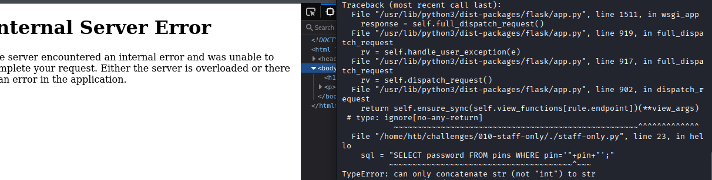

Noh tästähän tietenkin tuli errori. Mieleeni tuli vielä koittaa käyttää hyödyksi Pythonista löytyvää isdigit() metodia, mutta en saanut hahmoiteltua miten käyttäisin sitä.

Kysyinkin seuraavaksi Copilottia (Model: GPT-5.1-Codex-Max) korjaamaan virheen ja selittämään minulle mitä korjasi ja miksi. Tuossa on Copilotin ehdottama korjaus. 

Punaisella vanha koodi ja vihreänä uusi koodi

Nyt SQL injektio ei enää toiminut, joten virhe saatiin korjattua.

## c)
> Solve dirfuzt-1 from the article Karvinen 2023: Find Hidden Web Directories - Fuzz URLs with ffuf. This helps in solving 020-your-eyes-only.

Latasin Teron sivuilta dirfuzt-1 binäärin ja käynnistin sen. 

    chmod u+x dirfuzt-1
    ./dirfuzt-1 

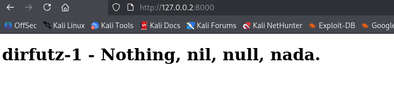

Osoite johon käytän Ffuf on `http://127.0.0.2:8000/FFUF`, eli käytännössä etsin alihakemistoja /hidden, /admin jne. Tehtävässä luki, että tästä haasteesta pitäisi löytää admin page sekä version control related page. Lähdin käyttämään Ffuffia komennolla `ffuf -w /usr/share/wordlists/seclists/Discovery/Web-Content/common.txt -u http://127.0.0.2:8000/FUZZ`
- -w = sanalista jota käytetään. Käytin samaa sanalistaa jota Tero käytti malliesimerkissään sivuillaan joka on yksi Seclistin monista sanalistoista
- -u URL joho ffuzaus tapahtuu ja FUZZ kertoo mihin Ffuf käyttää sanalistaa

Ffuzaus onnistui.

Nopeasti silmämääräisesti katsottuna huomaamme että `Size: 154, Words: 9, Lines: 10` ovat yleisimmät vastaukset. Lähdinkin filtteröimään vastauksia koon perusteella, eli lisään edelliseen komentoon vain `-fs 154`. Eli nyt koko komento on `ffuf -w /usr/share/wordlists/seclists/Discovery/Web-Content/common.txt -fs 154 -u http://127.0.0.2:8000/FUZZ`

Kuten näkyy, nyt löytyi admin sivu `WP-admin` sekä version control related page eli `.git`

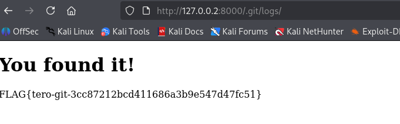

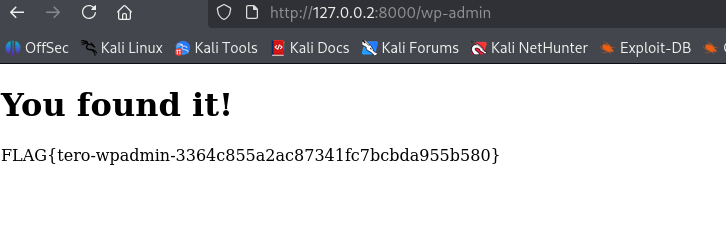

## d)
> Break into 020-your-eyes-only. See Karvinen 2024: Hack'n Fix
> Access adminsitrative console. The page contains text "you've found the secret page"

Luin aluksi README.MD tiedoston, jossa ohjeistettiin kuinka ohjelma käynnistetään.

    ./manage.py makemigrations; ./manage.py migrate
    ./manage.py runserver 

Tältä sivusto näytti kun sain sen avattua.

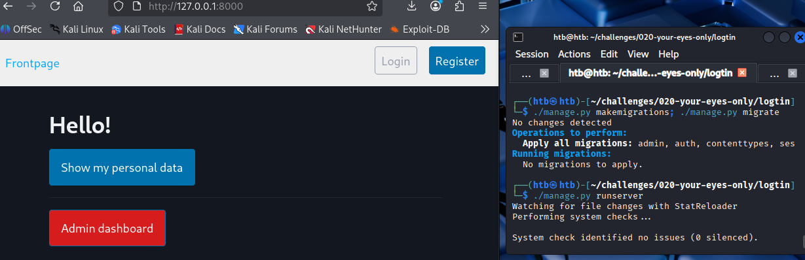

Menin admin-dashboard sivulle ja URL oli `http://127.0.0.1:8000/accounts/login/?next=/admin-dashboard/`. Koitin jos onni kävisi admin/admin mutta ei onnistunut. Seuraavaksi lähdin rekisteröimään käyttäjää. Rekisteröin käyttäjän "s". Seuraavaksi minulle avautui käyttäjän s "control panel"

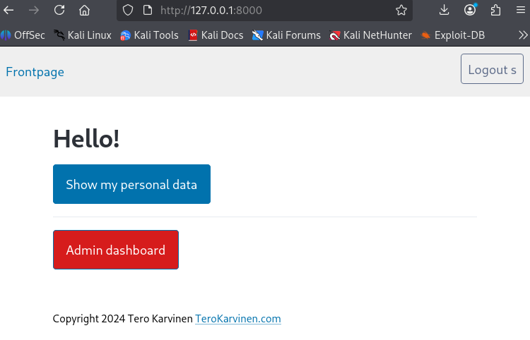

Klikkasin `admin dashboard`, mutta tuli 403 forbidden error.

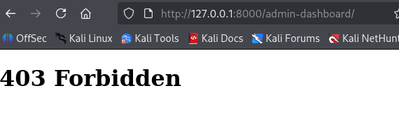

Seuraavaksi lähdinkin ffuzzaaman. Käytin edellisestä tehtävästä tuttua `ffuf -w /usr/share/wordlists/seclists/Discovery/Web-Content/common.txt -u http://127.0.0.1:8000/FUZZ`

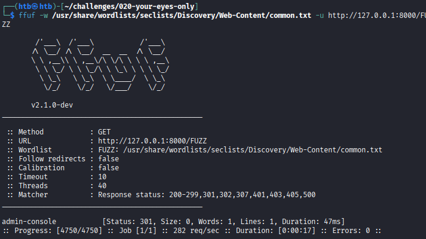

Ffuf löysi `admin-console` polun sivustolta. Laitoin sen url:n ja pääsin sivulle `/admin-console`.

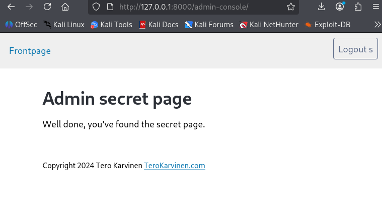

Koitin myös päästä `/admin-console` ilman kirjautumista, mutta tämä vaati kirjautumisen. Selkeästi ongelma on käyttäjän validoinissa, eli kuka tahansa käyttäjä pääsee näkemään admin consolen. Katsotaan seuraavassa tehtävässä kuinka paljon tässä pitää hakata päätä seinään.

## e)  Fix the 020-your-eyes-only vulnerability. Demonstrate with a test that your solution works.

Selaiin tiedostoja läpi ja löysin `.urls.py` tiedoston jonka polku oli`logtin/logtin/urls.py`. Tiedosto toimii url configuraationa ja sieltä oltiin kommentoitu pois ``#path('admin/', admin.site.urls),``. 

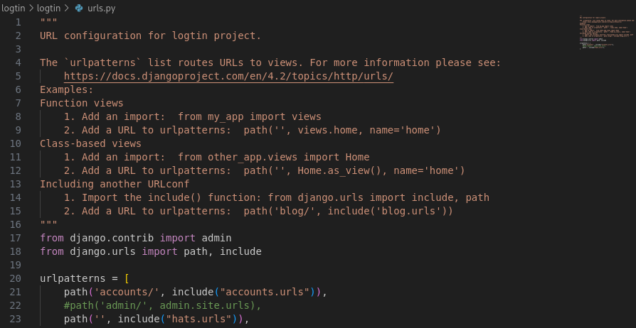

Poistin kommentin ja testasin toimisiko sovellus oletetulla tavalla, eli että vain admin pääsisi admin-consoleen. Näin ei kuitenkaan ollut, sillä pääsin admin-consoleen.

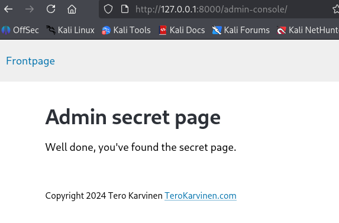

Testasin viellä muuttaa tämän `path` loppukohdan samanlaiseksi kuin muut, eli `admin.site.urls` --> `admin.urls`

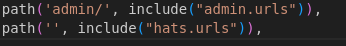

Ja tämä johti erroreihin

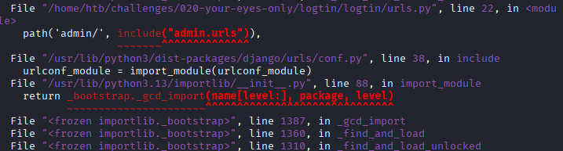

Laitoin kommentin takaisin ja palautin admin kohdan takaisin alkuperäiseen muotoon. Nyt ohjelma oli taas alkuperäinen.

Löysin `logtin/logtin/hats/urls.py` tiedoston, jossa on myös URL liittyviä asioita. Tässä admin-console on `AdminShowAllView.as_view` kun admin-dashboard johon ei pääse normaali user on `AdminDashBoardView.as_view`. Poistin `ShowAll` kohdan, mutta tuli erroria

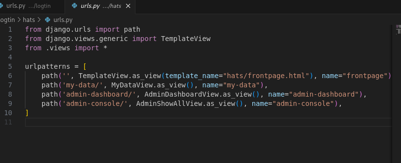

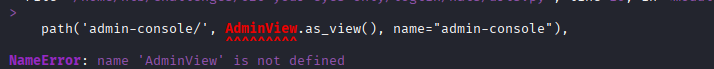

Jatkoin kaivamista ja minulle tuli vastaan `logtin/hats/views.py` tiedosto.

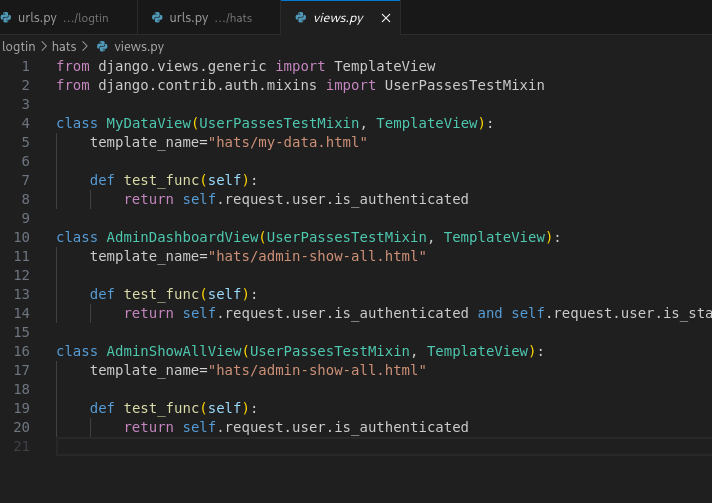

Tässä AdminDashboardView käyttäjä tarkistetaan `return self.request.user.is_authenticated and self.request.user.is_staff` mutta AdminShowAllView (eli admin-console) käyttäjä tarkistetaan vain `return self.request.user.is_authenticated` eikä että hän on myös osa "työntekijä" ryhmää `self.request.user.is_staff`. Lisäsin `AdminShowAllView` luokan return funktioon tarvittavan `self.request.user.is_staff`.

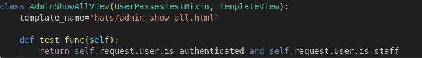

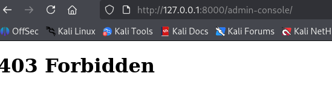

Nyt vika löytyi, sillä en enää pääse `admin-console`.

Voimme viellä tarkistaa consol logeihin tulleista logeista, että `admin-console` sekä `admin-dashboard` tulee samat logit siitä, että käyttöoikeutta ei ole.

`admin-console`

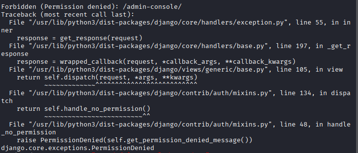

`admin-dashboard`

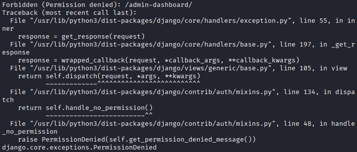

Tuli samat logit, eli nyt homma toimii kuten pitääkin.

# Lähteet

- Kurssisivu https://terokarvinen.com/application-hacking/
- OWASP: OWASP Top 10: https://owasp.org/Top10/2021/A01_2021-Broken_Access_Control/index.html
- Karvinen 2023: https://terokarvinen.com/2023/fuzz-urls-find-hidden-directories/
- PortSwigger: https://portswigger.net/web-security/access-control
- Karvinen 2006: https://terokarvinen.com/2006/raportin-kirjoittaminen-4/
- Portswigger SQL injection: https://portswigger.net/web-security/sql-injection
- SQLAlchemy dokumentaatio https://docs.sqlalchemy.org/en/21/tutorial/data_select.html#the-where-clause
- Karvinen 2024: https://terokarvinen.com/hack-n-fix/
- Copilot, Model: GPT-5.1-Codex-Max