# h4 Some Disassembly Required

Kotitehtävä h4 Some Disassembly Required Tero Karvisen & Lari Iso-Anttilan Sovellusten hakkerointi ja haavoittuvuudet 2026 kevät -kurssille. [Linkki kurssisivulle](https://terokarvinen.com/application-hacking/)
Jokaisessa kohdassa on alla olevalla "quote" tyylillä kerrottu tehtävänanto.
>Liirum laarum laa...

## x
> Hammond 2022: [Ghidra for Reverse Engineering](https://www.youtube.com/watch?v=oTD_ki86c9I) (PicoCTF 2022 #42 'bbbloat') (Video, about 20 min)

- Binaareja voi helposti myös käänteismallintaa esimerkiksi ohjelmien strace, ltrace sekä objdump avulla.
- Ghidrassa voi etsiä tiettyjä stringeja Defined Strings avulla.

## a
> Install Ghidra

Asensin Ghidran komennolla `sudo apt install ghidra`. 

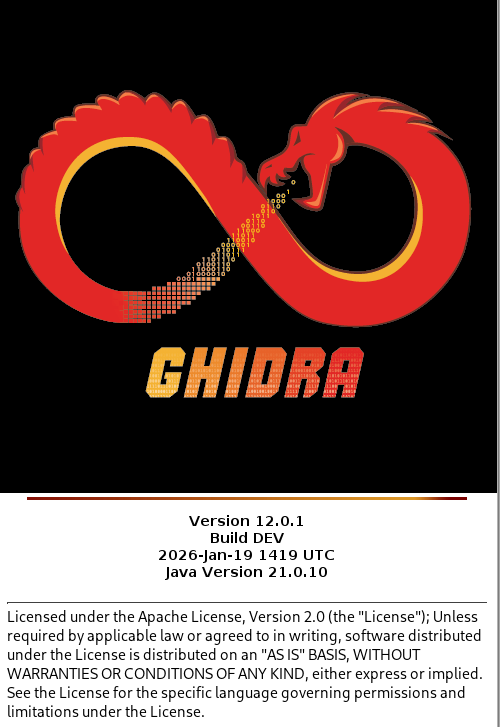

## b
> rever-C. Reverse engineer the packd binary to C language with Ghidra. Find the main program. Give variables descriptive names. Explain the program's operation. Solve the task from the binary, without the original source code. ezbin-challenges.zip

Asensin binäärin ja unzippasin sen:

    wget https://terokarvinen.com/loota/yctjx7/ezbin-challenges.zip
    unzip ezbin-challenges.zip 

Tämän jälkeen menin packd kansioon ja unpackasin sen upx avulla. Tein varmuuden vuoksi kopion alkuperäisestestä jota ei ole unpackattu.

    cd /challenges/packd
    cp packd packdunpacked
    upx -d packd 

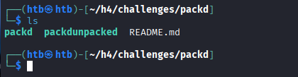

Seuraavaksi avasin Ghidran `ghidra` ja tein uuden projektin.

Vasemmasta yläkulmasta file --> New Project

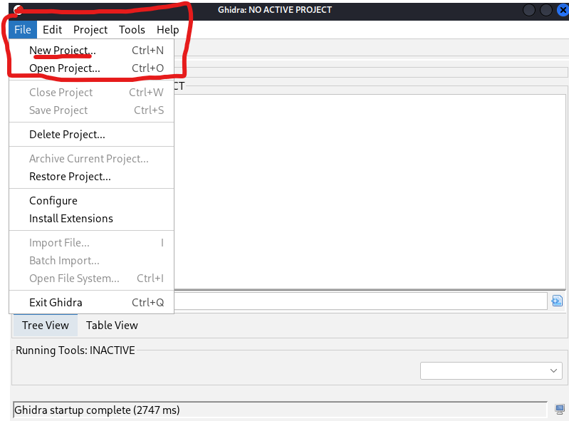

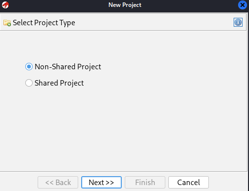

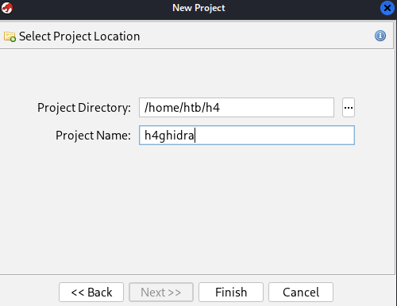

Tämän jälkeen importasin packd kyseiseen projektiin

File --> Import file 

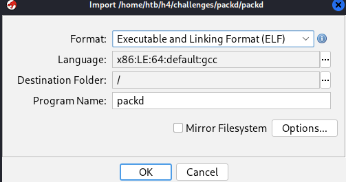

Seuraavaksi tuplaklikkasin packd tiedostoa.

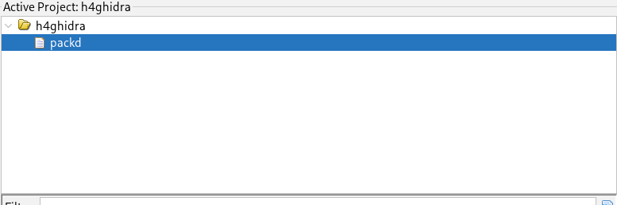

Analysoin tiedoston

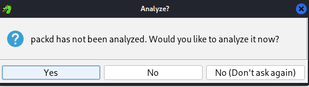

Ja nyt pääsin itse katsomaan binäärin koodia.

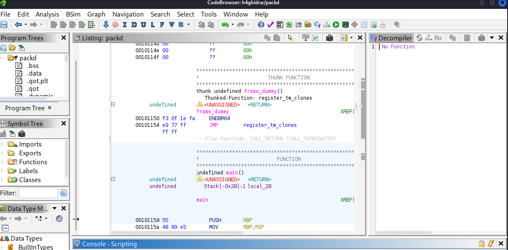

Lähdin etsimään main funktiota. Klikkasin vasemmalta Exports

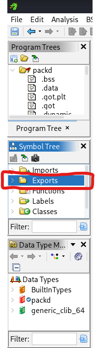

Sieltä löytyi main, klikkasin sitä ja isonsin Decompile näyttöä, jotta koodi näkyisi enemmän lueattavassa C muodossa eikä assemblyssa.

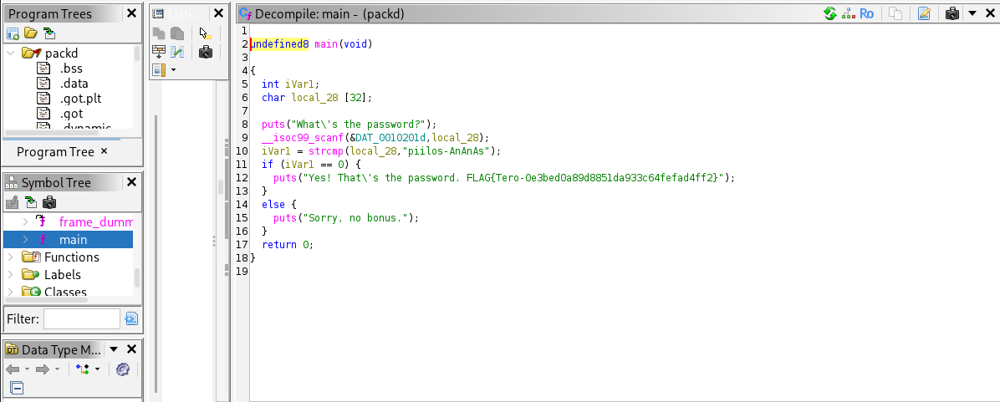

Seuraavaksi muutin kahden muuttujien nimet: `passowrd comparison, user_input`. Näin ainaskin itselle tästä tulee loogisempi.

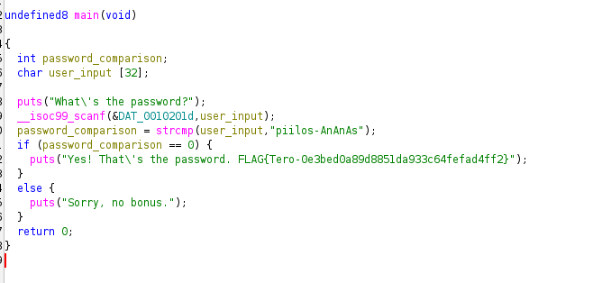

- Aluksi tehdään kaksi muuttujaa ``int password_comparison`` sekä `char user_input [32]`. Numero 32 kertoo kuinka monta kirjainta user_input hyväksyy
- Tämän jälkeen ohjelma printtaa `whats the password`
- Ohjelma kysyy käyttäjältä inputtia
- muuttujalle password_comparison annetaan arvo. Tämä riippuu siitä minkä arvon `strcmp`, eli string comparison antaa. Strcmp vertaa kahta stringia, user_input sekä kovakoodattua salasanaa `piilos-AnAnAs`. Jos salasanat ovat samat, antaa se arvon 0 ja jos ei niin antaa se toisen arvon.
- Sitten ohjelma loppuu if lauseeseen.
- Jos salasanat olivat samat, printtaa ohjelma flagin
- Jos ei niin  printtaa toisen tekstin, tässä tapauksessa, Sorry no bonus.

Ghidran avulla näimme kovakoodatun salasanan ja saimme flagin ohjelmasta. Samalla testasin ohjelman toimivuutta muutamalla typolla. Viimeisessä esimerkissä ohjelma ei suostunut antamaan flagia, koska käytin kyrillista o-kirjainta.

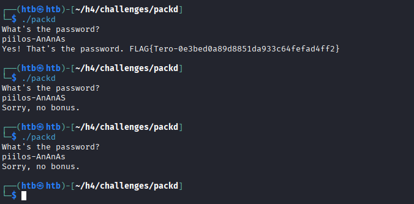

## c
> If backwards. Modify the passtr program's binary (without the original source code) so that it accepts all passwords except the correct one. Demonstrate with tests that the program works. ezbin-challenges.zip

Lisäsin passtr ohjelman Ghidraan.

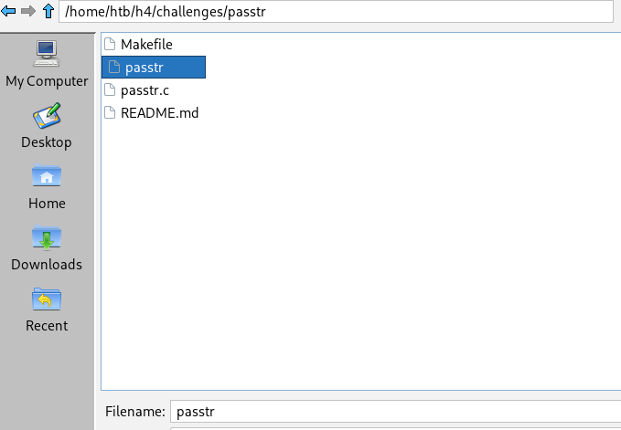

Tämän jälkeen tein samanlailla kuin b) osassa, eli avasin sen ja analysoin sen. Tämän jälkeen etsin taas exporteista main funktiota ja se löytyi.

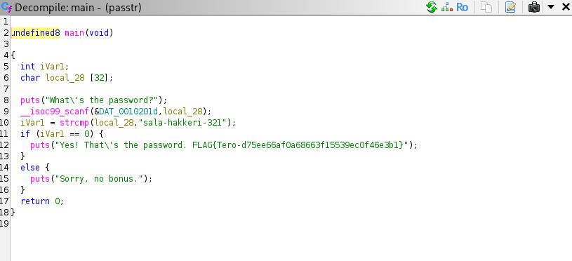

Ohjelma toimii samanlailla kuin b osan tehtävä. Jotta ohjelma hyväksyy kaikki muut paitsi oikean, muutamme vain `iVar1 == 0 --> iVar1 != 0`. Tällöin ohjelma hyväksyy kaikki muut salasanat, koska oikean salasanan arvo strcmp funktiossa on 0.

## d
>Nora CrackMe: Compile to binaries Tindall 2023: NoraCodes / crackmes. Read README.md: don't look at the source code unless you need training wheels. In these tasks, binaries are reverse engineered. Binaries are not modified, because otherwise the solution to every task would be to change the return value to "return 0".

Latasin Crackme git kansion `git clone https://github.com/NoraCodes/crackmes.git`

Tämän jälkeen menin crackme kansioon ja suoritin komennon "make" joka teki jokaisesta crackme filestä suoritetavan .64 tiedoston.

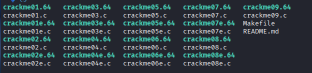

## e
> Nora crackme01. Solve the binary.

Importasin crackme01 Ghidraan, avasin sen ja anylsoin sen.

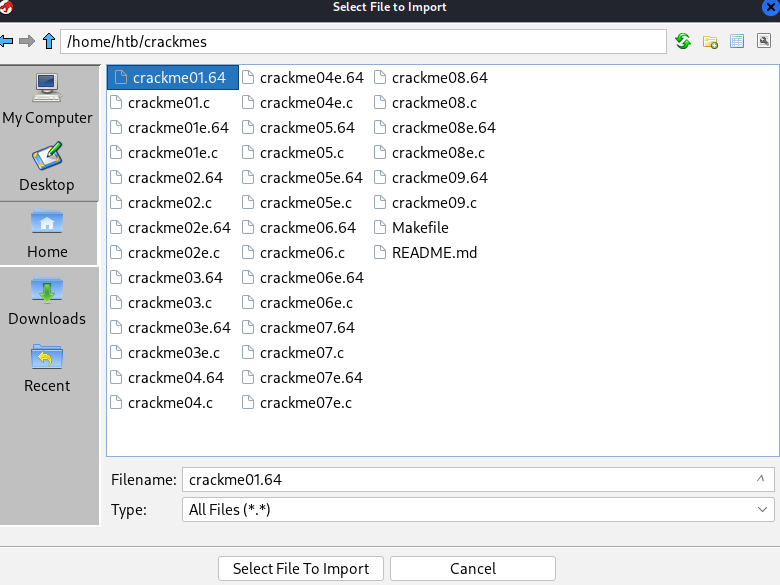

Katsoin vasemmalta taas Functions ja Ghidra oli tunnistanut main funktion

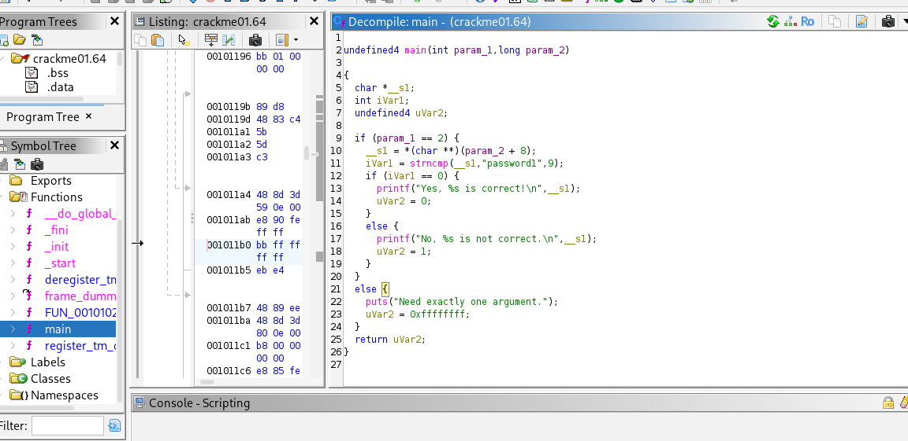

Ohjelma toimii samanlailla kuin tehtävien b) ja c) ohjelmat. Tässäkin on kovakoodattu, `password1`.

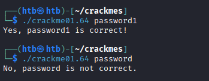

> Nora crackme01e. Solve the binary

Importasin crackme01e Ghidraan, avasin sen ja anylsoin sen. Katsoin vasemmalta taas Functions ja Ghidra oli tunnistanut main funktion

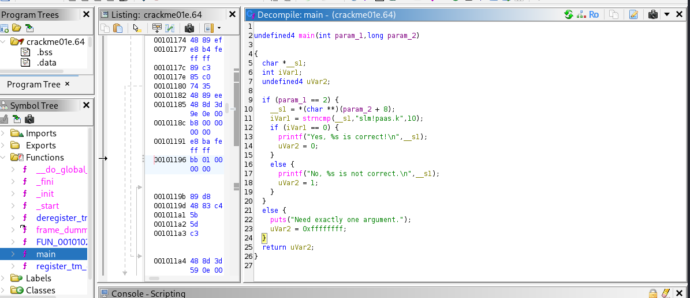

Tässä salasana oli `slm!paas.k`

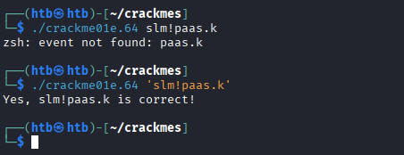

Salasanaa varten vaadittiin `''`, koska muuten ohjelma jotenkin sekoitti sen johonkin komentoon.

## f
> Nora crackme02. Name the main program's variables from the reverse-engineered binary and explain the program's operation. Solve the binary.

Tein taas samat asiat kuin ennen, import, open, analyze ja katsoin löysikö Ghidra main funktion. Vastaus, löysi.

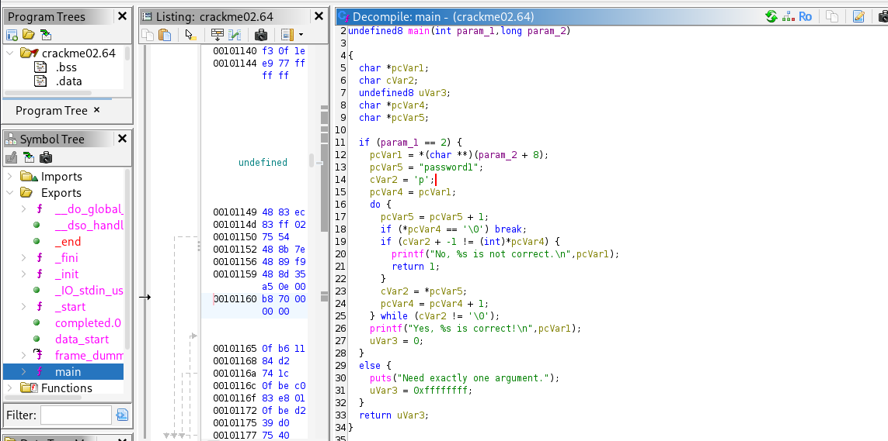

Sain aluksi muutettua muutaman muuttujan nimet, password & character

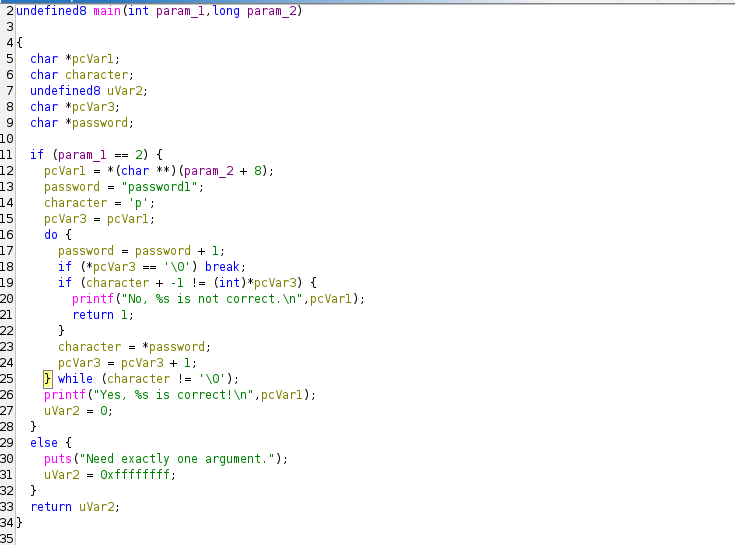

En oikein tajunnut mitä koodissa tapahtuu, paitsi rivillä rivit 16-24 toimivat while loopissa, niin pitkään kun character ei ole 0 (ehkä).

Tämä oli vähän hakuaammuntaa, mutta lähdin silti testaamaan tätä. 

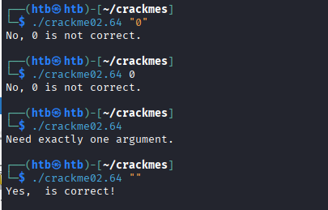

Tyhjä vastaus toimi. En tiedä onko tämä ns "oikea" tapa / salasana. 

Seuraavaksi kysyinkin tekoälyltä (Gemini 3 Fast), voisiko se kääntä tämän pythoniksi, sillä sitä ymmärrän paremmin. Samalla se antoi selityksen koodille.

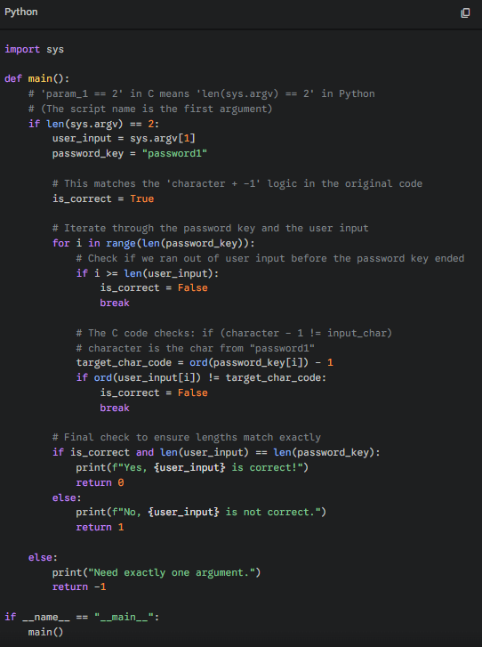

Kuvassa Geminin antama python koodi.

Koodi toimii siten, että se kysyy käyttäjältä inputin. Inputtia verrataan kovakoodattuun salasanaan. Input salasanan kirjaimet pitää olla -1 kirjain kovakoodatusta salasanasta, c --> b  b --> a. Minua jäi ihmetyttämään mitä käy jos juuri esimerkiksi a-kirjaimesta miinustaa yhden. Katsoin Geminin selitystä alemmas ja sieltä löytyi vastaus. Tässä ohjelmassa ohjelma miinustaa kirjaimen ASCII valuesta -1. Meninkin katsomaan sivustolta `ascii-code.com`, mikä on  a-1 ASCII value. Se oli `. Huom tämä on eri kuin '. 

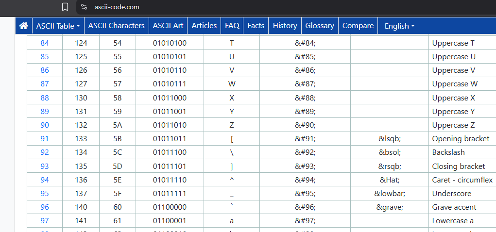

Seuraavaksi sitten käännetyn salasanan vuoro. En ollut hetkeen koodannut ja halusinkin koodata pythonilla ohjelman, joka printtaisi salasanan. Melkein meni ulkomuistista, mutta jouduin käyttämään muutamaa eri lähdettä kun syntaxi ja eri funktiot oli vähän hukassa.

    word = "password1"
    ascii_word=[]

    for i in word:
            i=ord(i)-1
            i=chr(i)
            ascii_word.append(i)
            

    print(''.join(ascii_word))

[Python Program to Find ASCII Value of Character](https://www.programiz.com/python-programming/examples/ascii-character), [Stack overflow](https://stackoverflow.com/questions/61811145/how-to-print-each-letter-of-ascii-value)

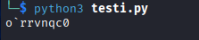

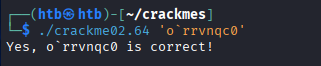

Salasana oli ``o`rrvnqc0`` ja se oli oikein.

## g
> Optional: And beyond. Crackme01 has multiple solutions. How many can you find? Why?

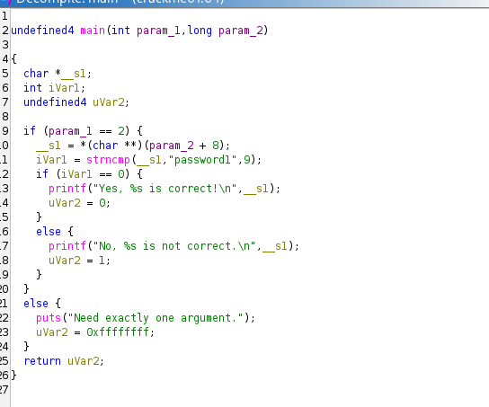

Rivillä 11 stringcompare funktiossa on kovakoodattu `password1 (pituus 9)` sekä myös kuinka monta kirjainta funktio katsoo käyttäjän inputista, eli 9. Tästä syystä esimerkiksi `password123` toimii.

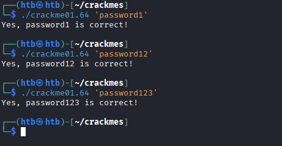

Itse en löytänyt koodista sen enempää haavoittuvuuksia, mutta testasin ns blank vastausta sekä aivan todella ylipitkää vastausta ja nämä eivät toimineet.

## h
> Optional: Unsolicited. Crackme02 has two solutions. Can you find both?

Sain jo aikaisemmin puolivahingossa tähän toisen vastauksen, eli antaa ohjelmalle vain tyhjän stringin.

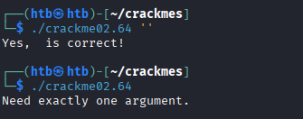

Oma ymmärrys tästä on seuraava: Koodi miinustaa ja tarkistaa vain jos käyttäjän antamassa stringissä on enää merkkejä jäljellä. Lopulta kun lause on tarkastettu ja sen pituus on 0 koodi on tarkastanut käyttäjän inputin onnistuneesti. Koska käyttäjä antaa suoraan tyhjän stringin, koodi on "tarkastanut" sen, koska se näkee että se on tyhjä.

Toinen vastaus minkä löysin tähän oli se, että riittää jos vain ensimmäinen kirjain on oikein. Myös sekin toimii, että ensimmäinen ja toinen on oikein jne. ``o`rrvnqc0``

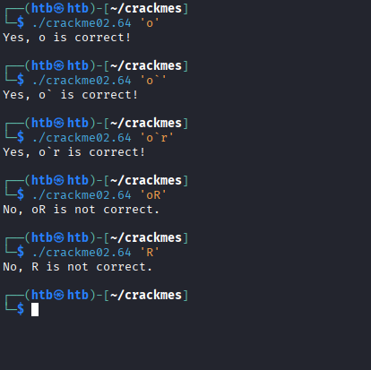

Koodissa on jossain kohtaa sellainen virhe, että se tarkistaa vain, että onko käyttäjän antama string ensimmäinen merkki oikein. Se tarkistaa järjestyksessä niin monta merkkiä salasanasta, kuin käyttäjän inputissa on merkkejä. Se ei tarkista, että käyttäjän input olisi yhtä suuri kuin salasana JA että kaikki käyttänä inputista olisivat oikein. 

## i) Optional, slightly more challenging: A ray. Nora crackme02e. Solve the binary.

Koodi näyttää tältä

Koodi näyttää toimivan about samanlailla kuin crackme02, joten testasin blank inputtia ja se toimi. Tämä ei ollut varmaan se "oikea" tapa ratkaista tätä tehtävää.

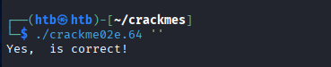

Crackme02 ensimmäinen kirjain jota katsottin oli sama kuin salasanan ensimmäinen, eli p. Tässä se on eri, u salasanassa mutta y toisessa. Myöskin do lauseen lopussa on tullut uutta koodia. Tässä if lauseessa siirretään 2 kirjainta. Koitin kaikkia pieniä aakkosia yksitellen, mutta ei onnistunut. Testasin myös erityismerkkejä, mutta ei hyväksynyt.

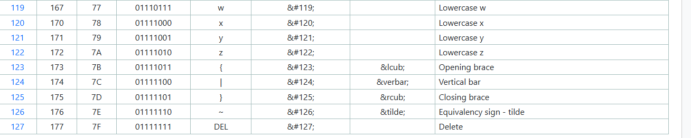

Pohdin hetken ja mietin, jos tässä versiossa koodi katsoisikin koko salasanan, eikä vain ensimmäistä kirjainta. Muutin tekemääni python koodia tähän, eli muutin vain kirjaimen siirron -1 --> -2 ja tietenkin salasanan `uvmnpoi`.

    ord = "uvmnpoi"
    ascii_word=[]

    for i in word:
            i=ord(i)-2
            i=chr(i)
            ascii_word.append(i)
            

    print(''.join(ascii_word))

Nyt salasana olisi `stklnmg`

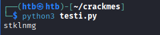

Testasin tätä ja se ei onnistunut. Muistin, että koodissa oltiin erikseen laitettu alkukirjaimeksi y. Testasin jos tämän laittaisi salasanan ensimmäisen u kirjaimen tilalle ja siirtäisi y-2, eli salasana olisi `wtklnmg`. Tämäkään ei toiminut. 

Sitten vielä viimeisenä oljenkortena testasin, jos tämä y(eli w kun -2) kirjain lisättäisiin lauseen alkuun tai loppuun.

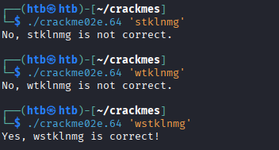

Nyt sain oikean salasanan `wstklnmg`. Tässä tuli kyllä avuksi tuo pieni python ohjelma, jonka avulla sai nopeasti siirettyä haluamansa sanan haluamallaan määrällä. 

## Lähteet

- Kurssisivu Application hacking - 2026 Spring, https://terokarvinen.com/application-hacking/
- Hammond 2022, Ghidra for Reverse Engineering (PicoCTF 2022 #42 'bbbloat') https://www.youtube.com/watch?v=oTD_ki86c9I
- Gemini 3 Pro (Fast)
- ASCII values, https://www.ascii-code.com/
- Python Program to Find ASCII Value of Character, https://www.programiz.com/python-programming/examples/ascii-character
- Stack overflow, https://stackoverflow.com/questions/61811145/how-to-print-each-letter-of-ascii-value
- NoraCodes crackmes github, https://github.com/NoraCodes/crackmes 

