# h6 Hardware Hacking

Kotitehtävä h6 Hardware Hacking Tero Karvisen & Lari Iso-Anttilan Sovellusten hakkerointi ja haavoittuvuudet 2026 kevät -kurssille. [Linkki kurssisivulle](https://terokarvinen.com/application-hacking/)
Jokaisessa kohdassa on alla olevalla "quote" tyylillä kerrottu tehtävänanto.
>Liirum laarum laa...

## x

Sain tunnilla asennettua tp link decrypt -sovelluksen ja sen kanssa oli hieman säätöä, joten ajattelin tehdä ihan oman kohdan asennukselle. Troubleshoottaamisessa käytetty apuna Gemini 3 Pro tekoälyä. 

Cloonasin repon,

    git clone https://github.com/robbins/tp-link-decrypt
    cd tp-link-decrypt

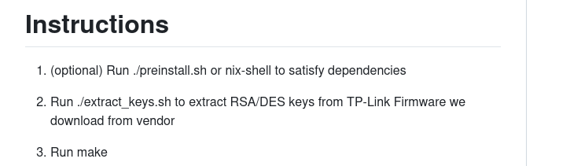

    ./preinstall.sh

    ./extract_keys.sh

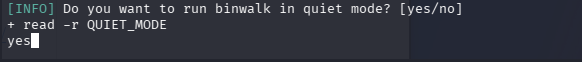

Yes

Nyt `make` pitäisi toimia, mutta näin ei ollut vaan tuli openssl error.

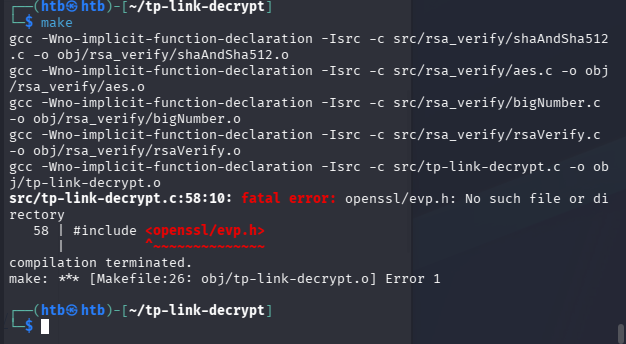

Ladataan `libssl-dev` paketti ja asennetaan se `sudo apt update && sudo apt install libssl-dev`

Tämän jälkeen `make clean` ja `make`. Seuraavaksi tuli tällainen errori.

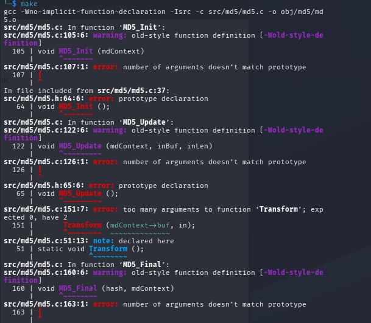

Tämä errori johtuu siitä, että kone yrittää compileta vanhempaa koodia uudemmalla systeemilla. Tätä varten Makefile tiedostosta, pitää lisätä CFLAGS kohtaan `-std=gnu89`.

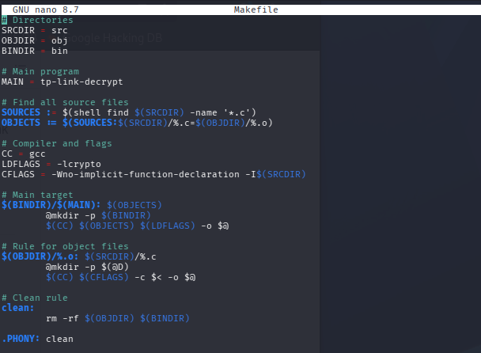

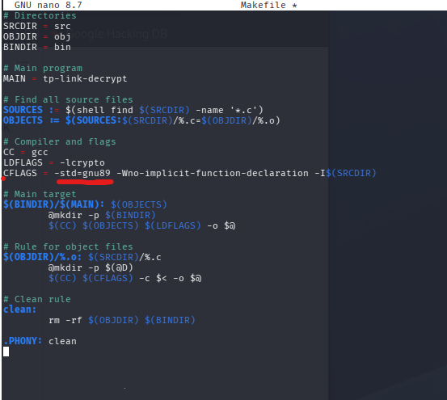

Seuraavaksi `make clean sekä make`

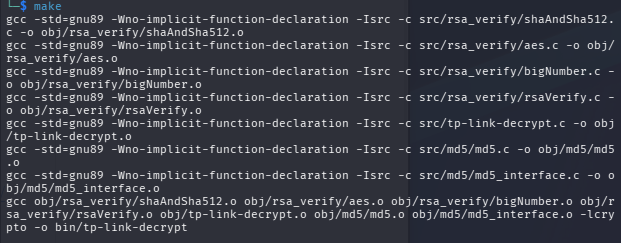

Nyt työkalun pitäisi toimia. 

## 1 & 2 & (4)
> Decrypt firmware image
> Analyse the image file
> extract rootfs from the image file

Tein tämän viikon tehtävää varten kahdet eri kansiot, dump ja image jotta dump ja image filet eivät mene sekaisin.

Latasin TPlink firmware imagen.

Koitin katsoa strings:n avulla jos tästä .bin saisi jotain irti, mutta en saanut. Koitin myös avata tätä Ghidran kanssa, mutta se ei tunnistanut kieltä joten sen enempää en saanut tietoa ilman decryptaamista

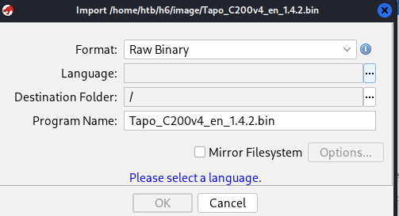

Tämän jälkeen decryptasin sen asennetulla työkalulla ja sain ``.bin.dec `` tiedoston

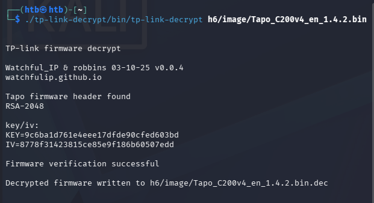

Ja tämän jälkeen käytin vielä binwalkkia avaamaan tämän.

`binwalk -e Tapo_C200v4_en_1.4.2.bin.dec`

Tämä teki `_Tapo_C200v4_en_1.4.2.bin.dec.extracted` kansion

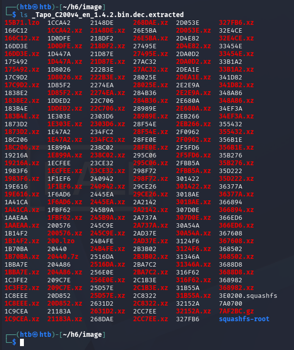

## 3
> extract rootfs from the dump file

Latasin Moodlesta dump filen. Muistan tunnilta tehdessäni jo tätä tehtävää, että tähän ei pidä käyttää tp-link-decrypttia, joten käytin tässä samaa binwalk -e komentoa kuin firmware imagessa.

## 5 & 6
> search available applications
> analyse and try to open root password

Koitin aluksi katsoa squashfs-root kansion sisältöä. Täältä ei löytynyt mitään ja se näytti vähän vajaalta, esimerkiksi siellä ei ollu shadow tiedostoa.

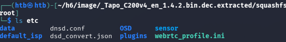

Katsoin grep:n avulla jos se löytäisi merkkijonon `root` ja se löysi muutaman tiedoston

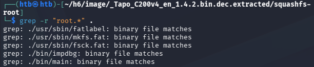

Katsoin vielä tällä `grep -Ri --text "root` komennolla koko `_dump-taco.bin.extracted` kansion
- R = rekursiivinen
- i = ei välitä isoista kirjaimista, eli etsii esimerkiksi ROOT, RoOt etc
- --text = prosessoi tiedostot kuin tekstinä. Oma käsitys tästä on se, että toimii vähän kuin strings.

Tässä apuna käytin grepin man pagesia jonka löysin netistä: https://man7.org/linux/man-pages/man1/grep.1.html

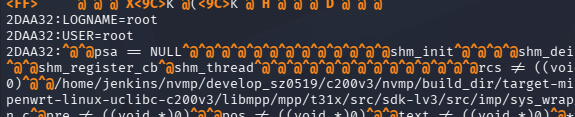

Tuli aika paljon ylimääräistä tekstiä, joten lisäsin tähän `:` rootin loppuun `grep -Ri --text "root:`

Täältä löytyi mielenkiintoista tekstiä.

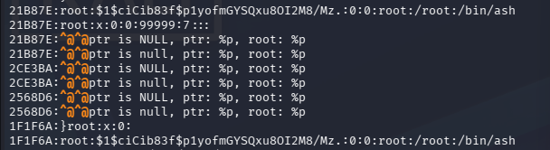

Otin tämän `root:$1$ciCib83f$p1yofmGYSQxu80I2M8/Mz.:0:0:root:/root:/bin/ash` omaan txt tiedostoon ja koitin murtaa sitä hashcatin avulla. Hain netistä kyseisen kameran root salasanaa ja löytyi tällainen postaus: https://www.hacefresko.com/posts/tp-link-tapo-c200-unauthenticated-rce jossa sanottiin sen olevan `slprealtek`. Halusin kummiskin itse crackata tämän. Helpotin hieman tekemistä Larin antamalla vinkillä, että ensimmäiset kolme oli slp (jos muistan oikein ja artikkeli pitää paikkansa ja minulla on oikea hash). 

``hashcat -m 500 hash.txt -a 3 slp?l?l?l?l?l``

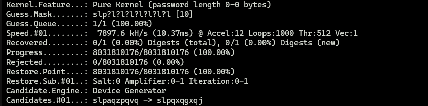

Tällä kertaa en saanut murrettua tätä hashia. Todennäköisesti löysin väärän hashin.

# Lähteet
- Kurssisivu https://terokarvinen.com/application-hacking/
- Gemini 3 Pro 
- TP link decrypt github https://github.com/robbins/tp-link-decrypt
- Grep man page https://man7.org/linux/man-pages/man1/grep.1.html
- https://www.hacefresko.com/posts/tp-link-tapo-c200-unauthenticated-rce