# h7 Uhagre2

Kotitehtävä h7 Uhagre2 Tero Karvisen & Lari Iso-Anttilan Sovellusten hakkerointi ja haavoittuvuudet 2026 kevät -kurssille. [Linkki kurssisivulle](https://terokarvinen.com/application-hacking/)
Jokaisessa kohdassa on alla olevalla "quote" tyylillä kerrottu tehtävänanto.
>Liirum laarum laa...

##
> Read/watch/listen and summarize. (In this x-subsection, you don't need to do tests on a computer; just reading or listening and a summary is enough. A few bullet points are sufficient for the summary.)

> € Schneier 2015: Applied Cryptography, 20ed: [Chapter 1: Foundations](https://learning.oreilly.com/library/view/applied-cryptography-protocols/9781119096726/08_chap01.html#chap01-sec001):
1.1 Terminology ("Historical Terms" to the end)
1.4 Simple XOR
1.7 Large Numbers

- Englanniksi salaamaton selkokielinen teksti on `plaintext`, se millä se salataan on `encryption`, plaintext+encryption eli salattu viesti on `ciphertext`. Kun tämä puretaan takaisin plaintext muotoon `decryption.`
- Teoreettisesti ainut rikkomaton salausmenetelmä on one time pad.
- XOR = Exclusive-or operation
  - 0 XOR 0 = 0
  - 0 XOR 1 = 1
  - 1 XOR 0 = 1
  - 1 XOR 1 = 1
- Todennäköisyys, että:
  - Kuolet salamaan (per päivä) 2^23
  - Hukut (Yhdysvalloissa per vuosi) 2^16
- Tässä ei sen enempää annettu näille kontekstia salaukseen liittyen, mutta tekstissä lukee että kirjassa tulee esintymään näitä lukuja.

> Karvinen 2024: [Python Basics for Hackers](https://terokarvinen.com/python-for-hackers/)
- Pythonia voi käyttää esimerkiksi REPL muodossa, Read-Eval-Print. Tässä kirjoitat esimerkiksi 2+2 ja saat sen vastauksen komentokehoitteeseen. Ei tarvitse compilata koodia ja suorittaa koodia.
- Toinen tällainen tapa on esimerkiksi iPython 
- Pythonia voi käyttää esimerkiksi laskimena.
- Jos et ole varma datan tyypistä, voit vain `type(muuttuja)`.
  
## a
>  1 Convert hex to base64.

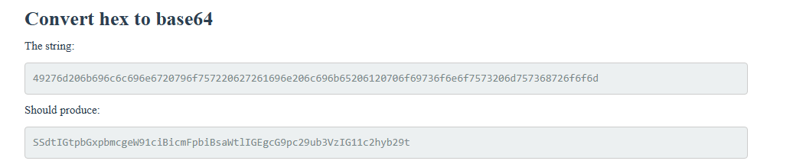

En tiennyt onko pythonissa jo valmiiksi sisäänrakennetu jokin funkito, jolla tämän voisi tehdä vai pitääkö importtaa jokin library. Googletin "python hex to base64" ja ensimmäisena tuli Stack Overflow forum postaus tästä https://stackoverflow.com/questions/33704327/hex-to-base64-conversion-in-python. 

Laitoin tämän omaan python tiedostoon.

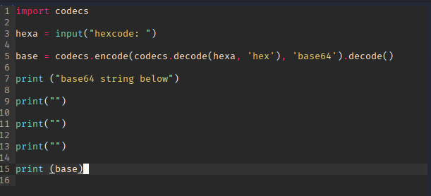

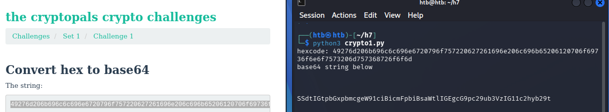

Ja se näyttää toimivan oikein. Testasin vielä nettisivulla pienemmällä hexalla ja vertasin sen antamaa outputtia oman python scriptini outputtiin.

## b
> 2 Fixed XOR

Aluksi en tiennyt yhtään mitä tässä tapahtuu tai mitä pitäisi tehdä. Seuraavaksi menikin varmaan 30min, että ymmärsin mitä tässä tapahtuu. 

Googlasin XOR calculator ja katsoin että toimiiko tämä samalla logiikalla kuin tehtävässä, eli esimerkiksi kun vertaa c ja 8  niin tulee 4. XOR calculator https://xor.pw/

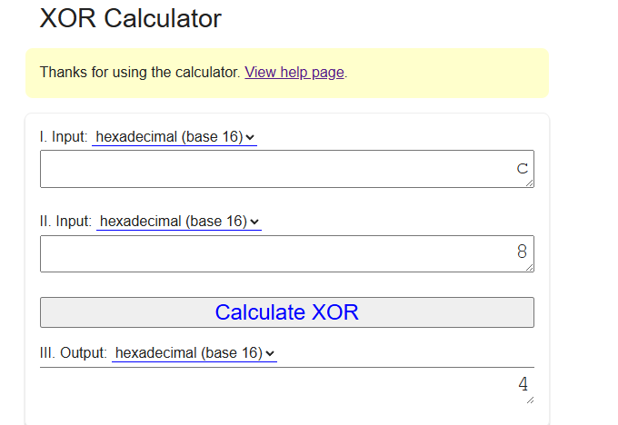

Täällä myös selitettiin asia samalla tavalla kuin Applied Crytpograpgy kirjassa,

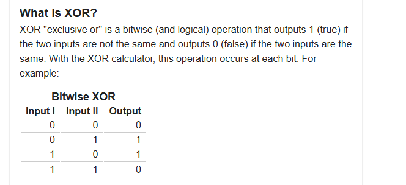

Käytin netistä löydettyä hex to biniary converteria, jotta pystyisin havainnollistamaan logiikan itselleni selkeämmin

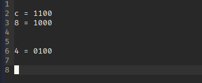

1 XOR 1 = 0
1 XOR 0 = 1
0 XOR 0 = 0
0 XOR 0 = 0

Tällein tämä toimii, lopulta aika simppeli homma. Seuraavaksi pitäisi siis tehdä python scripti, jossa tämä tapahtuisi. Itselle tulee mieleen kaksi tapaa tehdä tämä.

- Convertaan molemmat hexa "bufferit" binaariksi, vertailen ne ja convertaan sen takaisin hexaksi. 

- Käyttää jotain kirjastoa hyödyksi, josta löytyisi suoraan vertailu funktio, mikä hoitaisi tämän automaattisesti puolestani.

Lähdin testaamaan ensimmäistä, sillä en ollut hetkeen koodannut ja tämä olisi loistava hetki vähän kerrata sitä. Löysinkin hyvän sivun, jossa käytiin tätä läpi.

https://www.geeksforgeeks.org/python/python-ways-to-convert-hex-into-binary/

Halusin muuttaa parametrien nimiä ja sain tämän näköisen koodin. 

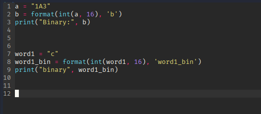

Googletin miten tämä Pythonin format methodi toimii ja löysin W3schoolsin sivun https://www.w3schools.com/python/ref_string_format.asp. Onglelma koodissani oli se, että formatin lopussa "b" ei viittaakkaan muuttujan nimeen "b". Se viittaa mihin formaattiin aikaisemmin määritetty muuttuja halutaan muuttaa.  

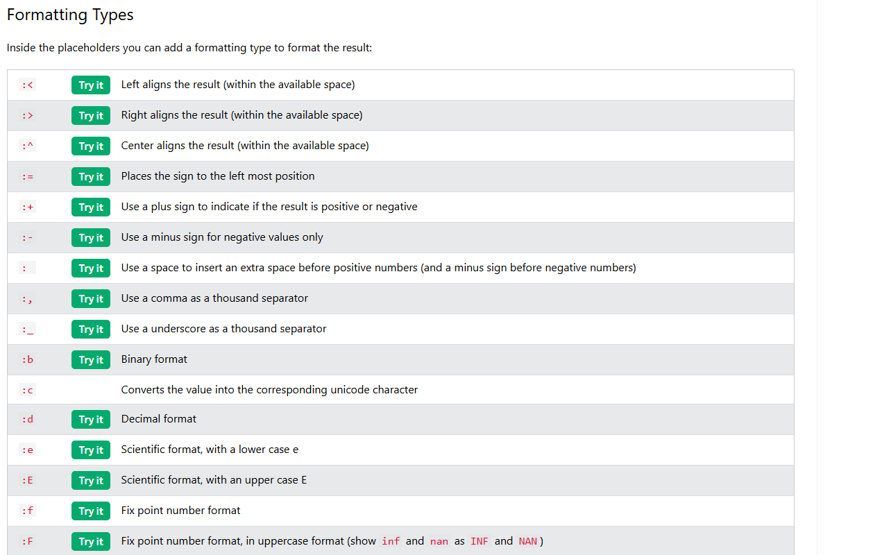

Ja nyt koodi toimii. 

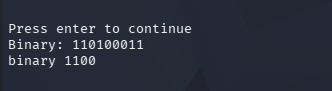

Muokkasin koodia hieman paremmaksi tulevaisuutta varten.

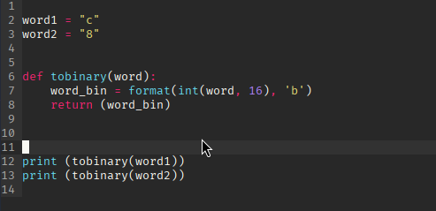

Seuraavaksi lisäsin XOR pätkän `^`.

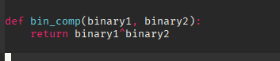

Ja vastauksena tuli tälläinen.

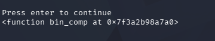

Muokkasin hieman koodia, jotta se toimisi oikein.

Ja nyt tuli tälläinen errori.

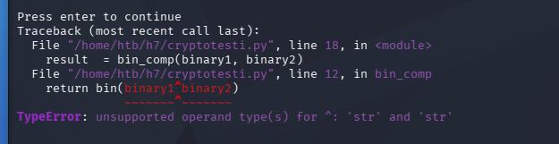

Ongelma on siis `tobinary` funktiossa. Katsoin tarkemmin [Geeksforgeeks](https://www.geeksforgeeks.org/python/python-ways-to-convert-hex-into-binary/) artikkelia, ja siellä oli toinen tapa muuttaa hexa integreriksi käyttämällä vain ` word_bin = int(word, 16)`

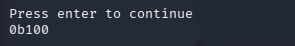

Ja nyt homma toimii. Tarkistin vastauksen online työkalulla https://www.rapidtables.com/convert/number/binary-to-hex.html  ja saatu vastaus oli oikein.

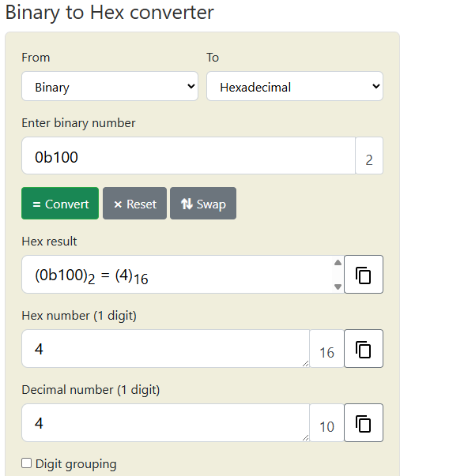

Ja lopuksi vain muuttaminen takaisin hexaksi `hex()` avulla

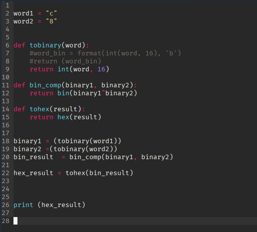

Mutta tuli taas samanlainen errori `type str`.

Tässä vaiheessa kysyin Geminiltä (Gemini 3 Pro) apua ja ongelma oli bin_comp funktion bin() kohdassa. Ongelma tässä oli se, että bin() muuttaa sen stringiksi. Voin ottaa pois bin funktion ja vain vertailla arvoja `^` avulla.

Nyt se toimii. Lisäsin vain printtiin [2:] jotta "0x" menee pois. 

Nyt testataan sitä isommilla hexoilla. Otin tehtävän antamat hexat ja laitoin ne word1 ja word2 tilalle. Sen lisäksi laitoin tehtävän odotetun outputin ``combination`` muuttujaan ja vertailin sitä saamaani hex_result outputtiin.

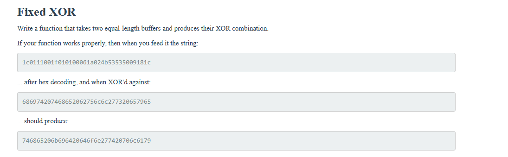

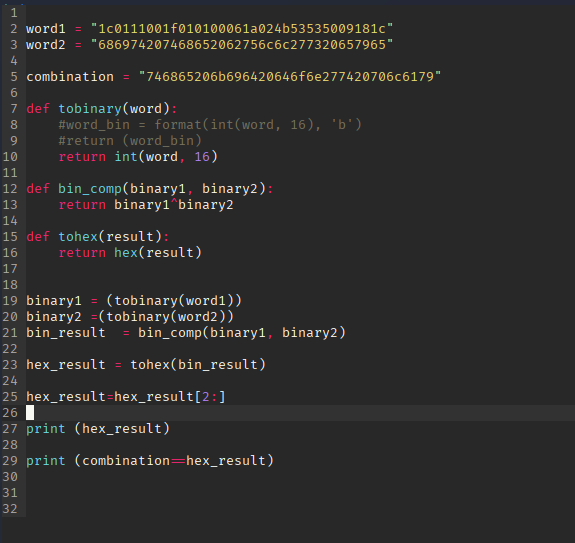

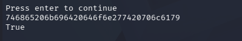

Python scripti toimi ja sain oikean vastauksen. Tähän olisi varmaan ollut jokin helpompikin tapa, mutta ei tämäkään nyt ollut mitään tajunnan räjäyttävää koodia. Hieman tuli lopussa käytettyä Geminiä apuna, mutta muuten tuli koodi tehtyä ilman sitä.

## c
> Single-byte XOR cipher.
X
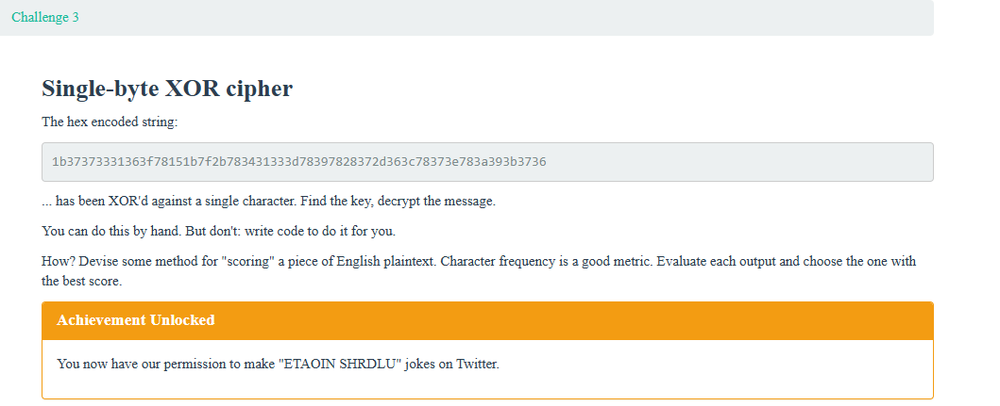

Tarkoituksena on siis käyttää aikaisemmin tehtyä XOR python skriptia, mutta tehdä vertailu `eli siis word1^word2` siten, että toinen sanoista on yksi hexa merkki `0-9 &A-F, a-f`(Myöhemmin tajusin, että mikä tahansa merkki). Jokaisen vertailun jälkeen hexa pitää muuttaa ASCII muotoon. Näistä voin joko 

- tehdä listan ja katsoa itse läpi kaikki stringit
- tai kuten tehtävänannossa sanotaan teen ohjelman joka laskee eri merkkien määrän lauseessa ja palauttaisi sellaiset missä on eniten sellaisia merkkejä joita on eniten englannin kielisissä merkeissä.

Helpoin tapa on varmaan ensiksi tehdä lista ja katsoa läpi manuaalisesti. Kun olen varmistanut tämän skriptin toimivuuden voisin tehdä tuon "automatisoidun" listan.

Tämä xor cypher scripti minulta löytyy jo, mutta hexa pitäisi saada ASCII muotoon. Googlasin asiaa ja löysin artikkelin asiasta: https://bobbyhadz.com/blog/python-convert-hex-to-ascii. 

Tämä omaan koodiin:

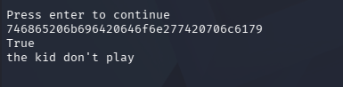

Näyttää toimivan hyvin.

Tein uuden scriptin joka toimii melkein samalla tavalla kuin viimeisen tehtävän scripti.

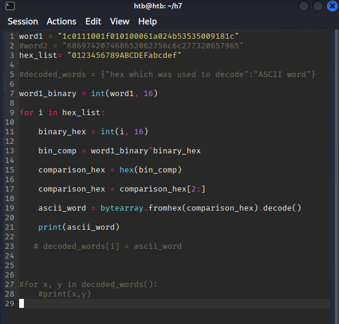

Mutta tämän antama printti oli tällainen

Katsoin missä kohtaa ongelma tulee

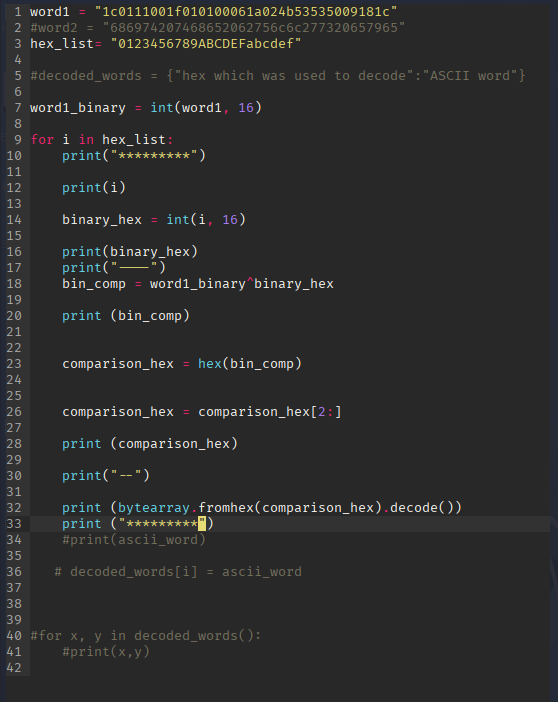

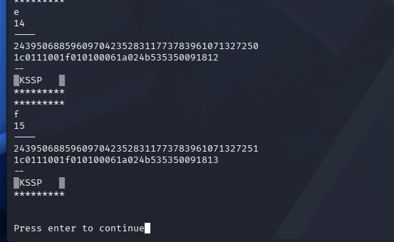

Ja ongelma ilmenee niin ``bytearray`` funktiossa sekä ``bin_comp``. Ongelma tässä on se, että kun XOR cypheraan, niin se vain tekee XOR:N viimeiseen 2 bittiin. XOR ei siis tapahdu koko bittijonolle, vaan viimeiselle kahdelle.

Tämä oli itselle liian vaikea tehtävä saada korjattua. Kysyinkin Geminiltä (Gemini 3 Pro) apua tämän ongelman ratkaisuun ja sain seuraavanlaisen koodin. 

Muokkasin sitä hieman itselle kivempaan muotoon

Ja sehän toimii.

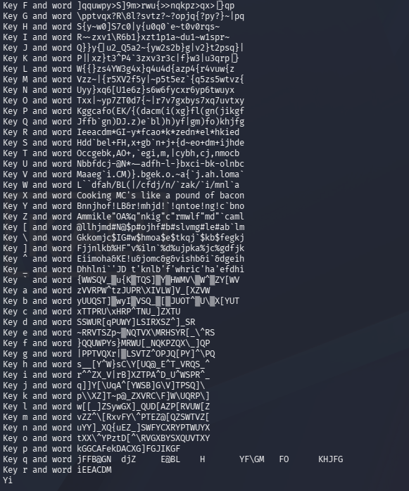

Selkeästi `X` oli merkki, jolla hexa XOR cypherattiin. Seuraavaksi lähdin vielä tekemään sanakirjaa decryptatuille sanoille.

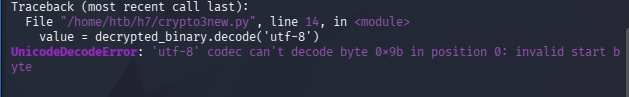

Tuli ``UnicodeDecodeError``. Laitetaan try block joka käsittelee errorin.

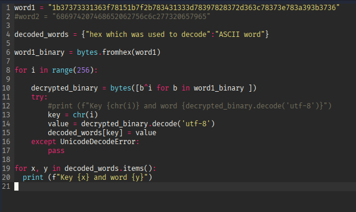

Tämän jälkeen minulle tuli selkeä visio miten tehdä loppukoodi, joka pisteyttäisi parhaimmat sanat
- Etsi yleisimmät kirjaimet englanninkielessä ja laita ne yhteen stringiin
- Käy läpi aikaisempi sanakirja ja pisteytä sanat yleisimpien kirjainten perusteella
- Tee  uusi sanakirja, mihin tulisi sana joka decypherattu sekä sen pisteet
- Laita nämä uuteen listaan jonka sisällä lista, missä sana sekä sen pisteet
- Sorttaa tämä isoimmasta pistemäärästä pienempään
- Käy läpi lista ja printtaa top x kandidaattia.

Löysin wikipediasta englannin kielen sanojen yleisimmille merkeille, https://en.wikipedia.org/wiki/Letter_frequency. 

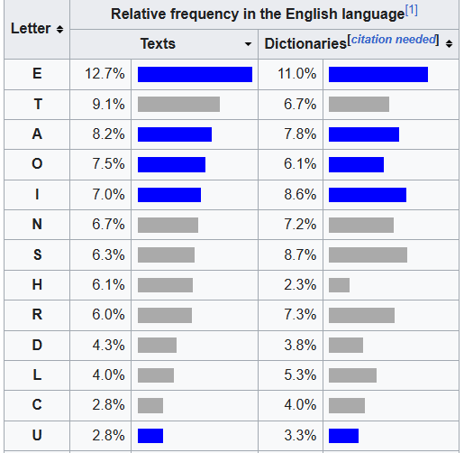

Tästä tulee jo tehtävässä viitattu "sana" ETAOIN SHRDLU.

Sitten väsäsin koodin.

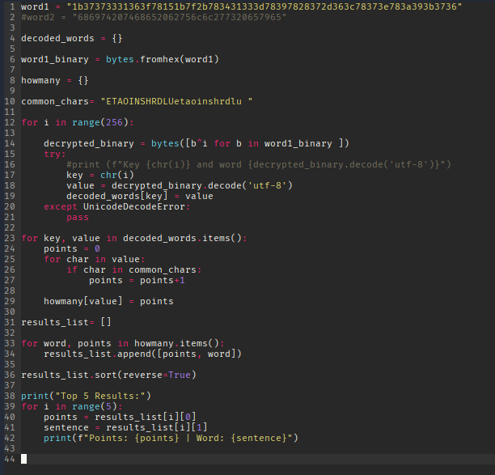

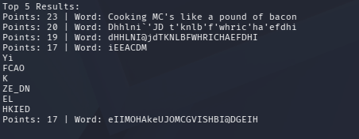

Ongelmia tuli vastaan 33-40 rivien toteutuksessa ja käytin tähän hieman apua Geminiltä. Sain koodin hyvin mietittyä päässä ja pseudokoodattua, mutta itse toteutus ei ihan onnistunut ilman Geminia.

## d
> Detect single-character XOR
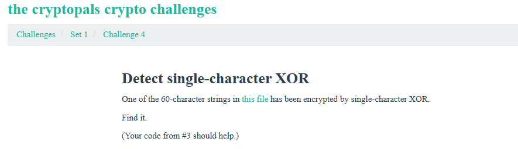

Tehtävän linkki on txt tiedostoon, joka näyttää tältä:

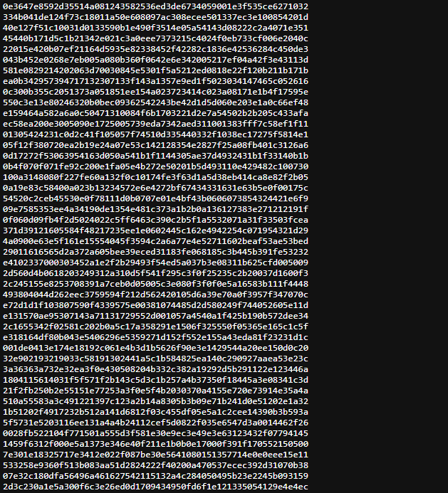

Hankin tämän tekstitiedoston ihan vain `wget https://cryptopals.com/static/challenge-data/4.txt`. 

Seuraavaksi pitäisi vain tehdä looppi, joka ottaa aina seuraavan rivin .txt tiedostosta. Tein seuraavat muutokset, eli lisäsin sanojen decypheraamisen for looppiin. Samalla siirsin muuttujat `decoded_words, howmany, common_chars` pois for loopista.

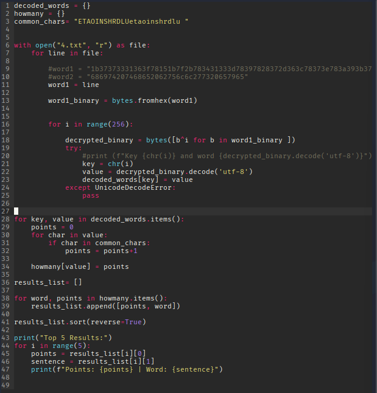

Tämä ei kuitenkaan ihan onnistunut:

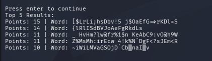

Katsoin koodia hetken ja huomasin, että en ollut tajunnut siirtää sanojen pisteytystä for looppiin. 

Tässä parannettu koodi, jossa pisteytys on mukana for loopissa

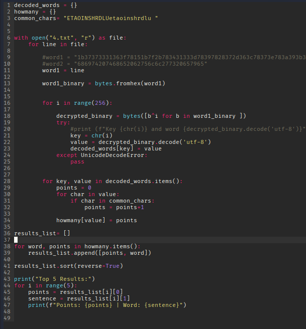

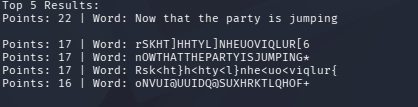

Oikea vastaus löytyi.

## e
> Implement repeating-key XOR.

Väsäsin aluksi tällaisen jossa ei vielä sekoitettu byteja,

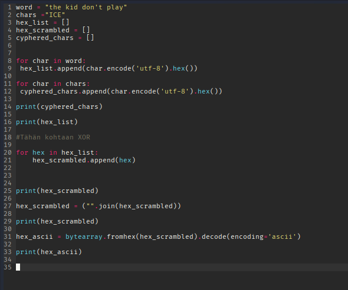

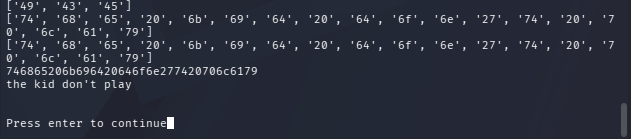

Sain väsättyä tällaisen

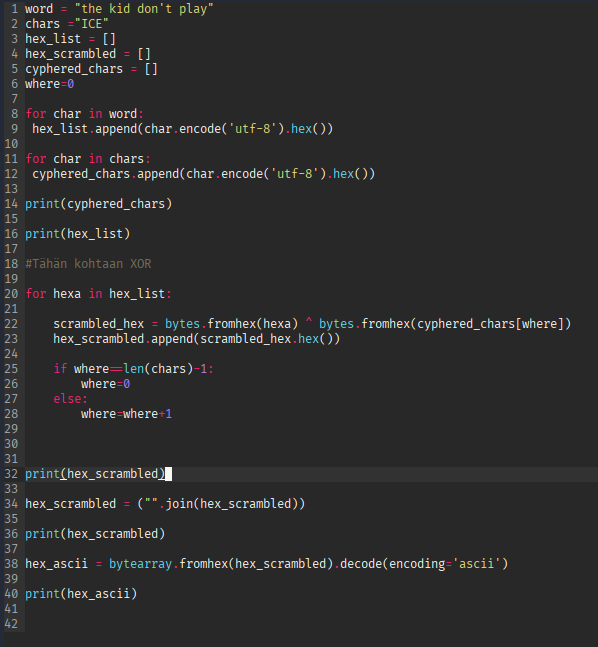

Mutta tuli tällainen errori

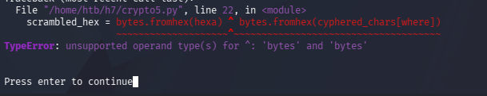

Tässä vaiheessa olin jumissa ja kysyin Geminiltä apua ja sain tälläisen koodin.

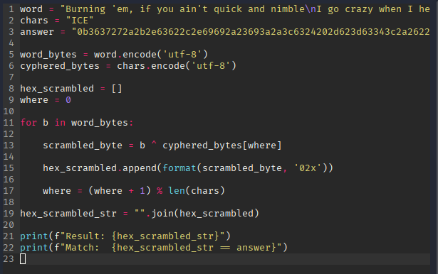

Tämä toimi

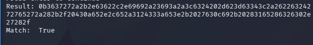
# Lähteet
- https://cryptopals.com/
- Kurssisivu: https://terokarvinen.com/application-hacking/
- Schneier 2015: Applied Cryptography, 20ed: https://learning.oreilly.com/library/view/applied-cryptography-protocols/9781119096726/08_chap01.html#chap01-sec001
- Karvinen 2024: Python basics for Hackers https://terokarvinen.com/python-for-hackers/
- Stack Overflow, Hex to Base64 conversion in Python https://stackoverflow.com/questions/33704327/hex-to-base64-conversion-in-python
- https://www.geeksforgeeks.org/python/python-ways-to-convert-hex-into-binary/
- https://www.w3schools.com/python/ref_string_format.asp
- https://www.w3schools.com/PYTHON/python_operators_bitwise.asp
- Python convert hex to ascii: https://bobbyhadz.com/blog/python-convert-hex-to-ascii
- Letter frequency Wikipedia: https://en.wikipedia.org/wiki/Letter_frequency. 
- XOR calculator, https://xor.pw/
- Gemini 3 Pro