# h1 Hei Ansiblen maailma 
Kotitehtävä h1 "Hei Ansiblen maailma" Tero Karvisen  2026 kevät -kurssille. [Linkki kurssisivulle](https://terokarvinen.com/palvelinten-hallinta/)
Jokaisessa kohdassa on alla olevalla "quote" tyylillä kerrottu tehtävänanto.
>Liirum laarum laa...

## x
> Lue ja tiivistä. (Tässä x-alakohdassa ei tarvitse tehdä testejä tietokoneella, vain lukeminen tai kuunteleminen ja tiivistelmä riittää. Tiivistämiseen riittää muutama ranskalainen viiva. Ei siis vaadita pitkää eikä essee-muotoista tiivistelmää. Lisää kuhunkin jokin oma kysymys tai huomio.)
> Karvinen 2026: [SSH public key - Login without password](https://terokarvinen.com/ssh-public-key-login-without-password/)
- SSH käyttäessä ei aina tarvitse käyttää salasanaa jos käyttää avainparia, `ssh-keygen`.
- Kun olet tehnyt avainparin, yhdistä haluamaasi ssh palvelimelle `ssh-copy-id` komennolla, jolloin kopioit julkisen avaimesi kyseiselle palvelimelle.
> Karvinen 2026: [Hello Ansible](https://terokarvinen.com/hello-ansible/)
- Ansiblen käyttöönotto on helppoa ja siihen tarvitsee vain 4 tiedostoa.
- Tämä ohje sisältää muutaman QOL (Quality of life) parannuksen, kuten
    - Python ilmoituksen poistamisen, `[all:vars] ansible_python_interpreter=/usr/bin/python3`
    - Komennon lyhentäminen, ettei aina tarvitse kirjoittaa ``-i host ini``, `[defaults]inventory = hosts.ini` 
## a
> Sshecrets. [Asenna SSH-demoni ja testaa se kirjautumalla SSH:lla.](https://terokarvinen.com/ssh-public-key-login-without-password/)

Asensin ssh:n komennolla ``sudo apt-get -y install ssh``. Tämän jälkeen tein ssh yhteyden localhostiin `ssh localhost`. Koska en ollut aikaisemmin yhdistänyt kyseiseen ssh serveriin, se kysyi että luotanko kyseiseen hostiin, kirjoitin yes. Tämän jälkeen se kysyi virtuaalikoneeni salasanaa ja laitettuani sen sain tehtyä ssh yhteyden localhostiin. Komennon `w` avulla näemme että meillä on ssh yhteys. Exit komennon jälkeen näemme, että yhteys on katakistu.

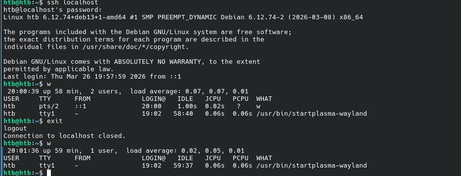

## b
> Pubkey. Automatisoi ssh-kirjautuminen julkisella avaimella.

Tein aluksi ssh avainpparin. Tämän jälkeen yhdistin ssh palvelimeen siten, että se samalla kopioi julkisen avaimeni hostille. 

    ssh-keygen
    ssh-copy-id localhost

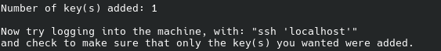

Nyt ei enää tarvitse naputtaa salasanaa

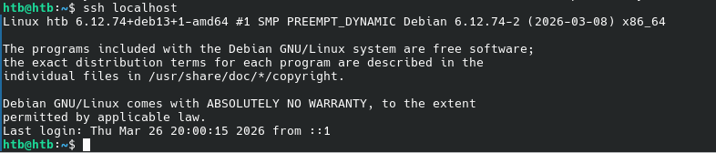

## c

>  Hei Ansible. Tee hei maailma ansiblella ja kokeile sitä SSH:n yli.

Lähdin tekemään tätä tehtävää Teron [Hello Ansible](https://terokarvinen.com/hello-ansible/) -artikkelin mukaan. Asensin Ansiblen `sudo apt-get install ansible` ja testasin ``ansible -h`` jotta näkisin asentuiko ansible oikein. 

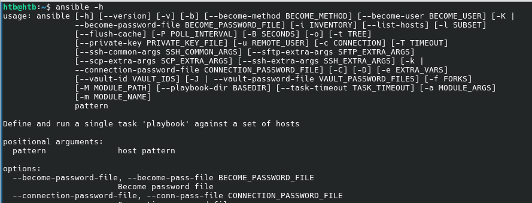

Asennus onnistui. Tämän jälkeen tein Ansible kansion, joka toimisi ansible configuraation pääjuurihakemistona.

Seuraavaksi menin kansioon ja tein hosts.ini tiedoston jonne lisäsin hostin jolle tulen käyttämään ansiblea, tässä tapauksessa localhost. Normaalisti tässä olisi haluttu/halutut koneet.

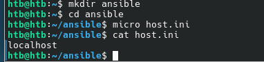

Suoritin seuraavan komennon testatakseni toimiiko Ansible.

    ansible all -a 'uptime' -i hosts.ini   

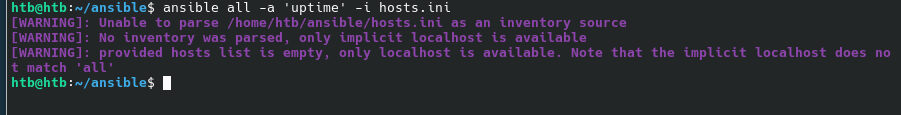

Tuli errori. Hetken katsottuani huomasin, että olin laittanut tiedoston himeksi host.ini enkä hosts.ini. Korjasin typon `mv host.ini hosts.ini` ja suoritin komennon uudestaan. 

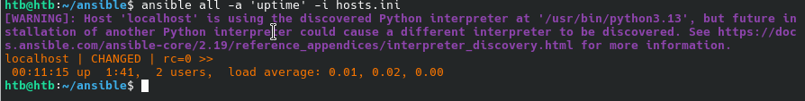

Nyt toimi typon korjaamisen jälkeen. Seuraavaksi lähdin korjaamaan ärsyttävää `WARNING... Python...` tekstiä. Lisäsin seuraavan tekstin hosts.ini tiedostoon jonka jälkeen testasin toimiko se.

    [all:vars]
    ansible_python_interpreter=/usr/bin/python3

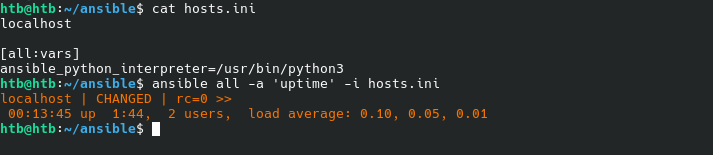

Nyt ansible löysi python polun ja ei antanut warning tekstiä. Seuraavaksi tein ansible.cfg tiedoston, eli konfiguraatio tiedoston. Tänne lisäsin hosts.ini, jotta ei aina tarvitse kirjoittaa hosts.ini ansiblen komentoon.

    [defaults]
    inventory = hosts.ini

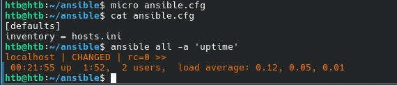

Seuraavaksi tein site.yml tiedoston. Tämän avulla pystyn kertoman ansiblelle minkä rolin mikäkin kone saa.

    - hosts: all
    roles:
        - hello

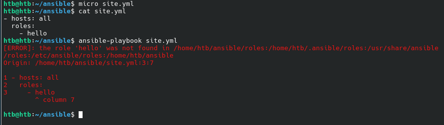

Tästä tuli error viesti, koska en ollut vielä määrittänyt hello roolia. Seuraavaksi määritin kyseisen roolin.

    - copy:
    dest: /tmp/hello-ansible
    content: "Hellou\n"

Suoritin komennon `ansible-playbook site.yml`

Seuraavaksi menin tarkistamaan oliko tiedosto oikeasti tullut /tmp/ kansioon.

    ssh localhost
    cat /tmp/hello-ansible

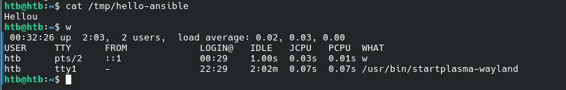

Ansible toimi ja sain luotua tiedoston "orjalle". Tein vielä viimeisen QOL (Quality of life) parannuksen ansible.cfg tiedoston. Lisäsin sinne `display_args_to_stdout = true` jotta näen paremmin mitä ansible tekee. Ensimmäisenä vanha ja sen jälkeen uusi parannettu versio. 

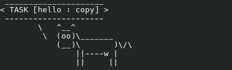

Minua alkoi ärsyttämään cowsay lehmät (ainaskin nyt) ja halusin ne pois. Googletin asiaa ja löysin artikkelin asiaan liityen https://michaelheap.com/cowsay-and-ansible/. Minun piti vain suorittaa komento `export ANSIBLE_NOCOWS=1` ja tällä saisin lehmät pois ruudulta

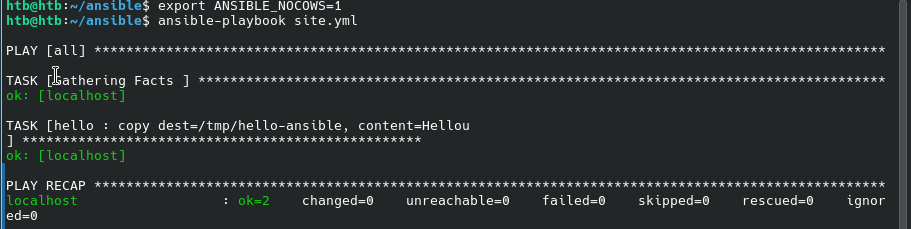

Ja jos haluan joskus lehmät takaisin suoritan vain saman komennon, mutta 0 arvolla.

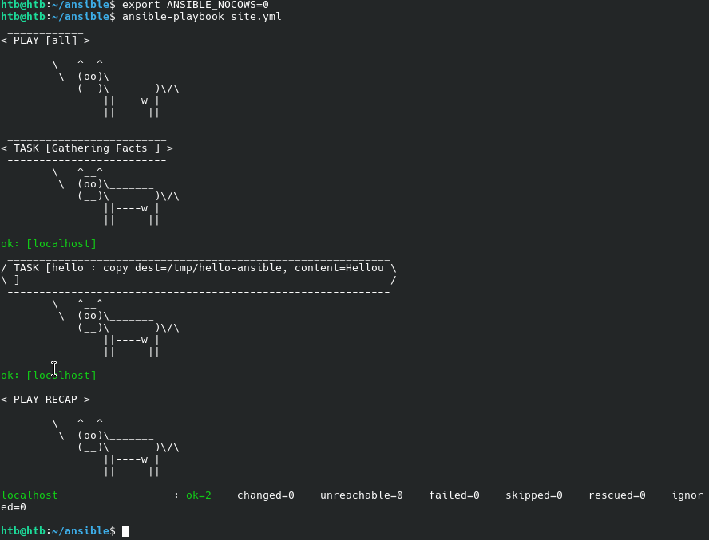

## d
> Vapaaehtoinen bonus, vaikea: kokeile Ansiblella jokin näista asetuksista: paketin asennus, asetustiedosto /etc/ alle, käynnistä jokin demoni, tee uusi käyttäjä. Tarvitset todennäköisesti sudoa, become: true.

# Lähteet
- Kurssisivu https://terokarvinen.com/palvelinten-hallinta/
- Karvinen 2026: [SSH public key - Login without password](https://terokarvinen.com/ssh-public-key-login-without-password/)
- Karvinen 2026: [Hello Ansible](https://terokarvinen.com/hello-ansible/)
- Cowsay and ansible https://michaelheap.com/cowsay-and-ansible/