# h2 Voileipä
Kotitehtävä h2 "Voileipä" Tero Karvisen  2026 kevät -kurssille. [Linkki kurssisivulle](https://terokarvinen.com/palvelinten-hallinta/)
Jokaisessa kohdassa on alla olevalla "quote" tyylillä kerrottu tehtävänanto.
>Liirum laarum laa...

## x
> Lue ja tiivistä. (Tässä x-alakohdassa ei tarvitse tehdä testejä tietokoneella, vain lukeminen tai kuunteleminen ja tiivistelmä riittää. Tiivistämiseen riittää muutama ranskalainen viiva. Ei siis vaadita pitkää eikä essee-muotoista tiivistelmää. Lisää kuhunkin jokin oma kysymys tai huomio.)
> [Karvinen 2026: Sudo without password](https://terokarvinen.com/passwordless-sudo/)

- Ansiblea varten kannattaa tehdä sudoless ryhmä, jonne tulee käyttäjä jolloin ei aina tarvitse antaa salasanaa kun käyttää Ansiblea.
- Kun muuttaa sudoon liittyviä tiedostoja, voivat ne rikkoutua helposti. Tätä varten kannattaa avata uusi ikkuna, jossa olet root shellina.

> Munroe 2006: [xkcd 149: Sandwitch](https://xkcd.com/149/)
- Meemi kuvastaa sudon vahvuutta, jos pyytää konetta tekemään jotain ilman sudoa saattaa hän väitellä vastaan "Tee se itse". Mutta kun sanot sen sudona, tekee kone sen sinullle ilman valituksia.

> Karvinen 2026: [Passwordless Sudo with Ansible](https://terokarvinen.com/passwordless-sudo-with-ansible/)
- Ansiblella voi tehdä käyttäjiä, myös sellaisia joilla on sudo oikeudet. Tätä varten tarvitsee tehdä tehtävä Ansiblelle, jossa on:
   - Group, ryhmä johon seuraavaksi määriteltävä käyttäjä tulee
   - User, käyttäjä joka tehdään ja mihin ryhmiin hänet laitetaan
   - authorized key, julkinen ssh avain ja käyttäjä
   - copy minne tehdään tarvittava tiedosto.

>Ansiblen sisäänrakennettu dokumentaatio ansible-doc -kommennolla.
Kustakin vain
Johdantokappale (Usein MODULE alla, päättyy OPTIONS alkuun)
Nimetyt optiot selityksineen
Esimerkeistä (EXAMPLES) jokin helppo ja keskeinen esimerkki

### copy

> 'ansible-doc copy': content, dest, src; owner, group, mode;
- ansible.builtin.copy moduulin avulla voit kopioida tiedostoja tai kansioita paikalliselta koneelta tai etäkoneelta haluttuun etäkoneeseen. 
- Copy moduulissa voi käyttää erilaisia optioita, 
  - **content**, Tämän avulla voidaan asettaa tietyn tiedosto haluttuun arvoon. Tekee tiedoston, jos sitä ei ole vielä tehty. On riippuvainen siitä, että "dest" on tiedosto.
  - **dest**, Absoluttinen polku etäkoneella, jonne haluttu tiedosto halutaan kopioida. Jos src on kansio, niin on tämäkin.
  - **group**, Ryhmän nimi, joka tulee olemaan tulevan tiedoston tai kansion omistaja.
  - **owner**,  Käyttäjän nimi, joka tulee olemaan tulevan tiedoston tai kansion omistaja.
  - **mode**, Tiedoston tai kansion oikeudet, eli read, write, execute. 

Alla oleva esimerkki otettu ansiblen dokumentaatiosta. 

    - name: Copy file with owner and permissions
      ansible.builtin.copy:
        src: /srv/myfiles/foo.conf
        dest: /etc/foo.conf
        owner: foo
        group: foo
        mode: '0644'

Kertaukseksi tässä jokaisella "oikeudella" on oma arvo, read=4, write=2, exeute=1. Nämä yhdistetään jos halutaan esimerkiksi tiedostolle read+write olisi tämä arvo 6 (eli4+2). Tässä esimerkissä ensimmäinen 0 on vain ylimääräinen 0, jotta yaml osaisi lukea tämän oikein. Tämän jälkeen:
- Ensimmäinen numero kertoo mitkä oikeudet tiedoston omistaja saa, tässä esimerkissä se on foo ja se saisi read+write (eli 4+2=6) oikeudet.
- Toinen numero kertoo mitkä oikeudet tiedoston ryhmä saisi, tässä esimerkissä se on foo ja se saisi vain read oikeuden (4=4).
- Kolmas kertoo muiden ryhmien oikeudet tähän, tässä esimerkissä se olisi vain read oikeus, 4.

### apt

> ansible-doc apt: name, state, update_cache.
- ansible.builtin.apt moduulin avulla voi hallinnoida apt paketteja. Toisin sanoen voi poistaa, asentaa päivittää paketteja.
- apt moduulissa voi käyttää erilaisia optioita,
  - **name**, paketin nimi ja mahdollisesti haluttu tietty versio, esim ssh=1, tai tietyn version mikä tahansa pienempi versio ssh=1.0* (tällöin siis versio voi olla mikä vain, esim 1.01, 1.09).
  - **state**, tarkistaa paketin halutun tilan. 
    - Latest tarkoittaisi, että ansible katsoisi paketin olevan uusinta uutta
    - buil-dep tarkistaisi että tarvittavat "dependencies" olisivat asennettu
    - present katsoisi että paketti on asennettuna
  - **update_cache**, 
    - Tekee saman asian kuin apt-get update. Tässä default arvona on false, eli se ei päivitä pakettilistaa. Jos haluat päivittää tulisi laittaa true.
  
Alla oleva esimerkki otettu ansiblen dokumentaatiosta ja sitä on muokattu lisäämällä muutama optio.

    - name: Install the version '1.00' of package "foo", and also update the cache
      ansible.builtin.apt:
        update_cache: yes
        name: foo=1.00
        state: present

Tässä päivitetään pakettilista, asennetaan tietty versio halutusta paketista ja katsotaan että asentuiko se. 

### file

> ansible-doc file: path, recurse, src, state. owner, group, mode;
- ansible.builtin.file moduulin avulla voidaan asettaa atribuutteja kansioihin, tiedostoihin tai esimerkiksi symlinkkeihin. Näitä kansioita, tiedostoja ja symlinkkeja voi myös poistaa tämän avulla.
- file moduulissa voi käyttää erilaisia optioita,
  - **path**, Tiedoston polku, jota halutaan hallinnoida.
  - **recurse**, asettaa rekursiivisesti halutun tiedoston attribuutit.
  - **src**, tiedoston polku johon linkki tehdään.
  - **state**, ilman tätä kansiot poistetetaan rekursiivisesti ja tiedostot tai symlinkit "unlinkataan". 
    - hard, hard linkki tehdään tai sitä muutetaan
    - link, symboolinen linkki tehdään tai sitä mutetaan
    - touch, tyhjä tiedosto tehdään.
  - **group**, Ryhmän nimi, joka tulee olemaan tulevan tiedoston tai kansion omistaja.
  - **owner**,  Käyttäjän nimi, joka tulee olemaan tulevan tiedoston tai kansion omistaja.
  - **mode**, Tiedoston tai kansion oikeudet, eli read, write, execute. 

Alla oleva esimerkki otettu ansiblen dokumentaatiosta.
    - name: Recursively change ownership of a directory
      ansible.builtin.file:
        path: /etc/foo
        state: directory
        recurse: yes
        owner: foo
        group: foo

### user

> ansible-doc user: name; create_home, comment, groups, shell, state, system.
- ansible.builtin.user moduulin avulla voidaan hallinnoida käyttäjiä ja niihin liittyviä attribuutteja.
- user modulessa voi käyttää erilaisia optioita,
  - **name**, käyttäjän nimi joka tehdään, poistetaan tai muokataan
  - **create_home**, tekee käyttäjälle kotikansion, default arvo on true:
  - **comment**, tällä voi asettaa käyttäjän descriptionin eli esim "user created for ansible".
  - **groups**, tällä asetetaan ryhmät joihin käyttäjä kuuluu.
  - **shell**, tällä voi halutessaan asettaa tietyn shellin, jota käyttäjä käyttää.
  - **state**, tarkistaa käyttäjän halutun tilan, eli onko se olemassa vai ei, default arvo on "present"
  - **system**, jos state=present tämän arvon voi laittaa true. Tällöin tästä käyttäjästä tulee "system account". Default arvo on false. 

Alla oleva esimerkki otettu ansiblen dokumentaatiosta ja sitä on muokattu lisäämällä muutama optio.

    - name: Add the user 'james' with a bash shell, appending the group 'admins' and 'developers' to the user's groups
      ansible.builtin.user:
        name: james
        shell: /bin/bash
        groups: admins,developers
        append: yes
        state: yes

### authorized_key

> ansible-doc authorized_key: user, key.
- ansible.posix.authorized_key moduulin avulla voidaan tehdä tai poistaa käyttäjien ssh avaimia.
- **user**, käyttäjä kenen avaimia tullaan muokkaamaan
- **key**, tämän avulla voi halutessaan ottaa esim urlin avulla julkisen avaimen.

Alla oleva esimerkki otettu ansiblen dokumentaatiosta ja sitä on muokattu lisäämällä muutama optio.

    - name: Set authorized key taken from file
      ansible.posix.authorized_key:
        user: charlie
        state: present
        key: "{{ lookup('file', '/home/charlie/.ssh/id_rsa.pub') }}"

## a
> Sudoless. Tee ansiblea varten tunnus, jolla voi käyttää sudoa ilman salasanaa. Sekä ssh-kirjautuminen että sudon käyttö tulee olla ansbilea varten automatisoitu.

Lähdin tekemään tätä tehtävää Teron artikkelin [Sudo without password](https://terokarvinen.com/passwordless-sudo/) avulla. 

Tein käyttäjän `ansu` ja ryhmän ``sudoless`` jonka jälkeen lisäsin ansun kyseiseen ryhmään.

    sudo adduser ansu
    sudo groupadd sudoless
    sudo adduser ansu sudoless

Ennen kuin lähdin muokkaamaan visudoa avasin root shellin `sudo -i`

Tämän jälkeen suoritin `sudo visudo /etc/sudoers.d/sudoless` ja lisäsin `%sudoless ALL = (ALL) NOPASSWD: ALL` kyseiseen uuteen tiedostoon.

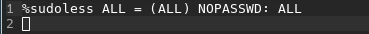

Tämän jälkeen testasin toimiiko sudo ilman salasanaa ansu käyttäjällä

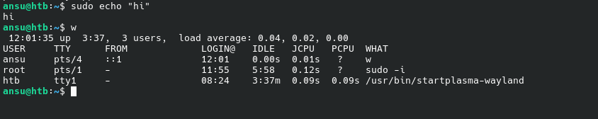

Ansu pystyy nyt käyttämään sudoa ilman salasanaa.

## b
>  Antero. Tee salasanaton, automaattisesti ssh:lla kirjautuva tunnus Ansiblella.

Lähdin tekemään tätä tehtävää Teron artikkelin [Passwordless Sudo with Ansible](https://terokarvinen.com/passwordless-sudo-with-ansible/) avulla. 

Minulla oli jo seuraava folder structure aikaisemmasta tehtävästä, joten tässä en tee kaikkea alusta.

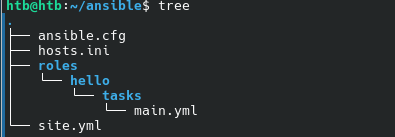

Tein uuden roles kansion ansu:lle sekä sinne tasks.

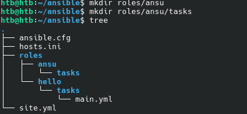

Sitten tein main.yml tiedoston.

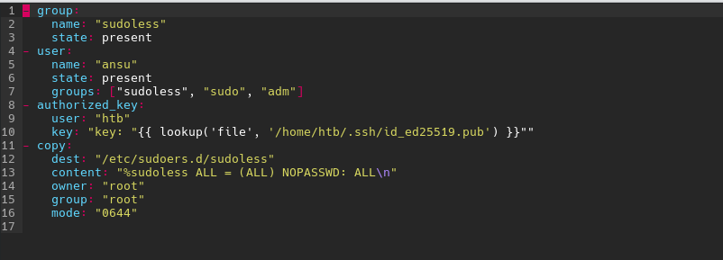

Tässä teen käyttäjän ansu joka kuuluu sudoless, sudo ja adm ryhmiin. Kopioin oman julkisen ssh avaimen ansulle. Lopuksi teen sudoless tiedoston, jonka avulla ansu pystyy käyttämään sudoa ilman salasanaa, oikeudet tässä on r+w, r, r. Ennen tämän suorittamista poistin aikaisemmin tekemäni ansu käyttäjän sekä sudoless tiedoston. 

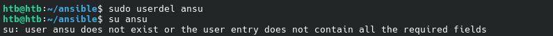

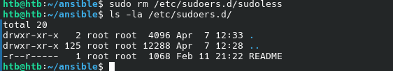

Tämän jälkeen lisäsin ansun site.yml tiedostoon rooleihin.

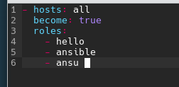

Koitin suorittaa kyseistä taskia `ansible-playbook site.yml`

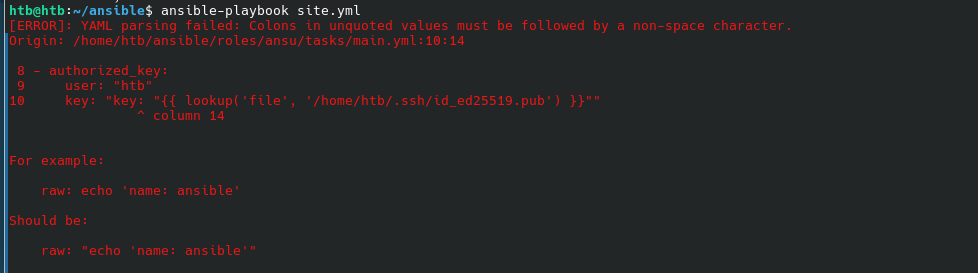

Noh tämä tiedoston kautta avaimen kopioiminen ei onnistunut joten laitoin vain tekstinä avaimeni. Tämän jälkeen suoritin komennon `ansible-playbook site.yml` uudestaan 

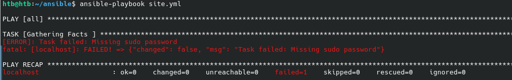

Nyt se valitti sudon salasanasta, niin kuin sen pitikin. Lisäsin -K komennon loppuun ja sain suoritettua komennon

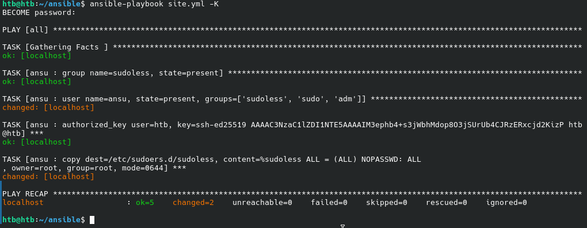

Tässä näkyy, että se muutti kahta kohtaa. Koitin kirjautua ansulle ssh:n avulla mutta se ei onnistunut. Koitin myös päästä käyttäjälle `su ansu` komennolla, mutta sekään ei toiminut. Käyttäjälle pääsi kummiskin roottina ja tämä toimi linuxin haluamalla tavalla (koska käyttäjälle ei ole asetettu salasanaa ei sille pääse edes su avulla ellet ole root?). Koitin selvittää tätä Gemini 3 Pro:n avulla mutta se antoi erittäin huonoja ratkaisuja, mallia "Ai ssh ei toimi, mene käyttäjälle ja fixaa se näin" tai "Aseta kovakoodattu salasana ja vaihda se jälkeenpäin" eikä iskenyt asian juurisyyhyn. Koitin fixata tekemällä esimerkiksi muokkaamalla tehtyä käyttäjää `ansu --> ansuks` mutta tälläkin tuli sama ongelma vastaan, ssh ei toiminut. Olin jo alussa katsonut ja kopioinut ssh avaimen uudestaan mutta se ei ollut toiminut. Testasin kuitenkin uudestaan, sillä muuten homma näytti hyvältä ja asia oli toiminut manuaalisti. 

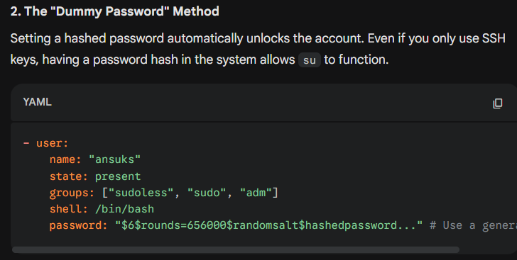

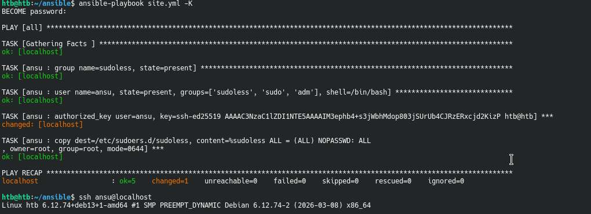

Ongelma oli tietenkin ssh avaimessa jokin lisä space tai kirjain tai jotain kun kopioin ja liitin sitä. Oli hauska nähdä, miten Gemini yritti keksiä kaikkia korjauskeinoja paitsi että tarkista ssh avain.

## c
> Package. Asenna kaksi pakettia ansiblella.

Laitoin ansiblen asentamaan kaksi pakettia apache2 ja cowsay. Lisäsin kyseisen tekstipätkän main.yml tiedostoon.

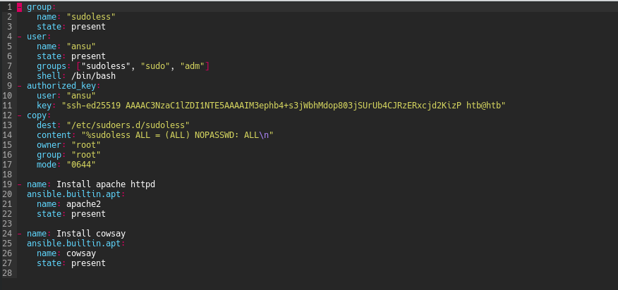

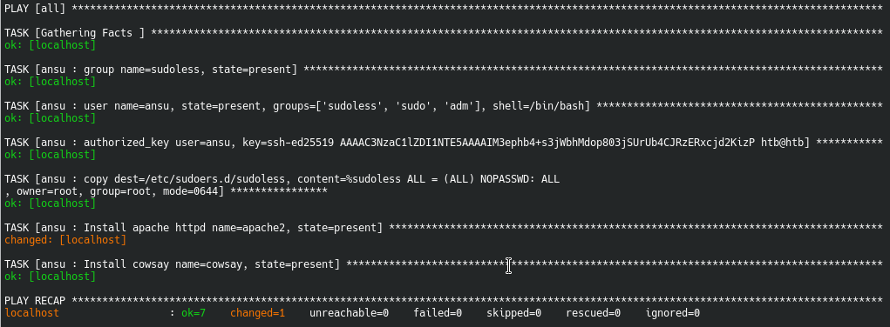

Katsoin tarkemmin ansiblen dokumentaatiota ja siellä pystyi tekemään tämän nätimmin, pkg

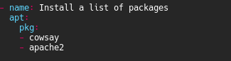

Katsoin vielä, että paketit olivat oikeasti asentuneet, vaikka ansiblen mukaan ne olivat.

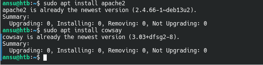

## d
> File. Kirjoita orjalle useamman rivin mittainen tiedosto Ansiblella. Määrittele sen omistaja, omistava ryhmä ja oikeudet. Käytä oikeuksille oktaalinumeroa, esim. "0600". Kerro, mitä oikeudet ovat symbolisessa muodossa, esim. "-rwxr--r--". Selitä, mitä kukin käyttäjä saa tehdä tuolle tiedostolle.

Teen "salasana" tiedoston /etc/ kansioon.

Tätä ennen lisäsin ansun host.ini tiedostoon.

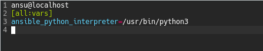

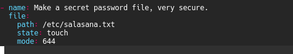

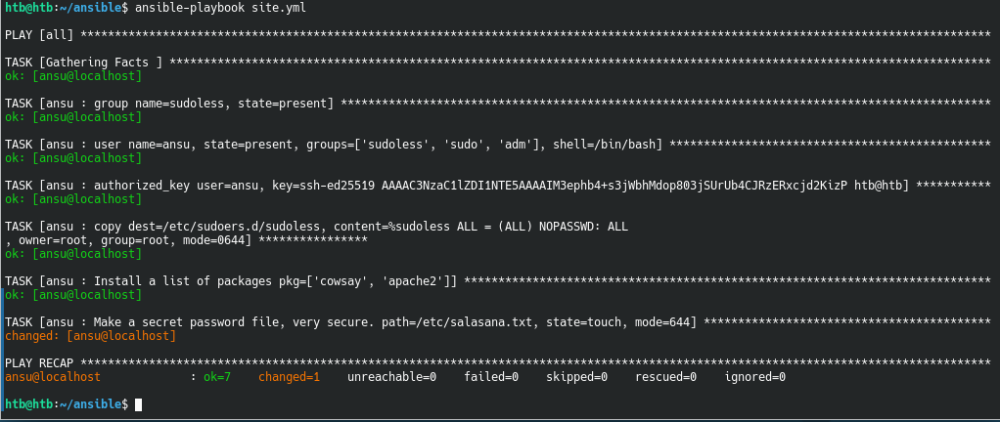

Kirjauduin ssh:lla ansu:lle ja katsoin oliko tiedosto tullut.

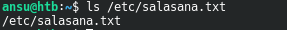

Sitten lisäsin vielä lineinfile moduulin kautta tekstiä sinne.

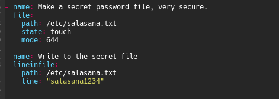

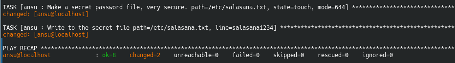

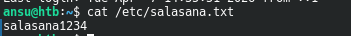

Kun ansiblen laittaa uudestaan tekemään saman asian, antaa se tällaisen outputin.

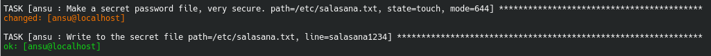

En tiedä miksi tuo näyttää, että tiedoston luomisessa tapahtuisi muutosta, koska se ei luo tiedostoa uudestaan. Tämä voidaan testata, kun muokkaamme salasanaa ja pyöritämme ansiblen uudestaan.

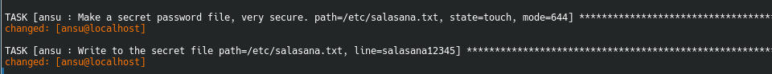

Tämä jäi itseä mietityttämään. Oikeudet tässä on rw-r-r, paitsi minulla oli käynyt typo, kun annoin tiedostoon oikeudet pitäisi siinä olla 0. Tällä hetkellä oikeudet näyttää tältä

Nyt näyttää paremmalta, rw-r--r--. Kopioin x tehtävästä selitykseni tähän mitä nämä tarkoittavat,

Kertaukseksi tässä jokaisella "oikeudella" on oma arvo, read=4, write=2, exeute=1. Nämä yhdistetään jos halutaan esimerkiksi tiedostolle read+write olisi tämä arvo 6 (eli4+2). Tässä esimerkissä ensimmäinen 0 on vain ylimääräinen 0, jotta yaml osaisi lukea tämän oikein. Tämän jälkeen:
- Ensimmäinen numero kertoo mitkä oikeudet tiedoston omistaja saa, tässä esimerkissä se on foo ja se saisi read+write (eli 4+2=6) oikeudet.
- Toinen numero kertoo mitkä oikeudet tiedoston ryhmä saisi, tässä esimerkissä se on foo ja se saisi vain read oikeuden (4=4).
- Kolmas kertoo muiden ryhmien oikeudet tähän, tässä esimerkissä se olisi vain read oikeus, 4.

> Jotain muuta. Näytä esimerkki ansiblen käskystä, jota ei ole vielä käsitelty kurssilla tai kotitehtävissä. Voit ottaa jonkun muun modulin kuin apt, file, copy, user tai authorized_key. Tai voit käyttää ominaisuutta, jota ei vielä ole demonstroitu. Jos tiivistystehtävässä x on mainittu ominaisuuksia, joita ei tunneilla tai läksyissä kokeiltu, nekin kelpaavat.

Sellaillin ansiblen moduleja ja löysin get_url nimisen moduulin jolla pystyisi lataamaan netistä tiedostoja. Laitoin ansiblen lataamaan oman pelin, jonka olen joskus koodannut githubista.

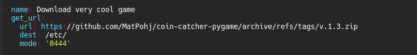

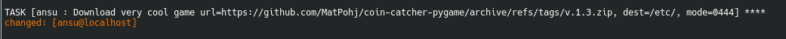

Tätä voisi vielä parantaa siten, että se unzippaisi sen samalla.

Selaillin lisää moduleja ja löysin unarchive modulen. Tällä pystyisi kätevästi samalla lataamaan ja unzippaamaan halutun tiedoston. 

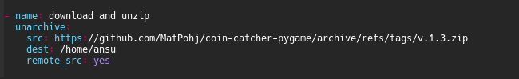

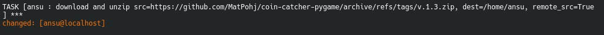

Se onnistui. Huom automaattisen unzippauksen jälkeen kansiolle tuli rwx-r-x-r-x oikeudet.

# Lähteet
- Ansiblen sisäänrakennettu dokumentaatio, ansible-doc copy, apt, file, user, authorized_key, get_url, lineinfile, unarchive.
- Gemini 3 Pro, Fast&Thinking.
- Karvinen 2026: Sudo without password: https://terokarvinen.com/passwordless-sudo/
- Karvinen 2026: Passwordless Sudo with Ansible https://terokarvinen.com/passwordless-sudo-with-ansible/
- Munroe 2006: xkcd 149: Sandwitch: https://xkcd.com/149/

