# h3 Demoni
Kotitehtävä h3 Demoni Tero Karvisen  2026 kevät -kurssille. [Linkki kurssisivulle](https://terokarvinen.com/palvelinten-hallinta/)
Jokaisessa kohdassa on alla olevalla "quote" tyylillä kerrottu tehtävänanto.
>Liirum laarum laa...

## x

>  Lue ja tiivistä. (Tässä x-alakohdassa ei tarvitse tehdä testejä tietokoneella, vain lukeminen tai kuunteleminen ja tiivistelmä riittää. Tiivistämiseen riittää muutama ranskalainen viiva. Ei siis vaadita pitkää eikä essee-muotoista tiivistelmää. Lisää kuhunkin jokin oma kysymys tai huomio.)
> Karvinen 2026: Apache installed with Ansible - quick notes
- Ansiblella voi hallita d(a)emoneja täysin (CRUD), eli create, read, update sekä delete.
- Tarvittu tiedostorakenne on: 

``Tiedostorakenne otettu Teron artikkelista.``

        roles/apache2/
            files/
                example.com.conf
        handlers/
            main.yml
        tasks/
            main.yml

- tasks/main.yml tiedostossa kerrotaan 
  - apt: Hallittu daemoni, esim apache2. Ansible asentaa tämän jos se ei ole asennettu ja tarkistaa onko se asennettu
  - copy: kopioi halutun config tiedoston masterilta slavelle. Tässä määritetään tulevan tiedoston omistaja ja ryhmä sekä oikeudet, read write execute.
  - file. 

- handlers/main.yml tiedostossa kerrotaan
  - mitä esimerkiksi apache daemonille tehdään.

- files/example.com.conf tiedostosa kerrotaan:
  - halutun demonin config tiedosto, esimerkiksi apachen.

> Ansible Community Documentation: [Handlers: running operations on change ](https://docs.ansible.com/projects/ansible/latest/playbook_guide/playbooks_handlers.html)
>Handlers: running operations on change (johdantokappale pääotsikon alta) 
>Notifying handlers
- Ansiblessa voi tehdä "Handlereita". Näiden avulla ansible suorittaa taskin vain, jos muutoksia on tehty koneella. 
- Syntaxi on tämänlainen

        handlers:
            - name: Restart apache
            ansible.builtin.service:
                name: httpd
                state: restarted       

- Handlersien kanssa voi käyttää myös notify sanaa. Tämän avulla voit hallita monta handleria.
- Nämä suoritetaan järjestyksessä, missä ne ovat handerls kohdassa eikä notify kohdassa. Eli alla olevassa esimerkissä suoritetaan ensin memcached ja sitten apache.

``Esimerkki otettu ansiblen dokumentaatiosta``

        tasks:
        - name: Template configuration file
        ansible.builtin.template:
            src: template.j2
            dest: /etc/foo.conf
        notify:
            - Restart apache
            - Restart memcached

        handlers:
        - name: Restart memcached
            ansible.builtin.service:
            name: memcached
            state: restarted

        - name: Restart apache
            ansible.builtin.service:
            name: apache
            state: restarted

>ansible-doc service:
>johdantokappale (MODULE alta)
>enabled
>name
>state
>EXAMPLES

- ansible.builtin.service modulin avulla voit hallita palveluita kohdekoneella.
- Tässä voi käyttää monia optioita:
  - enabled: Kertoo pitäisikö palvelun käynnnistyä kun kone käynnistetään.
  - name: palvelun nimi, esim apache2
  - state: Tässä voi käyttää seuraavia vaihtoehtoja:
    - started/stopeed: Ei suorita komentoja ellei ole pakko
    - restarted: uudelleen käynnistää palvelun kaikissa tapauksisa
    - reloaded: pitää halutun palvelun käynnissä, mutta päivittää configin.

Alla muutama esimerkki:  

``Esimerkit otettu ansiblen dokumentaatiosta``

    - name: Start service httpd, if not started
      ansible.builtin.service:
        name: httpd
        state: started

    - name: Stop service httpd, if started
      ansible.builtin.service:
        name: httpd
        state: stopped

    - name: Restart service httpd, in all cases
      ansible.builtin.service:
        name: httpd
        state: restarted

    - name: Reload service httpd, in all cases
      ansible.builtin.service:
        name: httpd
        state: reloaded

## a
>  Apassi. Asenna Apache 2 käsin. Weppisivun tulee näkyä palvelimen etusivulla. Sivun tulee olla tavallisen käyttäjän muokattavissa, ilman root- tai sudo-oikeuksia.

Asensin apache2 `sudo apt install apache2` jonka jälkeen katsoin oliko se asentunut, `sudo apache2 -v`

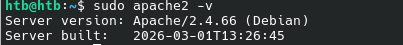

Seuraavaksi pitäisi saada apache2 kotikansioon, jotta sitä voi helposti muokata ilman sudoa tai roottia. Löysin tähän hyvän artikkelin, Dr. Donald Kinghorn: [Note: How To Setup Apache on Ubuntu 22.04 For User public_html](https://www.pugetsystems.com/labs/hpc/note-how-to-setup-apache-on-ubuntu-22-04-for-user-public_html/). 

Aluksi otin käyttöön apachen userdir modulen jonka jälkeen käynnistin apachen uudelleen.

    sudo a2enmod userdir
    sudo systemctl restart apache2

Sitten tein public_html kansion ja annoin siihen tarvittavat oikeudet.

    mkdir public_html 
    chmod 751 public_html

Tämän jälkeen tein public_html kansioon tiedoston index.html.

Lisäsin vielä /etc/apache2/sites-enabled/000-default-conf tiedostoon DocumentRoot polun oikeaksi.

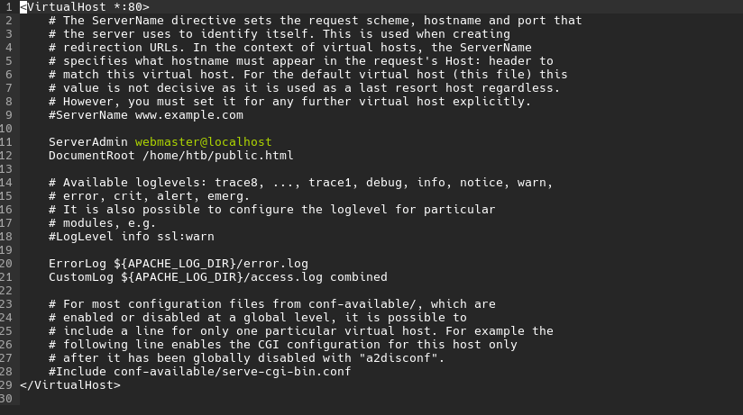

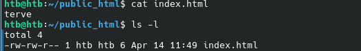

Restartasin apachen `sudo systemctl restart apache2`

Ja tuli tällainen errori

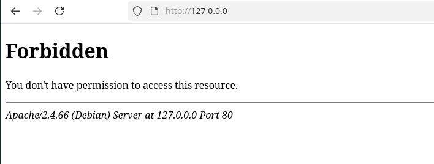

Tämä johtui siitä, että en ollut antanut x oikeutta kotikansiooni.

Muutin tämän `chmod ugo+x /home/htb/`

Tässä vaiheessa minulla oli kaikki oikeudet oikein, mutta silti tuli erroria. 

Kysyin Geminiltä apua ja se sanoi, että minun pitäisi mennä ``http://localhost/~htb/``. 

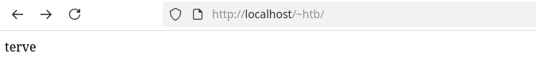

Ihmettelin mistä tämä johtuu, sillä teoriassa se pitäisi olla saatavilla ihan `http://localhost/`. Kysyin geminiltä lisää apua ja ongelma oli `/etc/apache2/sites-enabled/000-default-conf` tiedostossa. Olin laittanut poluksi public.html enkä public_html. 

    sudo systemctl restart apache2

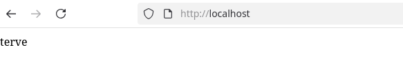

Nyt kaikki toimii ja sitä pystyy muokkaamaan ilman root tai sudo oikeuksia.

## b
> Moottorix. Asenna Nginx käsin. Weppisivun tulee näkyä palvelimen etusivulla. Sivun tulee olla tavallisen käyttäjän muokattavissa, ilman root- tai sudo-oikeuksia. (Muista sammuttaa Apache ensin.)

Asensin nginx `sudo apt install nginx` ja samalla sammutin apachen, jotta se ei häiritse nginx tointaa `sudo systemctl stop apache2`

Katsoin netistä ubuntun tutoriaalin, [Ubuntu: Install and configure Nginx](https://ubuntu.com/tutorials/install-and-configure-nginx#4-setting-up-virtual-host). Katsoin tästä vähän mallia, että mitä tiedostoja pitäisi muokata. Lähdin muokkaamaan `etc/nginx/sites-available/default` tiedostoa.

Lisäsin siihen seuraavat rivit

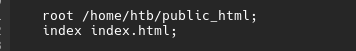

Ja tuli errori. 

Ennen kuin katsoin logeja, katsoin `sites-available` kansion, jos siellä oli aikaisemmin tunnilta jäännyt tehtävä sekoittamassa nginxia.

Poistin website tiedoston ja käynnistin nginx uudelleen

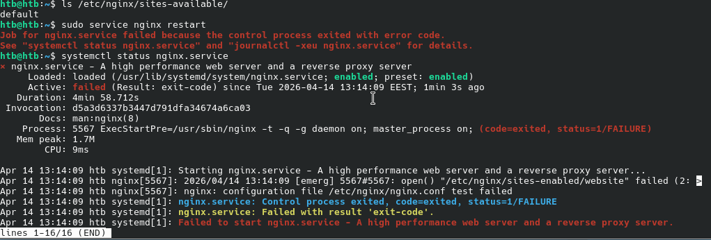

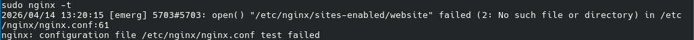

Ongelmana oli, että nginx yritti lukea website tiedostoa, jonka olin juuri poistanut. Tein uuden website tiedoston, pohjana toimi ubuntun tutoriaalista otettu malli.

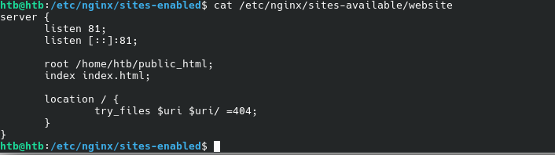

Käynnistin nginx uudelleen, `sudo systemctl restart nginx`

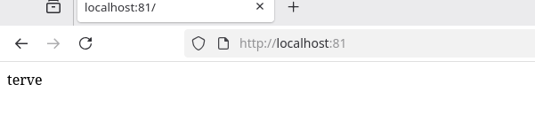

Nyt nginx toimii. Se, miksi aikaisempi website tiedosto ei toiminut johtui todennäköisesti siitä, että siinä hakemisto `root dirpath` oli todennäköisesti väärin tai siinä oli jokin typo. 

## c
> Automoottorix. Automatisoi Nginx asennus Ansiblella. Ylläpitäjän osuus Ansiblella riittää, itse HTML-weppisivut voi tehdä käsin.

Tämä tehtävä jäi itseltä kesken.

# Lähteet
- Ansible Community Documentation: Handlers: running operations on change https://docs.ansible.com/projects/ansible/latest/playbook_guide/playbooks_handlers.html
- Ansible docs: ansible-doc service https://docs.ansible.com/ansible/latest/collections/ansible/builtin/service_module.html
- Dr. Donald Kinghorn: Note: How To Setup Apache on Ubuntu 22.04 For User public_html  https://www.pugetsystems.com/labs/hpc/note-how-to-setup-apache-on-ubuntu-22-04-for-user-public_html/
- Google Gemini: Gemini 3 Pro
- Karvinen 2026: Apache installed with Ansible - quick notes https://terokarvinen.com/apache-ansible/
- Kurssisivu: Palvelinten hallinta https://terokarvinen.com/palvelinten-hallinta/
- Ubuntu: Install and configure Nginx https://ubuntu.com/tutorials/install-and-configure-nginx#4-setting-up-virtual-host 

