# h4 Pizza Fantasia
Kotitehtävä h4 Pizza Fantasia Tero Karvisen  2026 kevät -kurssille. [Linkki kurssisivulle](https://terokarvinen.com/palvelinten-hallinta/)
Jokaisessa kohdassa on alla olevalla "quote" tyylillä kerrottu tehtävänanto.
>Liirum laarum laa...

## x
> Lue ja tiivistä. (Tässä x-alakohdassa ei tarvitse tehdä testejä tietokoneella, vain lukeminen tai kuunteleminen ja tiivistelmä riittää. Tiivistämiseen riittää muutama ranskalainen viiva. Ei siis vaadita pitkää eikä essee-muotoista tiivistelmää. Lisää kuhunkin jokin oma kysymys tai huomio.)
> Karvinen 2023: [Configuration Management of Distributed Systems over Unreliable and Hostile Networks](https://westminsterresearch.westminster.ac.uk/item/w7vvz/configuration-management-of-distributed-systems-over-unreliable-and-hostile-networks) (pdf, ̣mirrors: local, archive.org), vain nämä kohdat:
> 4.12.1 Size and Complexity of Some DSLs (112. Ominaisuuksien määrä.)
- DSL = Domain specific language
- Saltin DSL:ssa (Versiossa 2017.7.4) on 510 eri tilafunktiota joilla käyttäjä voi hallita hallitsemiaan koneita.
- Näiden 510 tilafunktion dokumentaatio on yli 75 000 sanaa.
- Puppet on Saltin tapainen keskitetyn hallinan työkalu.
- Puppetissa oletuksena 113 "funktiota"
- Puppetin funktiot toimivat eri tavalla kuin ohjelmointikielien funktiot. Puppet määrittää uusia resurrseija ja niille yhteydet.

> 4.12.2 Use of DSL Functions in Case Configuration (112-115. Mitä oikeasti käytetään.)
- Mozillan engineering puppet Manifestissa 3 yleisintä functiota ja control structurea olivat case(control structure), file ja package (molemmat funktiota). Näiden määrä oli melkein puolet 49% käytetyistä funktioista, control structuresta sekä "internally defined" komennoista.
- United States Government Configuration Baseline (USGCB) kolme yleisintä komentoa olivat augeas, file ja service. Näiden määrä oli 53,7% käytetyistä komennoista. 

> 4.12.3.1 Dependencies Between Main Functions (115-117. Tärkeimmät rakennuspalikat.)
- Yleisimmät asiat mitä keskitetyn hallinan työkaluilla tehdään on: Daemonien asennus ja configurointi, käyttäjien hallinta ja tiedostojen "manipulointi".
- Eli, package, file, service, user, group, directory, symlink
- Näiden avulla on tarkoitus tehdä järjestelmästä idempotentti.
  
> Oma kommentti
- Kuten Tero on jo aikaisemmin todennut, niin ei tämä ole loppujen lopuksin niin rakettitiedettä. Tämä selkeni helposti tämän avulla, sillä komentoja on paljon, mutta usein vain kourallista käytetään säännöllisesti.
## a
> Räpylä. Asenna itse valitsemasi demoni käsin. Jokin muu kuin tunnilla tai kotitehtävissä aiemmin asennettu, eli ei apache, ngninx eikä openssh-server. Kuten aina, testaa lopputulos.
>
Mietin minkä daemonin voisin asentaa ja katsoin vinkeistä apua. Lähdin asentamaan Sambaa, joka on tiedostopalvelin, jolla voi jakaa tiedostoja verkon välityksellä. Olen asentanut tämän pariin otteeseen Raspberry Pi:lle eikä muistaakseni asennus ollut kovin mutkikas. Lähdin tekemään tätä tehtävää Ubuntun ohjeilla: [Install and configure Samba](https://ubuntu.com/tutorials/install-and-configure-samba#1-overview)

Päivitin pakettilistan ja asensin samban

    sudo apt update
    sudo apt install samba

Katsoin oliko samba asentunut oikein

    whereis samba

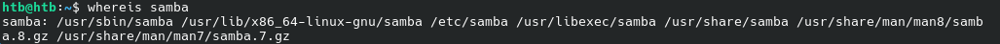

Samba oli asentunut oikein. Tämän jälkeen tein kansion, joka olisi samban jaettu kansio.

    mkdir /home/htb/sambashare/

Tämän jälkeen menin muokkaamaan samban config tiedostoa `sudo micro /etc/samba/smb.conf` ja lisäsin seuraavat rivit tiedoston loppuun:

- Tässä path on absoluuttinen poku, eli /home/username/folder
- read only = no, eli kansio ei ole vain read only
- browsable yes = kansio tulee näkyviin jaettuna kansiona verkon sisällä (näkyy myöhemmin)

Tämän jälkeen käynnistin uudelleen samban `sudo service smbd restart`. 

Tämän jälkeen asetin salasanan sambaan käyttäjälle htb:

Ja tämän jälkeen yhdistin samban palvelimeen:

Tämähän onnistui aika kätevästi. Yritin kirjautua eri käyttäjällä ja se ei onnistunut, eli toimii kuten pitäisikin.

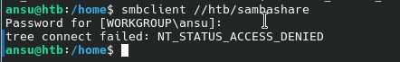

Lisäsin tiedoston kansioon, jotta pystyisin demoamaan tätä paremmin.

Seuraavaksi halusin lisätä käyttäjän sambaan, jotta pystyisin pääsemään käsiksi kansioon myös muilla käyttäjillä.

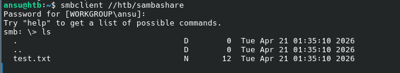

Nyt samba on configuroitu käsin ja seuraavaksi olisi aika automatisoida se.

##  b
>Automaatti. Automatisoi valitsemasi demonin asennus Ansiblella.

Tein sambaa varten ansible kansiooni uuden roolin, ja sinne sisälle tasks kansion.

    mkdir samba
    cd samba/
    mkdir tasks 
    cd tasks/

Sitten lähdin tekemään main.yml tiedostoa. Aloitin pienestä ja tein asennuksen sekä samban uudelleenkäynnistyksen. Katsoin apua netistä löytämästäni ohjeesta [Automating Samba Installations with Ansible on Multiple Distributions.](https://shape.host/resources/automating-samba-installations-with-ansible-on-multiple-distributions)

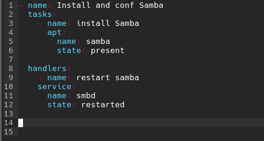

Sitten lisäsin vielä samba roolin site.yml roles kohtaan

Seuraavaksi suoritin `ansible-playbook site.yml` komennon

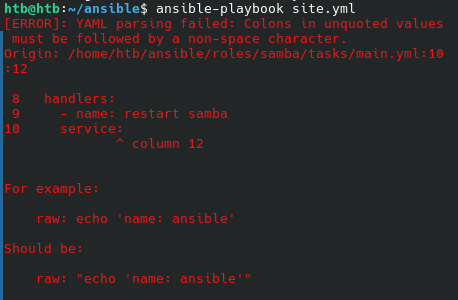

No eihän tuo YAML voi ikinä mennä ensimmäisellä oikein. Korjasin tämän ja suoritin komennon uudelleen.

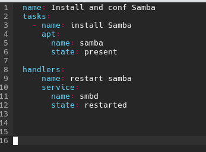

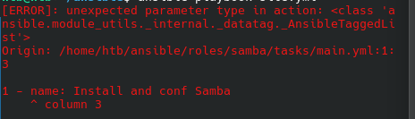

Tässä vaiheessa promptasin Gemini 3 Pro tekoälylle error messagen, sekä main.yml tiedoston sisällön. Geminin mukaan ongelma johtui siitä, että käytin playbook syntaxia task filen sisällä. Toisin sanottuna handlerseja varten minun pitäisi tehdä erikseen kansio ``samba/handlers/``, eikä laittaa handlerseja ``samba/tasks/ ``sijaitseviin tiedostoihin.

Lähdin toteuttamaan tätä Geminin antamien ohjeiden avulla. Tein handlers kansion ja sinne sisään main.yml tiedoston jonne laitoin samban uudelleen käynnistyksen.

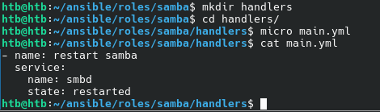

Ja tässä vielä ``tasks/main.yml`` tiedoston uusi sisältö

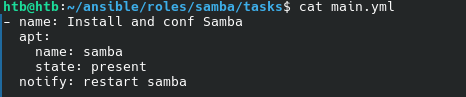

Sitten uudestaan suorittamaan `ansible-playbook site.yml`

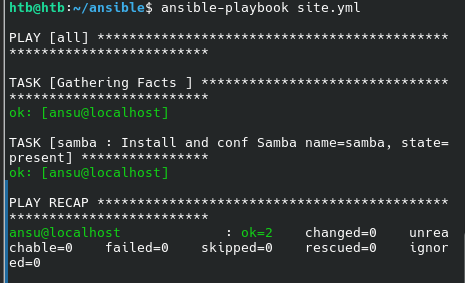

Nyt onnistui ilman erroreita. Koska samba oli jo asennettu, ei mitään muutettu eikä myöskään daemonia käynistetty uudelleen. Seuraavaksi minun pitäisi saada configuroitua samba jaetulla kansiolla. 

Katsoin apua aikaisemmin mainitsemastani [ohjeesta ](https://shape.host/resources/automating-samba-installations-with-ansible-on-multiple-distributions) miten tämä tehtäisiin. 

Lisäsin main.yml tiedostoon samban configurointi kohdan. Tässä kopioin valmiin templaten master koneelta kohdekoneelle.

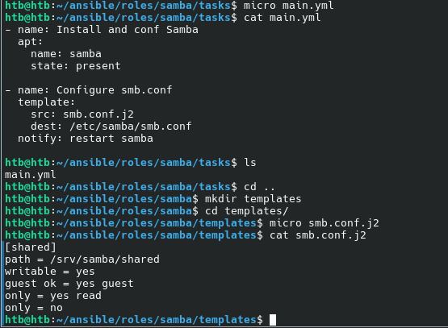

Seuraavaksi lähdin katsomaan toimisiko äsken tekemä automatisointi.

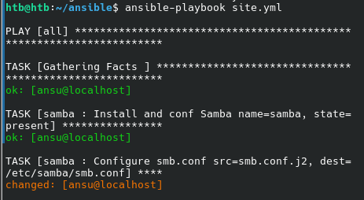

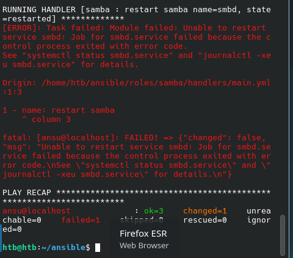

Katsoin `systemctl status smbd.service`.

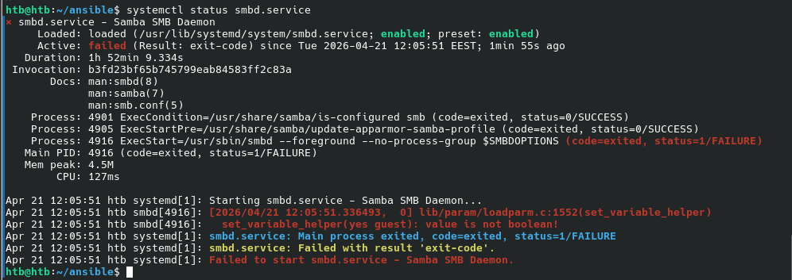

Tämän avulla ei itselle oikein avautunut, mikä on ongelmana. Kysyin Geminiltä apua ja suoritin sen antamat ohjeet ongelmien selvittämiseksi.

Ensimmäinen ongelma oli `smb.conf.j2` templatessa. Tässä guest ok = yes guest viimeinen guest oli ylimääräinen. Poistin tämän

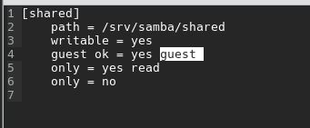

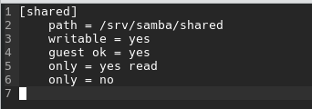

Toinen ongelma oli, että minulla oli /srv/ hakemisto, mutta ei samba/shared/ kansioita siellä

Lisäsin tämän tekemisen tasks/main.yml tiedostoon.

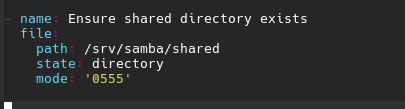

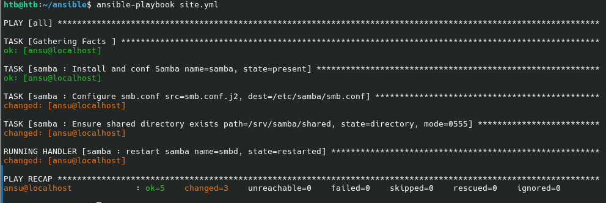

Nyt ainaskin ansible suoritti kokonaan ja ei tullut erroria. 

Yhdistin ssh:lla ansu käyttäjälle, joka suoritti ansiblen. Tämän jälkeen yhdistin samban serveriin `smbclinet //localhost/shared`

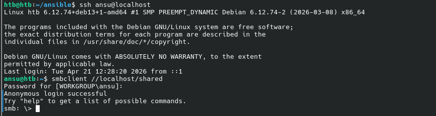

Pääsin onnistuneesti jaettuun kansioon.

Syy miksi pääsin tänne ilman salasanaa oli koska `smb.conf.j2` tiedostossa olin laittanus `guest ok = yes`.

Lisäsin vielä tiedoston tekemisen tasks/main.yml tiedostoon.

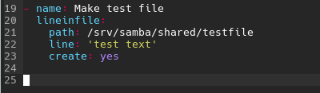

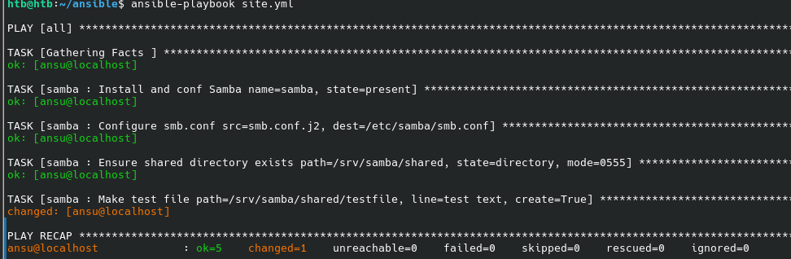

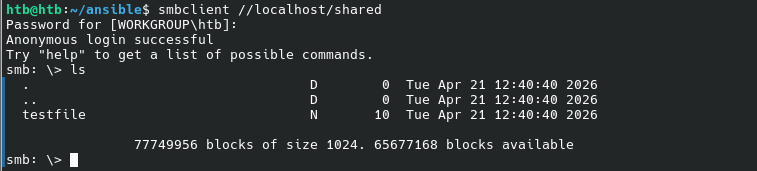

Tiedosto luotiin onnistuneesti, ja mitään muuta ei muutettu (ok 5 changed 1). Kansioon pääsi myös käsiksi toisellä käyttäjällä, kuten oli tarkoituskin.

Suoritin vielä kerran ansible-playbookin, jotta pystyisin toteamaan että tila on idempotentti.

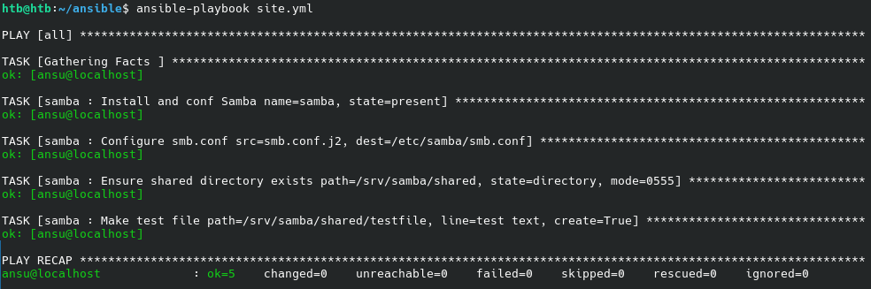

Tila on idempotentti, ok 5, changed 0

Alla vielä tiedostorakenne, ja tiedostojen sisältö mitä tässä vaiheessa tuli tehtyä.

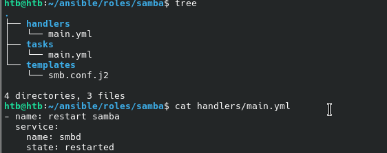

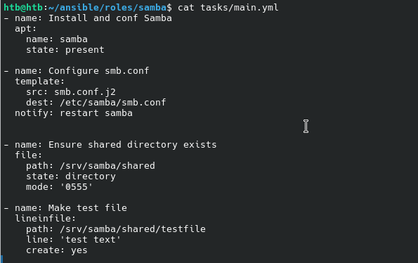

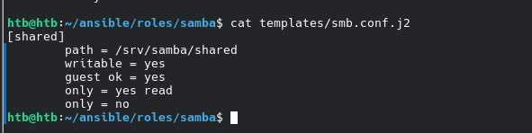

## c
> Asetus. Muuta asetustiedostoa herralla (master, "control node") ja aja ansible uudestaan. Osoita, että asetukset tulivat käyttöön

Muokkasin `samba/templates/smb.conf.j2` tiedostoa. Laitoin tästä `guest ok = no`, eli tällöin vieraita ei sallita.

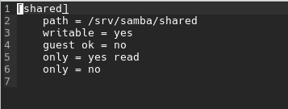

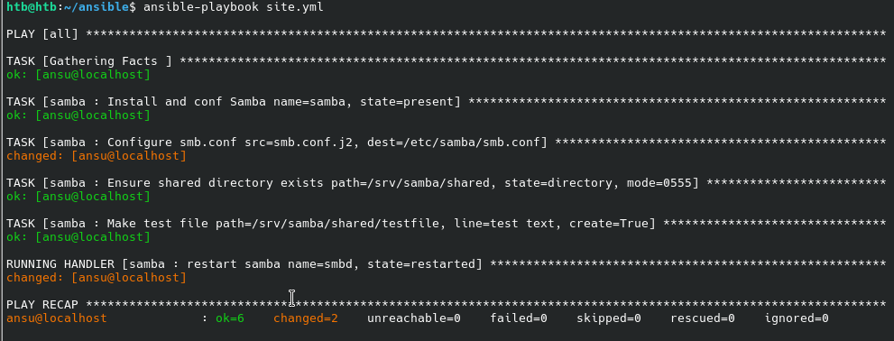

Kuten näkyy, ansible muokkasi tiedostoa ja tämän jälken käynnisti samban uudelleen, koska tiedostoa oltiin muokattu.

Nyt kun yritän päästä samban palvelimeen, niin en pääse sinne.

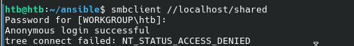

Enkä myöskään pääse ansu käyttäjällä jolla tämä ansible suoritti komennot. Se luetellaan vieraaksi, koska en ollut asettanut salasanaa `sudo smbpasswd -a `. Asetus tuli siis käyttöön ja nyt käytännössä kukaan ei pääse palvelimen jaetulle kansiolle, koska kaikki ovat vieraita. Tämä ei ole ideaali tilanne, vaan oikeasti tämä suojattaisiin salasanalla ja annettaisiin halutuille käyttäjille/ip osoitteille oikeus päästä palvelimelle. 

Vaihdoin guest ok= yes ja suoritin ansiblen kahdesti, jotta tila on todistetusti idempotentti.

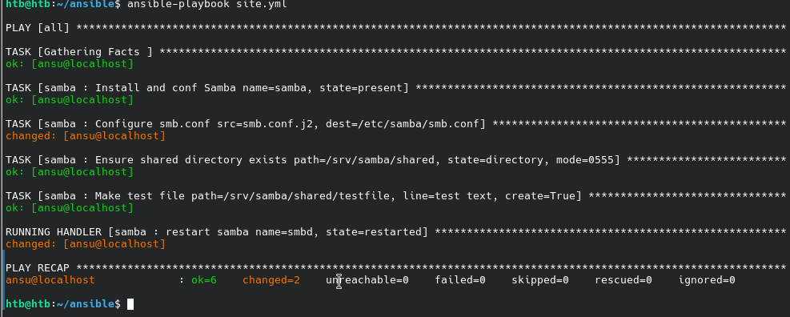

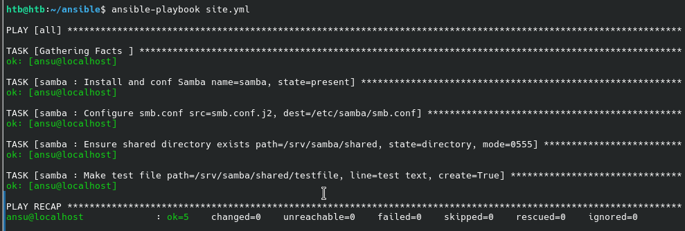

## d
> Paikka remonttiin. Riko jotain asetuksia. Voit esimerkiksi poistaa demonin 'sudo apt-get purge foobar' (purge poistaa myös asetustiedostoja), poistaa asennuksen yhteydessä tulevan kansion (sudo rm -r /etc/foobar/ # vaarallista) tms. Ja sitten ajaa ansible-roolisi uudestaan ja todeta, että se korjaa tilanteen.

Poistin srv hakemistosta samban kansiot.

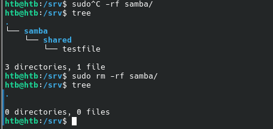

Sekä `/etc/samba/smb.conf` tiedoston

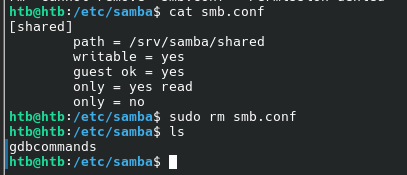

Sekä myös itse samba paketin `sudo apt-get purge samba`.

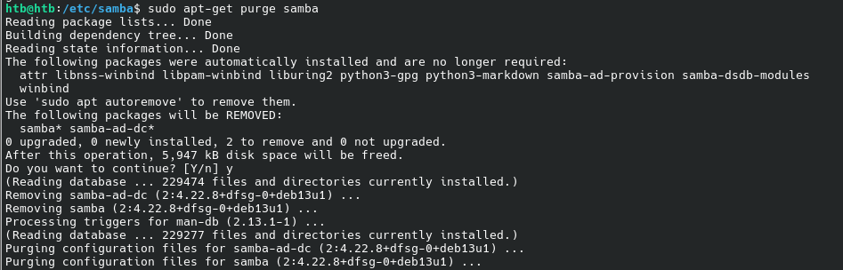

Seuraavaksi ajoin ansiblen uudelleen.

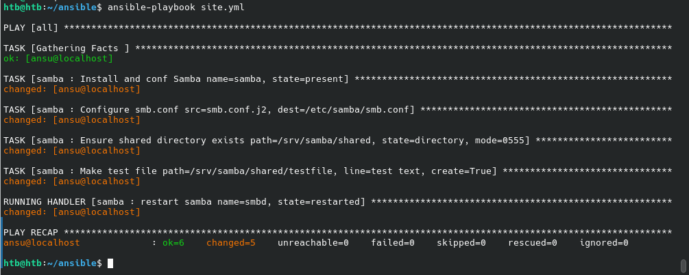

Kaikki näytti onnistuneen, ei ainaskaan tullut erroria. Sitten lähdin katsomaan toimiiko samba ja ovatko poistamani tiedostot tulleet takaisin.

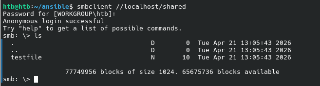

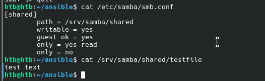

Kaikki näytti hyvältä ja ansible asensi oikein samban.

## e
> Idempotentti. Osoita, että tilasi on idempotentti.

Suoritin vielä kerran `ansible playvbook site.yml` ja tila oli idempotentti.

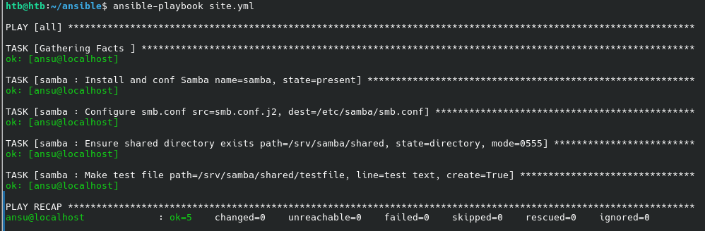

# Lähteet
- Gemini 3 Pro
- Kurssisivu: https://terokarvinen.com/palvelinten-hallinta/
- Karvinen 2023: Configuration Management of Distributed Systems over Unreliable and Hostile Networks https://westminsterresearch.westminster.ac.uk/item/w7vvz/configuration-management-of-distributed-systems-over-unreliable-and-hostile-networks
- Ubuntu artikkeli/ohje: Install and Configure Samba: https://ubuntu.com/tutorials/install-and-configure-samba#1-overview
- Automating Samba Installations with Ansible on Multiple Distributions: https://shape.host/resources/automating-samba-installations-with-ansible-on-multiple-distributions
