# h4 Fuzzy
Kotitehtävä h4 Fuzzy Tero Karvisen Tunkeutumistestaus 2025 syksy -kurssille. [Linkki kurssisivulle](https://terokarvinen.com/tunkeutumistestaus/)
Jokaisessa kohdassa on alla olevalla "quote" tyylillä kerrottu tehtävänanto.
>Liirum laarum laa...
## Tehtävät
### x)
> Lue/katso/kuuntele ja tiivistä. (Tässä x-alakohdassa ei tarvitse tehdä testejä tietokoneella, vain lukeminen tai kuunteleminen ja tiivistelmä riittää. Tiivistämiseen riittää muutama ranskalainen viiva. Lisää mukaan jokin oma idea, huomio, kysymys tai kommentti
> * Karvinen 2023: [Find Hidden Web Directories - Fuzz URLs with ffuf](https://terokarvinen.com/2023/fuzz-urls-find-hidden-directories/)
> * Jompi kumpi, Hoikkalan video tai teksti:
>   * Hoikkala 2023: ffuf README.md, tai
>   * Hoikkala "joohoi" 2020: [Still Fuzzing Faster (U fool).](https://www.youtube.com/watch?v=mbmsT3AhwWU) In HelSec Virtual meetup #1. (Noin tunnin mittainen)

#### Hoikkalan video
 
* Erittäin kattava demovideo ffuf:sta. 
* Ffuffia voidaan käyttää erittäin laajasti.
* Hieno nähdä että noinkin ammattilaisella demo voi mennä rikki kesken demon.

#### Teron artikkeli

* Hyvä tiivis pikaohje ffuffiin. Veikkaan että tämän avulla pääsee hyvin alkuun kotitehtävissä

### a) 
> a) Fuzzzz. Ratkaise dirfuz-1 artikkelista Karvinen 2023: [Find Hidden Web Directories - Fuzz URLs with ffuf.](https://terokarvinen.com/2023/fuzz-urls-find-hidden-directories/)

Seurasin tässä asennuksessa Teron ohjeita, jotka löytyy a) otsikon artikkelista. Testasin heti ensimmäisenä, että löytyykö ffuf Kalista `fuff` ja sehän löytyi.

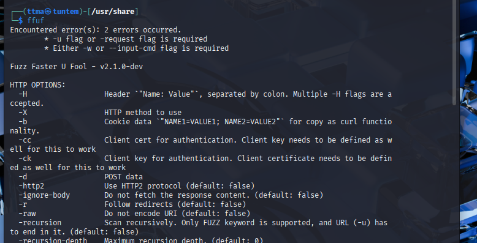

Seuraavaksi katsoin löytyykö Seclistiä Kalistani, ei löytynyt joten latasin koko Seclistin `sudo apt install seclists` komennolla. Tämän jälkeen asensin dirfuzt-1 maalin.

Ennen kuin lähdin testaamaan fuzzausta, niin otin nettiadapterin pois käytöstä suoraan Virtualboxista. Tämän jälkee pingasin vielä `ping 8.8.8.8`, jotta varmistun että kone ei ole yhdistetty nettiin.

Sitten muutin dirfuzt-1 maalin oikeudet niin, että sen pystyy suorittamaan. Tämän jälkeen käynnistin sen ja katsoin nettiselaimesta että sivu toimii. Laitoin `&` komennon jälkeen, jotta pystyn jatkamaan samassa terminaalissa.

    chmod +ux dirfuzt-1
    ./dirfuzt-1 &

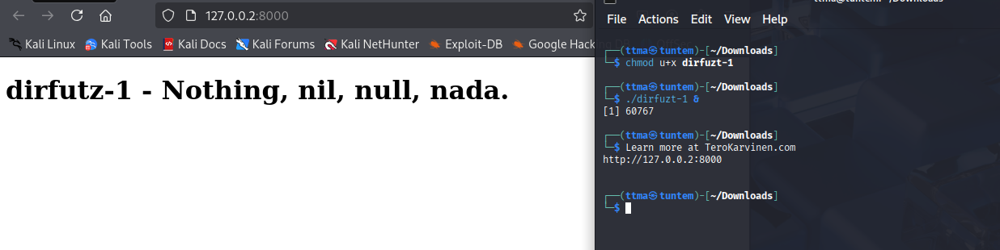

Kopion vielä common.txt wordlistin Downloads folderiin, jotta ei aina tarvitse laittaa pitkää filepathia

    cp /usr/share/seclists/Discovery/Web-Content/common.txt /home/ttma/Downloads/ 

#### Ffuffin käytön aloittaminen
Katsoin vielä tehtävanantoa ja siellä oli seuraava "vinkki".
> Can you find two URLs:
Admin page
Version control related page

Eli tarkoituksena on löytää `http://127.0.0.2:8000/FUZZ`, jossa FUZZ on siis muuttuja, jonka löytämiseen käytämme hyväksi wordlistia. Testasinkin seuraavaksi fuzzata ihan normaalisti

    http://127.0.0.2:8000/FUZZ

Ja vastaus oli odotettu, kaikkiin vaihtoehtoihin tuli "Status 200". Tämä tarkoittaa sitä, että seuraavaksi kun lähden filtteröimään vastauksia, en voi käyttää pelkästään statuskoodia filtteröinissä. Melkein jokaisen vastauksen koko oli 154, sanoja 9 ja rivejä 10. Lähdinkin seuraavaksi filtteröimään koon mukaan `-fs `, eli filter by size.

    ┌──(ttma㉿tuntem)-[~/Downloads]
    └─$ ffuf -w common.txt -u http://127.0.0.2:8000/FUZZ -fs 154 -v

            /'___\  /'___\           /'___\       
        /\ \__/ /\ \__/  __  __  /\ \__/       
        \ \ ,__\\ \ ,__\/\ \/\ \ \ \ ,__\      
            \ \ \_/ \ \ \_/\ \ \_\ \ \ \ \_/      
            \ \_\   \ \_\  \ \____/  \ \_\       
            \/_/    \/_/   \/___/    \/_/       

        v2.1.0-dev
    ________________________________________________

    :: Method           : GET
    :: URL              : http://127.0.0.2:8000/FUZZ
    :: Wordlist         : FUZZ: /home/ttma/Downloads/common.txt
    :: Follow redirects : false
    :: Calibration      : false
    :: Timeout          : 10
    :: Threads          : 40
    :: Matcher          : Response status: 200-299,301,302,307,401,403,405,500
    :: Filter           : Response size: 154
    ________________________________________________

    [Status: 200, Size: 178, Words: 6, Lines: 11, Duration: 20ms]
    | URL | http://127.0.0.2:8000/.git/logs/
        * FUZZ: .git/logs/

    [Status: 200, Size: 178, Words: 6, Lines: 11, Duration: 2ms]
    | URL | http://127.0.0.2:8000/.git/index
        * FUZZ: .git/index

    [Status: 200, Size: 178, Words: 6, Lines: 11, Duration: 0ms]
    | URL | http://127.0.0.2:8000/.git/config
        * FUZZ: .git/config

    [Status: 200, Size: 178, Words: 6, Lines: 11, Duration: 0ms]
    | URL | http://127.0.0.2:8000/.git/HEAD
        * FUZZ: .git/HEAD

    [Status: 301, Size: 41, Words: 3, Lines: 3, Duration: 1ms]
    | URL | http://127.0.0.2:8000/.git
    | --> | /.git/
        * FUZZ: .git

    [Status: 301, Size: 64, Words: 3, Lines: 3, Duration: 0ms]
    | URL | http://127.0.0.2:8000/render/https://www.google.com
    | --> | /render/https:/www.google.com
        * FUZZ: render/https://www.google.com

    [Status: 200, Size: 182, Words: 6, Lines: 11, Duration: 3ms]
    | URL | http://127.0.0.2:8000/wp-admin
        * FUZZ: wp-admin

    :: Progress: [4746/4746] :: Job [1/1] :: 0 req/sec :: Duration: [0:00:00] :: Errors: 0 ::
                                                                                                    
    ┌──(ttma㉿tuntem)-[~/Downloads]
    └─$ 

No sehän toimi! Selkeästi alihakemistot ``"wp-admin" ja ".git/logs &config &head "`` vaikuttavat oikeilta alihakemistoilta, joista voisi löytyä jotain liittyen versionhallintaan sekä ylläpitösivuun. 

Varmasti löytyy jokin parempikin tapa curlata monta osoitetta samaan aikaan. Mutta nyt curlattavia osoitteita oli sen verran vähän, joten curlasin ne manuaalisesti yksitellen.

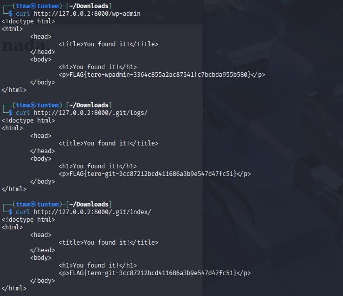

Kaikista `.git` alihakemistoista löytyi flagi, sekä myös `wp-admin` alihakemistosta.

### b)
> Fuff me. Asenna FuffMe-harjoitusmaali. Karvinen 2023: [Fuffme - Install Web Fuzzing Target on Debian](https://terokarvinen.com/2023/fuffme-web-fuzzing-target-debian)

Seuraavaksi lähdin asentamaan Fuffme-harjoitusmaalia. Ennen tätä, suljin dirtfuzt-1 `kill %1` ja laitoin virtuaalikaapelin takaisin Kaliin, jotta voin ottaa yhteyden internettiin. 

Seurasin annettua ohjetta asennukseen,

    sudo apt-get install docker.io git ffuf
    git clone https://github.com/adamtlangley/ffufme
    cd ffufme
    sudo docker build -t ffufme .
    curl localhost

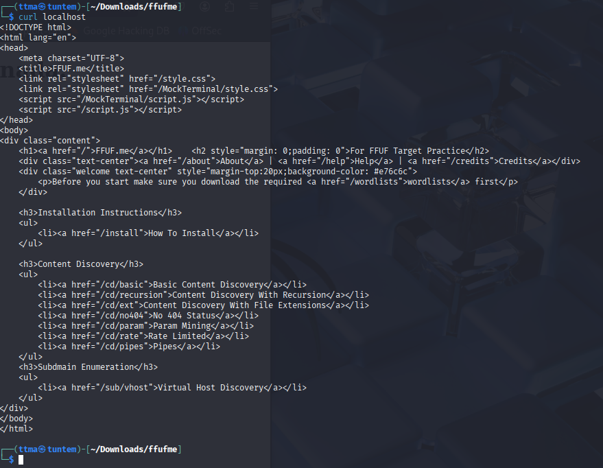

Tämän jälkeen latasin vielä tarvittavat wordlistit. Olin jo kyllä ladannut nämä Seclistin mukana, mutta latasin silti nämä tarvittavat uudelleen.

    mkdir $HOME/wordlists
    cd $HOME/wordlists
    wget http://ffuf.me/wordlist/common.txt
    wget http://ffuf.me/wordlist/parameters.txt 
    wget http://ffuf.me/wordlist/subdomains.txt    

Seuraavaksi otin Kalin pois netistä, testasin ettei se saa yhteyttä nettiin. Kone ei saanut yhteyttä nettiin, joten testasin fuzzausta juuri asennettuun kohteeseen.

    ffuf -w $HOME/wordlists/common.txt -u http://ffuf.me/cd/basic/FUZZ

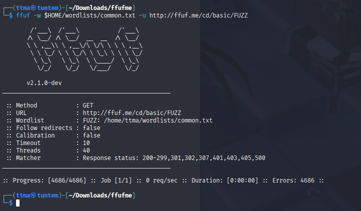

Tuli errori. Katsoin localhostin Content Discovery Basic kohtaa, jossa sama komento annettiinkin 

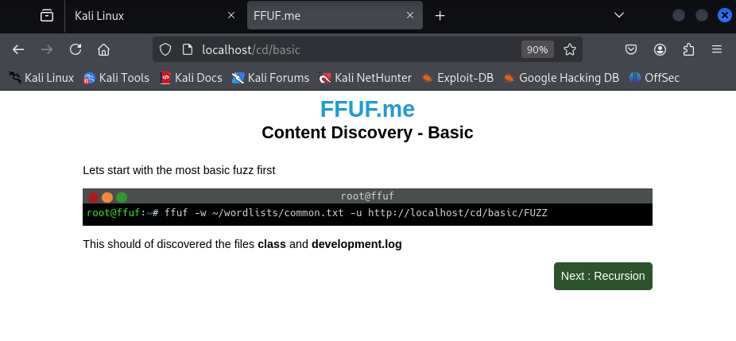

    ffuf -w ~/wordlists/common.txt -u http://localhost/cd/basic/FUZZ

Testasin tätä ja löysin onnistuneesti class ja development.log alihakemistot.

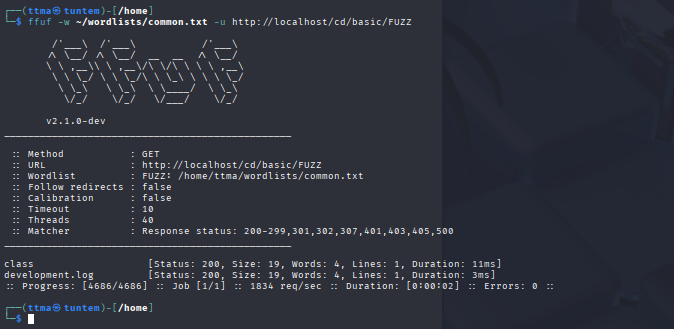

Eroa näissä komennoissa on se, että ohjeessa fuzzaus menee `ffuf.me` eikä ``localhost``. Tässä tuli taas hyvä muistutus itselle, että ei kannata olla "script kiddie" vaan myös katsoa mitä komentoja suorittaa koneella.

### c) Basic Content Discovery
Äskeisen kohdan loppu oli C kohta.

### d) Content Discovery With Recursion

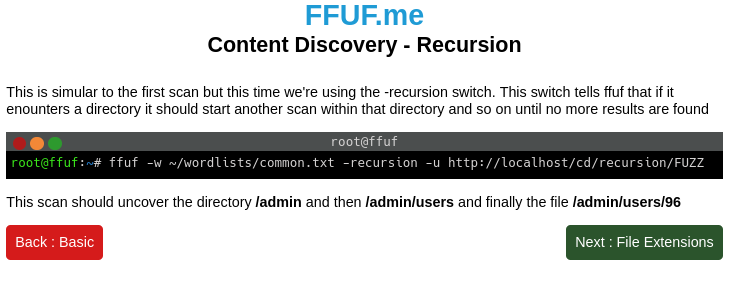

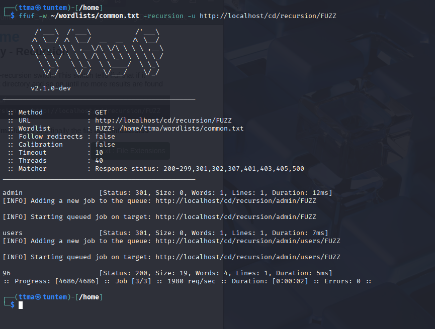

Tässä tehtävässä käytettiin rekursiota. Eli jos ffuf löytää alihakemiston, käy se myös sen läpi kokonaan. Tässä esimerkissä ffuf löytää aluksi alihakemiston `http://localhost/admin`. Tämän jälkeen rekursion avulla ffuf käy wordlistan uudestaan läpi `http://localhost/admin` alihakemistosta. Ffuf löysi polun `http://localhost/admin/users`. Ffuf käy vielä tämän läpi ja löytää `http://localhost/admin/users/96`. Ffuf käy tämänkin alihakemiston läpi, mutta ei löydä pidemmälle. 

### e) Content Discovery With File Extensions

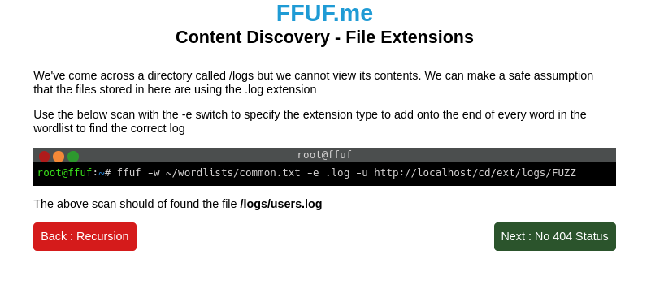

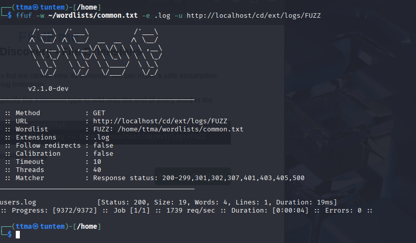

Tässä tehtävässä käytettiin -e parametria. Tämän avulla pystymme etsimään tietyn muotoista tiedostonloppua alihakemistosta. Tässä tehtävässä etsittiin `.log` loppuista alihakemistosta `http://localhost/cd/ext/logs`. FFuf siis fuzzaa `http://localhost/cd/ext/logs/FUZZ.log`. 
### f) No 404 Status

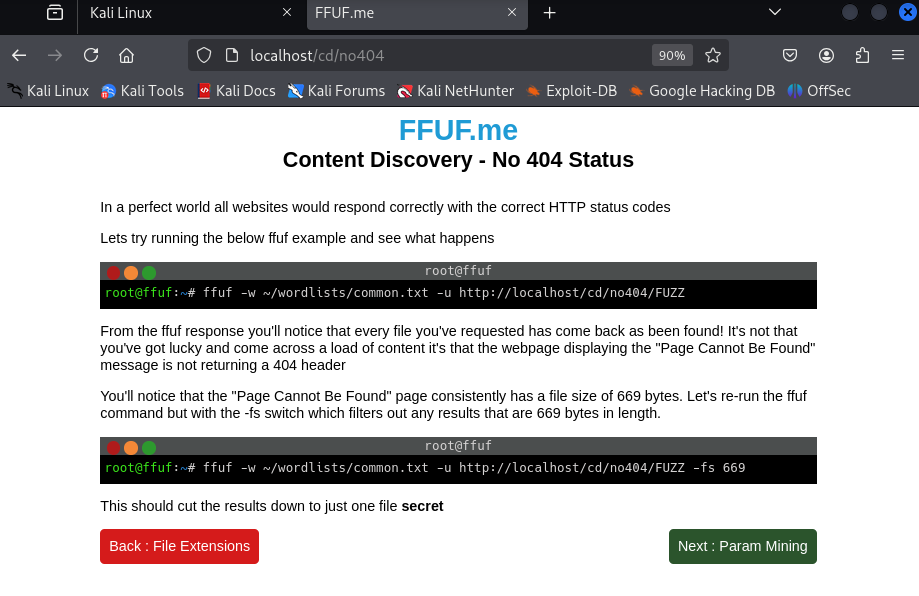

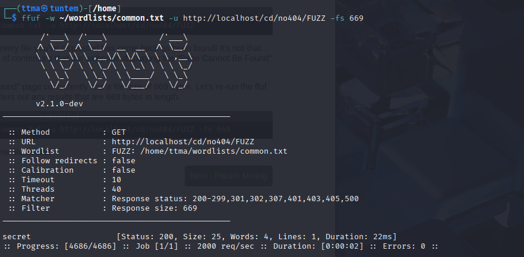

Tämän tehtävässä ratkaisu toimi samalla tavalla kuin Teron alkutehtävä dirfuz-1. Aluksi fuzzasin alihakemiston `http://localhost/cd/no404/FUZZ`. Kaikista tuli status 200. Silmällä katsoen, jokaisessa on sama tiedostonkoko ja sanamäärä. Sitten lisäsin parametrin ``-fs``, joka filtteröi kaikki vastaukset jotka ovat x tavun kokoisia. Tässä tapauksessa 669 tavua. Sitten löytyi alihakemisto `http://localhost/cd/no404/secret`.

### g) Param Mining

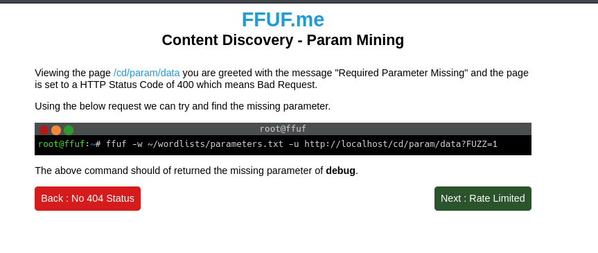

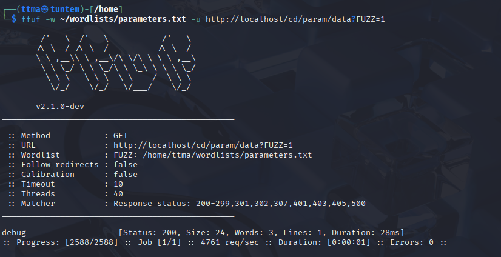

Tässä tehtävässä vaadittiin puuttuvan parametrin fuzzausta. Nyt käytin fuzzauksessa `parameters.txt` tiedostoa, joka on parempi parametrien fuzzaukseen. Fuzzasin `http://localhost/cd/param/data?FUZZ=1` alihakemistoon ja sielä löytyi alihakemisto `http://localhost/cd/param/data?debug=1`. Alihakemisto olisi hyvin voinut olla esimerkiksi user=1.

### h) Rate Limited

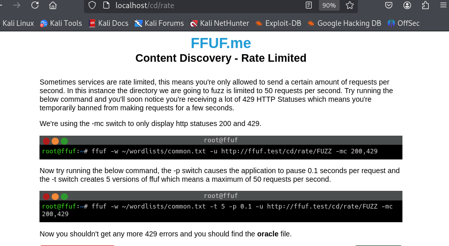

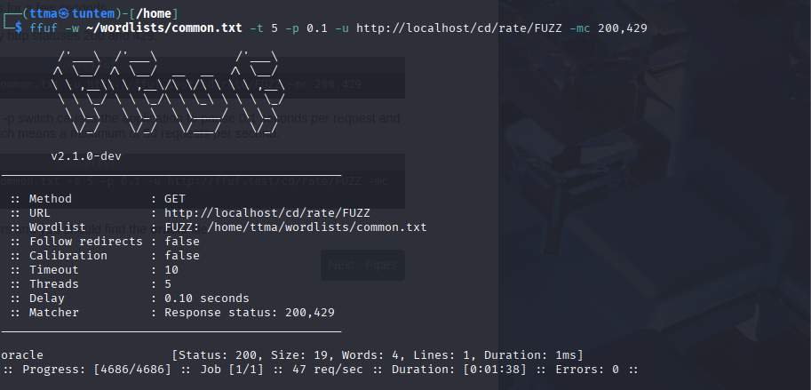

Tässäm meinasin taas olla "script kiddie". Malliesimerkissä fuzzataan ``http://ffuf.test/cd/rate/FUZZ``. `fuff.test` piti vaihtaa `localhost` jotta fuzzaus onnistuu. Parametri `-mc 200,429` filtteröi meille sellaiset vastaukset, joiden status code on joko 200 tai 429. Aluksi fuzzasin `http://localhost/cd/rate/FUZZ`, mutta palvelin hylkäsi pyyntöni, koska lähetin pyyntöjä liian nopeasti. Tämän jälkeen lisäsin parametrin `-t 5`, jossa t määrittää montako säiettä käytämme. Default value on 40, eli ffuf normaalisti lähettäisi 40 pyyntöä nyt 5. Lisäsin vielä `-p 0.1`, joka lisää fuzzauksen 0.1 sekunnin viiveen per pyyntö. En löytänyt tämän default valueta ffuffin manuaalista, mutta veikkaisin että se on 0 (Eli lähettää niin nopeasti kun pystyy). Nyt lähetin siis 5 pyyntöä, jokainen 0,1 sekunnin viiveellä. Eli joka sekuntti 50 pyyntöä. Jos `-p 0.5` ja `-t 10` lähettäisin 20 pyyntöä. Fuzzaus onnistui parametreilla `-t 5 -p 0.1` ja löysin alihakemiston `http://localhost/cd/rate/oracle`.  

### i) Subdomains - Virtual Host Enumeration

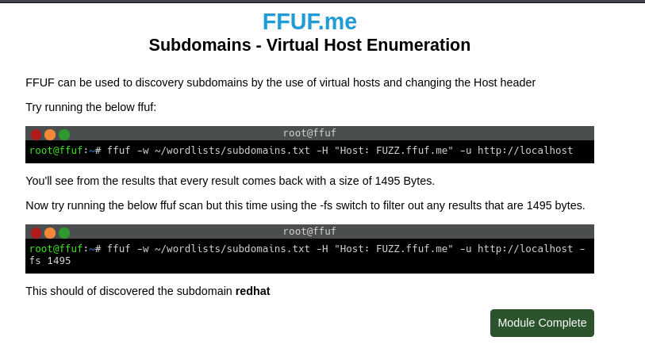

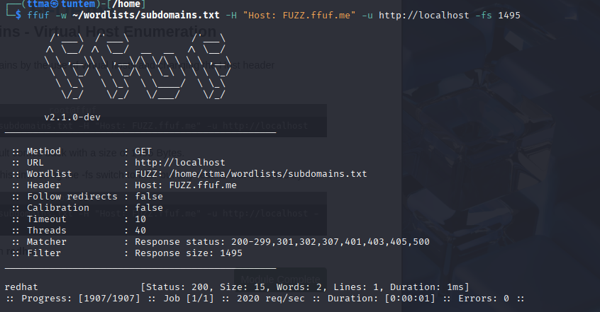

Tässä tehtävässä fuzzattiin subdomainia `subodamins.txt` tiedostolla. Aluksi kaikki vastaukset olivat 1495 tavun kokoisia. Tämän takia filtteröin vastaukset `-fs 1495` ja löysin subdomainin `redhat.ffuf.me`. 

# Lähteet
https://www.kali.org/tools/seclists/

https://terokarvinen.com/tunkeutumistestaus/

https://github.com/ffuf/ffuf

Tero Karvinen, Fuffme - Install Web Fuzzing Target on Debian, 30.10.2023 https://terokarvinen.com/2023/fuffme-web-fuzzing-target-debian/

Tero Karvinen, Find Hidden Web Directories - Fuzz URLs with ffuf, 5.10.2023 https://terokarvinen.com/2023/fuzz-urls-find-hidden-directories/

0x03 Still Fuzzing Faster (U Fool) - joohoi - HelSec Virtual meetup #1 16.5.2020 https://www.youtube.com/watch?v=mbmsT3AhwWU