# h5 Syyskuu2025!
Kotitehtävä h5 Syyskuu2025! Tero Karvisen Tunkeutumistestaus 2025 syksy -kurssille. [Linkki kurssisivulle](https://terokarvinen.com/tunkeutumistestaus/)
Jokaisessa kohdassa on alla olevalla "quote" tyylillä kerrottu tehtävänanto.
>Liirum laarum laa...

## Tehtävät
### x)
>Lue/katso ja tiivistä. (Tässä x-alakohdassa ei tarvitse tehdä testejä tietokoneella, vain lukeminen tai kuunteleminen ja tiivistelmä riittää. Tiivistämiseen riittää muutama ranskalainen viiva kustakin artikkelista. Kannattaa lisätä myös jokin oma ajatus, idea, huomio tai kysymys.)
Karvinen 2022: [Cracking Passwords with Hashcat](https://terokarvinen.com/2022/cracking-passwords-with-hashcat/)
Karvinen 2023: [Crack File Password With John](https://terokarvinen.com/2023/crack-file-password-with-john/)
€ Santos et al 2017: Security Penetration Testing - The Art of Hacking Series LiveLessons:[ Lesson 6: Hacking User Credentials](https://learning.oreilly.com/videos/security-penetration-testing/9780134833989/9780134833989-sptt_00_06_00_00) (8 videos, about 30 min)

#### Karvinen 2022: cracking Passwords with Hashcat
Hashcat TLDR
- Käytä jotain x hashia      
- ``hashid -m 5c661701b27d8d1a9b79880b9c7c4376`` (eli siis tähän hash jonka haluat murtaa)

- Valitse se millä tavalla luulet että kyseinen hash on tehty, esim MD5

            hashid -m 5c661701b27d8d1a9b79880b9c7c4376                           
            Analyzing '5c661701b27d8d1a9b79880b9c7c4376'
            [+] MD2 
            [+] MD5 [Hashcat Mode: 0]
            [+] MD4 [Hashcat Mode: 900]

- ``hashcat -m 0 '5c661701b27d8d1a9b79880b9c7c4376' rockyou.txt -o solved``. Hashcat yrittää murtaa halutun hashin valitulla tavalla. Tässä -m 0 kertoo että käytetään aiemmin päätettyä x hashia, esim nyt se on siis MD5. Sitten laitetaan hash mikä halutaan murtaa. Tämän jälkeen millä sanalistalla. Lopuksi nyt esimerkissä käytettiin `-o solved` joka siis tallentaa murretun salasanan solved nimiseen teidostoon. Tiedoston sisältö on mallia hash:hash_in_plainword

#### Karvinen 2023: Cracking File Password With John

Johnilla helppo murtaa esimerkiksi kansioiden salasanoja. 

Jos john asennettuna
    
    john
    cd .john
    zip2john tiedosto.zip > tiedosto.zip.hash
    john tiedosto.zip.hash

#### Santos et al 2017: Security Penetration Testing - The Art of Hacking Series LiveLessons: Lesson 6: Hacking User Credentials (8 videos, about 30 min)

- Salasanat pitää suojata itse tietokannassa sekä myös itse "kuljetuksessa".
- Pelkkä hashaus ei riitä, se pitää suolata
- Ainaskin kyseisen videon teon aikana, Windows ei suolaa salasanojen hasheja, mutta Linux suolaa.

### a)
>  Asenna Hashcat ja testaa sen toiminta murtamalla esimerkkisalasana.

Minulla oli jo hashcat asennettuna, mutta sen pystyy helposti asentamaan ``sudo apt install hashcat``. Seuraavaksi tein uuden kansion jossa testin tiedostot pysyvät helposti samassa paikassa.

    ┌──(ttma㉿tuntem)-[~]
    └─$ mkdir hashcat_testi
                                                                                
    ┌──(ttma㉿tuntem)-[~]
    └─$ cd hashcat_testi 
        
Tämän jälkeen tein tiedoston, johon tallensin salasanan selkokielellä, jotta muistan oikean salasanan. Tämän jälkeen otin kyseisen sanan hashin.

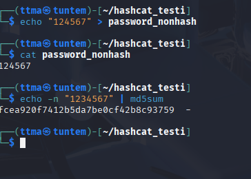

Seuraavaksi tunnistin minkä tyyppinen hash on kyseessä

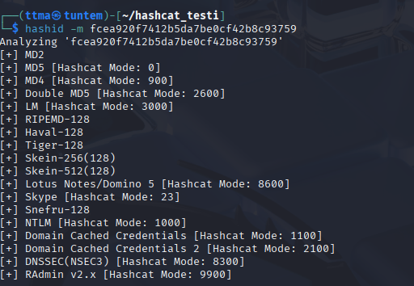

Mitä ylempänä listalla, sitä todennäköisemmin kyseinen hash on hashattu x tavalla. 

Nyt on aika murtaa salasana! Runasin seuraavan komennon ``hashcat -m 0 'fcea920f7412b5da7be0cf42b8c93759' /usr/share/wordlists/rockyou.txt
``. 

Kohdasta status näkee, että kyseinen salasana on murrettu. Hieman ylempänä näkyy myös hash ja murrettu salasana, `fcea920f7412b5da7be0cf42b8c93759:1234567 `. Saman voi myös printata consoleen helposti nyt jälkeenpäin runaamalla edellinen komento ``--show`` tagilla.

    └─$ hashcat -m 0 'fcea920f7412b5da7be0cf42b8c93759' /usr/share/wordlists/rockyou.txt --show
    fcea920f7412b5da7be0cf42b8c93759:1234567

### c) 
> Asenna John the Ripper ja testaa sen toiminta murtamalla jonkin esimerkkitiedoston salasana.

Testasin onko John asennettu komennolla `john`.

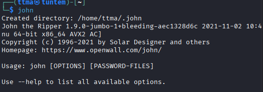

John oli asennettu koneelleni ja teki myös kansion ``.john``. Seuraavaksi latasin Teron esimerkin artikkelista, Karvinen 2023: [Crack File Password With John](https://terokarvinen.com/2023/crack-file-password-with-john/). 

    cd .john
    wget https://TeroKarvinen.com/2023/crack-file-password-with-john/tero.zip

ZIP-tiedosto on suojattu salasanalla. Koitin arvata salasanan, mutta ei onnistunut.     

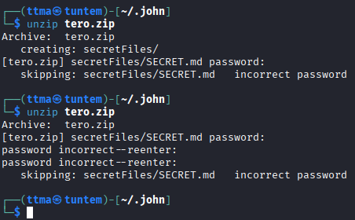

Johnin yksi työkalu on zip2john, jolla zip tiedostosta saadaan helposti hash. 

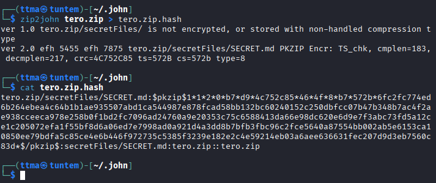

Nyt kun minulla on tiedoston hash, voin yrittää murtaa sen johnin avulla `john tero.zip.hash`.

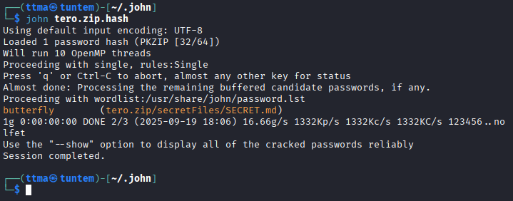

ZIP-tiedoston salasana saatiin murrettua, `butterfly`. Minua kiinnosti mitä g/s Kp/s sekä KC/s tarkoittivat. Koitin etsiä netin syövereistä vastausta eri documentaatioista, mutta en löytänyt vastausta mistään. Kysyinkin ChatGPT tekoälyltä (GPT5), että mitä nämä tarkoittivat. Kyseisen promptin/keskustelun kanssa en käyttänyt think longer tai search the web ominaisuuksia.

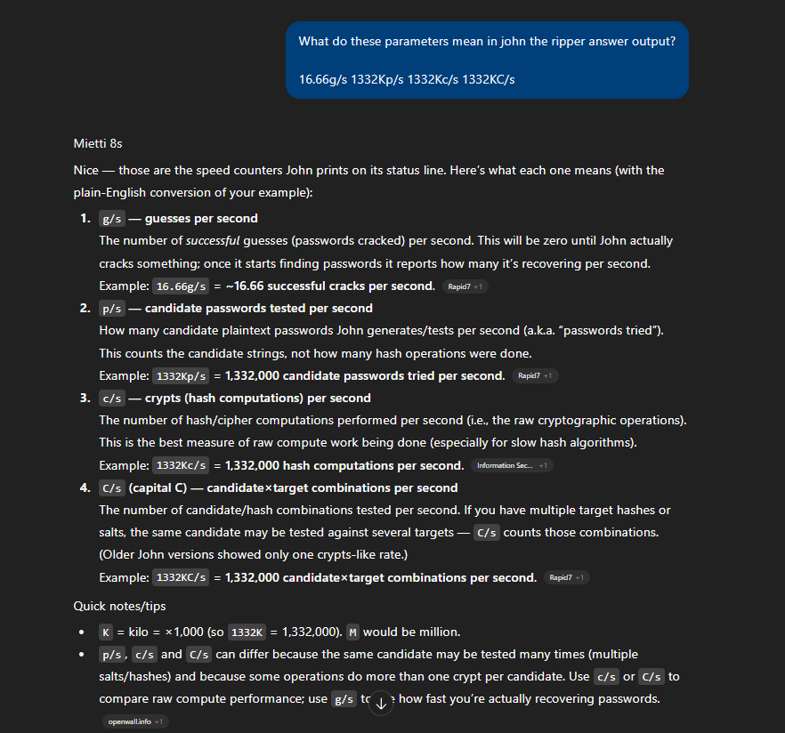

Sitten vielä testasin murrettua salasanaa ZIP-tiedoston avaamiseen. Avaus onnistui ja pääsin näkemään salaisen tiedoston sisällön.

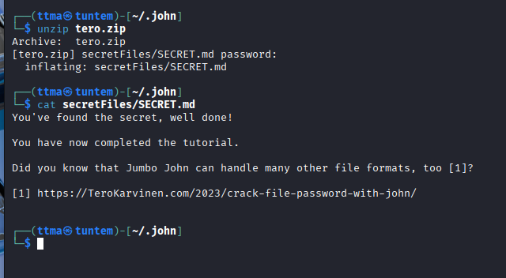

### e) 
>  Tiedosto. Tee itse tai etsi verkosta jokin salakirjoitettu tiedosto, jonka saat auki. Murra sen salaus. (Jokin muu formaatti kuin aiemmissa alakohdissa kokeilemasi).

Googlasin "how to make password protected file in linux" ja ensimmäinen hakukoneen tulos oli askubuntu.com forum postaus "[Secure/password protected access to a file in Ubuntu 22.04](https://askubuntu.com/questions/1456941/secure-password-protected-access-to-a-file-in-ubuntu-22-04)"(Olin erittäin iloinen ja yllättynyt ettei Googlen AI-tiivistelmä halunnut antaa tähän vastausta). Täällä minulla tuli vastaan GPG salaus, eli Gnu Privacy guard. 

Seuraavaksi tein tiedoston, jossa oli jotain tekstiä sisällä.

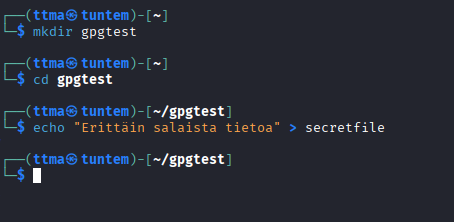

Seuraavaksi salasin tiedoston `gpg -c secretfile` jonka jälkeen laitoin salalauseeksi ``hello123``. Tämän jälkeen GPG loi uuden tiedoston, ``secretfile.gpg``

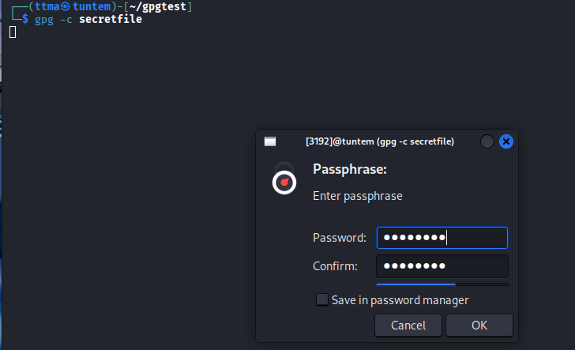

Seuraavaksi googletin "how to crack gpg" ja tuloksista valitsin openwall sivuston https://www.openwall.com/lists/john-users/2015/11/17/1. Sivulla henkilö nimeltä Dhiru Kholia kertoo, kuinka hän lisäsi Johniin tuen murtaa PGP:lla salattuja tiedostoja. Siitä en tiedä onko, onko Dhiru nyt oikeasti tehnyt tämän, vaan toimiiko se. 

Seuraavaksi otin .gpg tiedostosta hashin ``gpg2john secretfile.gpg``. Tämän jälkeen annoin Johnin tehdä loput.

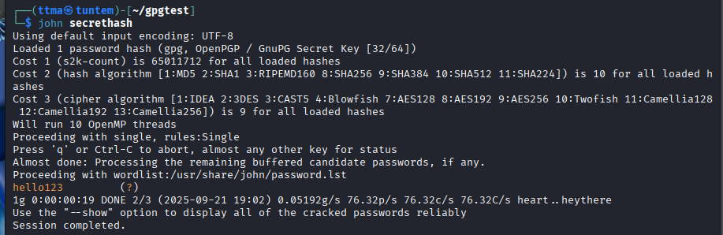

Kuten kuvasta näkyy, salasanan murtaminen onnistui, hello123. 

### f)

>Tiiviste. Tee itse tai etsi verkosta salasanan tiiviste, jonka saat auki. Murra sen salaus. (Jokin muu formaatti kuin aiemmissa alakohdissa kokeilemasi. Voit esim. tehdä käyttäjän Linuxiin ja murtaa sen salasanan.)

Löysin githubin syövereistä repon, jossa on tiedosto, missä on 150287 suomalaista sanaa https://github.com/elonen/fin-ascii-words-17bit/blob/2cfa7ab943c2ce74a40315a6db9569e487107869/fin-pw-safe-words-17bit-ascii-20241106.txt. Seuraavaksi tein uuden kansion ja latasin repon. 

    mkdir finpas
    cd finpas
    git clone https://github.com/elonen/fin-ascii-words-17bit.git

Tämän jälkeen otin SHA256 hashin salasanasta papukaija12345.

    $ echo -n "papukaija12345" | sha256sum
    e0a1ab938ecdce4341f6c7c896e173fd496fa3ae19c3a0af8cfa3c62184af60c

Sitten katsoin `hashid e0a1ab938ecdce4341f6c7c896e173fd496fa3ae19c3a0af8cfa3c62184af60c` komennolla, mitä mieltä hashcat on hashista.

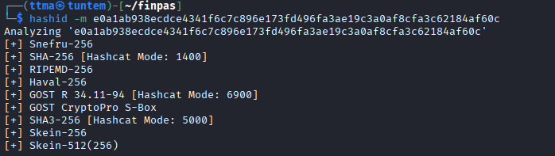

Seuraavaksi runasin seuraavan komennon

    hashcat -m 1400 -a 6 e0a1ab938ecdce4341f6c7c896e173fd496fa3ae19c3a0af8cfa3c62184af60c fin-ascii-words-17bit/fin-pw-safe-words-17bit-ascii-20241106.txt ?d?d?d?d?d

- -m 1400, Minkä tyyppistä hashia murretaan, hashcatissa SHA-256 on 1400
- -a 6, hashcatissa on monta eri hyökkäystilaa itse käytin tähän 6 eli hybrid attack. Tässä annetaan sanalista sekä mahdolliset muuttujat sanalistan sanojen lopussa tai alussa.
- Sitten annetaan hash mikä halutaan murtaa
- Seuraavaksi sanalista
- Seuraavaksi muuttujat, eli itse käytin tässä ?d = numerot 1-9. On myös muitakin kuten ?l = aakkoset. Itselläni oli viisi kertaa ?d, joten ohjelma testasi aina sana12345, eikä esimerkiksi sana12. Eli ohjelma testasi salasanoja vain viidellä numerolla. Sillä on myös väliä, mihin kohtaan ?d laitetaan. Jos se laitetaan sanalistan eteen, 3sana, 321sana. 

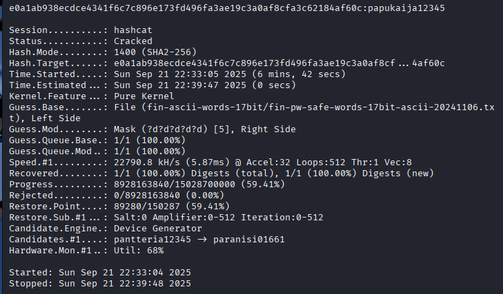

Hashcat onnistui murtamaan salasanan. Näin jälkeenpäin viisaampana, olisi ehkä kannattanut testata vähemmällä numeromäärällä, sillä murtamisessa kesti noin 7 minuuttia.

## Lähteet

* Tunkeutumistestaus 2025 alkusyksy https://terokarvinen.com/tunkeutumistestaus/
* Karvinen 2022: Cracking Passwords with Hashcat https://terokarvinen.com/2022/cracking-passwords-with-hashcat/
* Karvinen 2023: Crack File Password With John https://terokarvinen.com/2023/crack-file-password-with-john/
* € Santos et al 2017: Security Penetration Testing - The Art of Hacking Series LiveLessons: Lesson 6: Hacking User Credentials https://learning.oreilly.com/videos/security-penetration-testing/9780134833989/9780134833989-sptt_00_06_00_00
* https://www.openwall.com/lists/john-users/2015/10/24/2
* ChatGPT-tekoäly, malli GPT5.
* https://askubuntu.com/questions/1456941/secure-password-protected-access-to-a-file-in-ubuntu-22-04
* https://www.openwall.com/lists/john-users/2015/11/17/1
* https://github.com/elonen/fin-ascii-words-17bit/blob/main/fin-pw-safe-words-17bit-ascii-20241106.txt
* https://www.blackhillsinfosec.com/hashcat-cheatsheet/
* https://hashcat.net/wiki/doku.php?id=hybrid_attack
* https://www.blackhillsinfosec.com/hashcat-cheatsheet/