# h1 Sniff
Kotitehtävä h1 Sniff Tero Karvisen Verkkoon tunkeutuminen ja tiedustelu - 2025 syksy kurssille. [Linkki kurssisivulle](https://terokarvinen.com/verkkoon-tunkeutuminen-ja-tiedustelu/)
Jokaisessa kohdassa on alla olevalla "quote" tyylillä kerrottu tehtävänanto.
>Liirum laarum laa...
## Tehtävät

### x)

> Karvinen 2025: [Wireshark - Getting Started](https://terokarvinen.com/wireshark-getting-started/)
- Tässä artikkelissa käytiin hyvin tiiviisti Wiresharkin perusteet sen asennuksesta käyttöön.
- Uutena tietona tuli, että Wiresharkkia varten kannattaa tehdä oma ryhmä.

> Karvinen 2025: [Network Interface Names on Linux](https://terokarvinen.com/network-interface-linux/)
- Artikkelissa kerrottiin yleisimmät "Interface Prefix", EN = Wired Ethernet, wl = WLAN sekä lo = Loopback adapter
- Linuxissa näet nämä helposti `ip a` tai `ip route` komennolla.

### a)

>Linux. Asenna Debian tai Kali Linux virtuaalikoneeseen. (Tätä alakohtaa ei poikkeuksellisesti tarvitse raportoida, jos sinulla ei ole mitään ongelmia. Jos on mitään haasteita, tee täsmällinen raportti)

Minulla oli jo uusin Kali asennettuna virtualboxiin. 

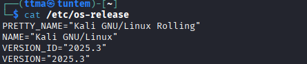

### b) 

>Ei voi kalastaa. Osoita, että pystyt katkaisemaan ja palauttamaan virtuaalikoneen Internet-yhteyden.

Netin voi ottaa pois käytöstä Kalista komennolla `nmcli networking off` sekä laittaa takaisin päälle ``nmcli networking on``

Netin voi myös ottaa pois Virtualboksista menemällä kyseisen virtuaalikoneen asetuksiin ja ottamalla ruksin pois kohdasta ``"Cable connected"``

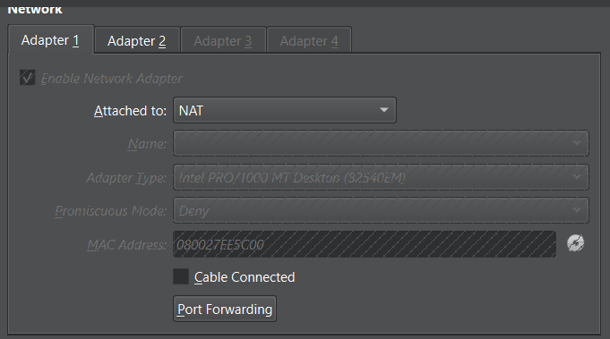

### c)
> Wireshark. Asenna Wireshark. Sieppaa liikennettä Wiresharkilla. (Vain omaa liikennettäsi. Voit käyttää tähän esimerkiksi virtuaalikonetta).

Lädhin kaappaamaan liikennettä Kalilla. Avasin Wiresharkin, joka oli jo valmiiksi asennettuna Kaliin. 

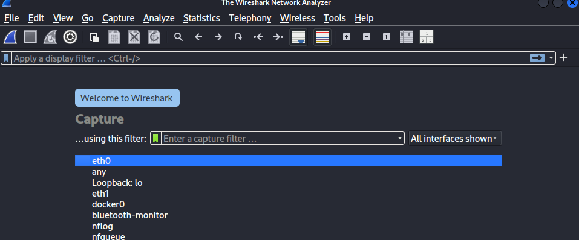

Sitten pingasin Googlen DNS nimipalvelinta, jotta tietäisin mitä interfacea Kalini käyttää `ping 8.8.8.8`. Kalini käyttää eth0 interfacea, joten lähdin sieppaamaan sen liikennettä. 

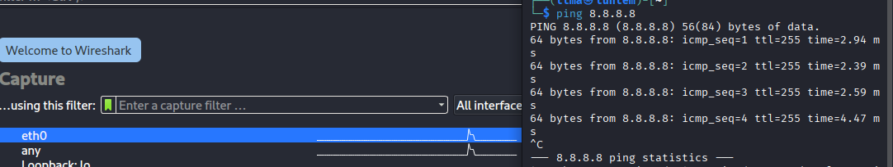

Seuraavaa tehtävää varten, avasin firefoxin,  menin ylen sivulle (yle.fi) jonka jälkeen lopetin liikenteen kaappaamisen.

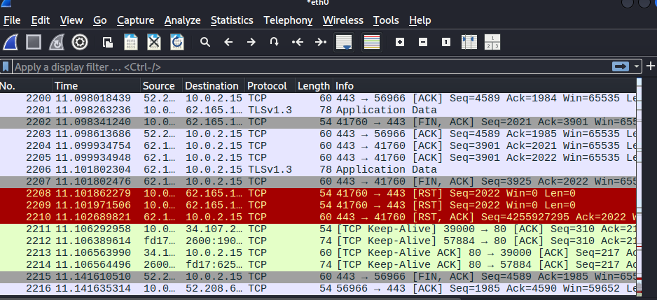

### d) 
> Oikeesti TCP/IP. Osoita TCP/IP-mallin neljä kerrosta yhdestä siepatusta paketista. Voit selityksen tueksi laatikoida ne ruutukaappauksesta. (Voit käyttää vastauksesi osana ruutukaappaustasi h0-tehtävästä, mutta tässä tehtävässä tarvitaan myös sanallinen selitys.)

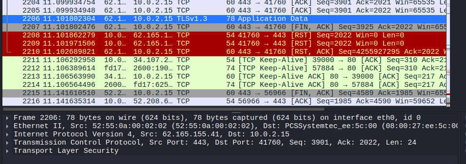

Lähdin tarkastelemaan TLSv1.3 pakettia.

- Link layer: Ethernet II
- Internet layer: Internet protocol Version 4, IPV4
- Transport Layer: Transmission Control Protocol, TCP
- Application Layer: Transport Layer Security. TLSv1.3

### e)
> Mitäs tuli surffattua? Avaa surfing-secure.pcap. Tutustu siihen pintapuolisesti ja kuvaile, millainen kaappaus on kyseessä. Tässä siis vain lyhyesti ja yleisellä tasolla. Voit esimerkiksi vilkaista, montako konetta näkyy, mitä protokollia pistää silmään. Määrästä voit arvioida esimerkiksi pakettien lukumäärää, kaappauksen kokoa ja kestoa.

Aluksi lähdin katsomaan mitä protokollia kaappauksesta löytyy. Kaappauksessa on seuraavat protokollat: ARP, DNS, QUIC, TCP sekä TLSv1.3. Itse kaappaus kesti noin 7,5 sekunttia. Seuraavaksi tarkastelin DNS-pyyntöjä, koska niiden avulla näkee, mihin osoitteisiin pyyntöjä on lähetetty.

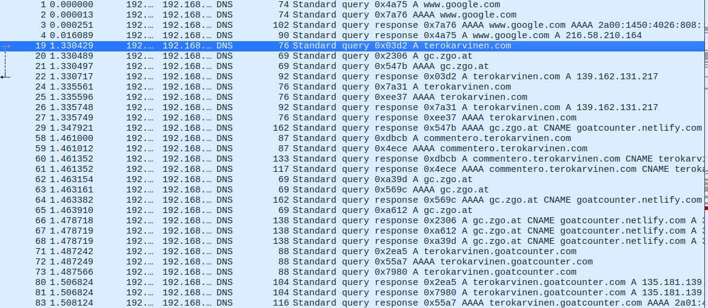

Aluksi käyttäjä on mennyt googleen (paketti nr3). Tämän jälkeen käyttäjä on mennyt terokarvinen.com sivustolle. Seuraavaksi ihmettelin, mitä DNS pyynnöt `gc.zgo.at` sekä `.goatcounter` olivat. Nopean googletuksen avulla, löytyi GoatCounterin sivusto (https://www.goatcounter.com/). 

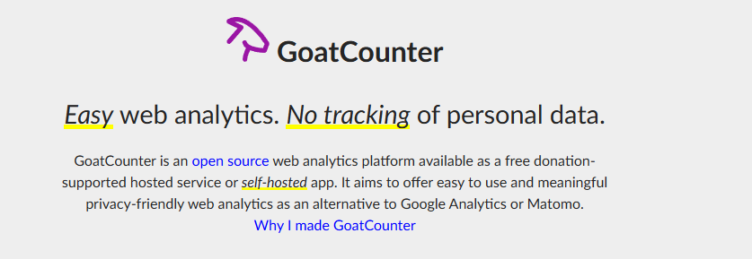

Kyseessä on siis sivustolla pyörivä web-analytiikka alusta.

Sitten lähdin katsomaan mitä IPv4 osoitteita näkyy kaappauksessa. 

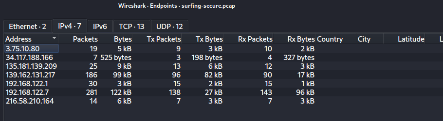

 Paikallisessa verkossa on ip osoitteet `192.168.122.7` sekä `192.168.122.1`, missä .7 on laite millä otettu yhteys nettiin ja .1 reititin. 

 Lopuksi katsoin pikaisen yhteenvedon kaappauksesta Statistics --> Protocol Hierarchy

 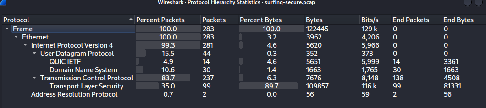

 Pakettejä lähetettiin 283 sekä dataa noin 122KB. Kyseessä on siis todennäköisesti perus nettiselaus sessio, joka on salattu TLS over TCP metodilla.

### f)
> Vapaaehtoinen, vaikea: Mitä selainta käyttäjä käyttää? surfing-secure.pcap (Päivitys 2025-03-31 w14 ma - muutin tehtävän vapaaehtoiseksi Giang:n suosituksesta)

### g) 
> Minkä merkkinen verkkokortti käyttäjällä on? surfing-secure.pcap

Lähdin selvittämään tätä verkkolaitteen ``(ip 192.168.222.7)`` mac osoitteen avulla joka on ``52:54:00:2f:e1:e5``. 

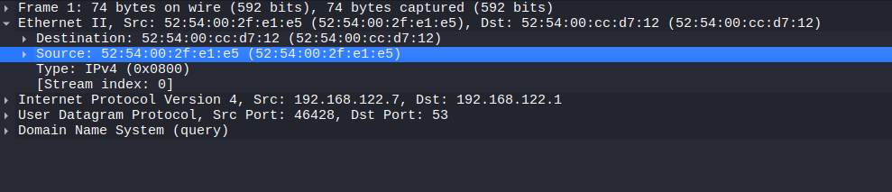

Wiresharkin oma työkalu ei antanut vastausta tähän.

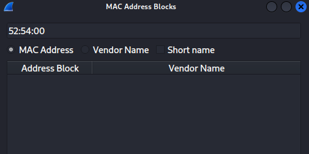

Tämän jälkeen lähdin katsomaan netistä, jos sieltä jokin palvelu tunnistaisi tämän.

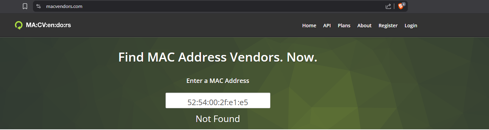

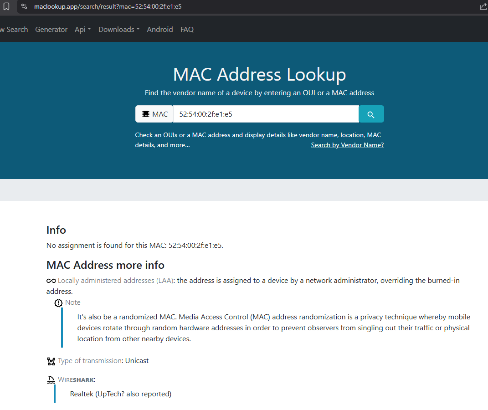

Mistään näistä ei tullut selkeää vastausta.  

### h) 
> Millä weppipalvelimella käyttäjä on surffaillut? surfing-secure.pcap
Huonoja uutisia: yhteys on suojattu TLS-salauksella.

Vaikka yhteys on salattu, voi silti DNS pyynnöistä nähdä, millä sivustoilla käyttäjä on surffailut. Kävin tätä jo hieman e) kohdassa. Alla lista vielä, mitä osoitteita DNS paketeista näkyy.

- www.google.com
- terokarvinen.com
- gc.zgo.at
- commentero.terokarvinen.com
- terokarvinen.goatcounter.com

### i)
> Analyysi. Sieppaa pieni määrä omaa liikennettäsi. Analysoi se, eli selitä mahdollisimman perusteellisesti, mitä tapahtuu. (Tässä pääpaino on siis analyysillä ja selityksellä, joten liikennettä kannattaa ottaa tarkasteluun todella vähän - vaikka vain pari pakettia. Gurut huomio: Selitä myös mielestäsi yksinkertaiset asiat.)

Lähdin curlaamaan googlen sivua `curl google.com`. Tämä curlaus tapahtuu automaattisesti http:n kautta, koska en laittanut alkuun https://

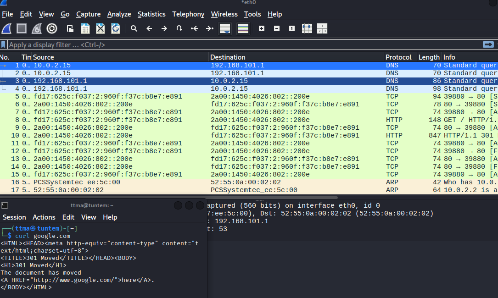

1-4
Koneeni lähettää ``192.168.101.1``, kautta DNS pyynnöt IPv4 sekä IPv6 muodossa

5-7
Perus TCP 3-way handshake SYN,ACK SYN,SYN

8-15
HTTP Request/Response

Request 8.

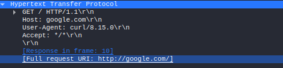

Response 10.

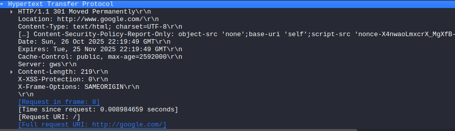

16-17 Arp pyynnöt

Näitä en osaa sen enempää analysoida. 

# Lähteet
- https://terokarvinen.com/verkkoon-tunkeutuminen-ja-tiedustelu/
  
- https://terokarvinen.com/wireshark-getting-started/
- https://terokarvinen.com/network-interface-linux/
- https://www.goatcounter.com/
- https://macvendors.com/
- https://dnschecker.org/mac-lookup.php

