# h2 Lempiväri: violetti
Kotitehtävä h2 Lempiväri: violetti Tero Karvisen Verkkoon tunkeutuminen ja tiedustelu - 2025 syksy kurssille. [Linkki kurssisivulle](https://terokarvinen.com/verkkoon-tunkeutuminen-ja-tiedustelu/)
Jokaisessa kohdassa on alla olevalla "quote" tyylillä kerrottu tehtävänanto.
>Liirum laarum laa...
## Tehtävät

### x)
> x) Lue ja vastaa lyhyesti kysymyksiin. Tässä alakohdassa x ei tällä kertaa tarvitse lukea artikkeleita kokonaan, ei tarvitse tiivistää niitä, eikä tehdä testejä koneella.
Selitä tuskan pyramidin idea 1-2 virkkeellä. Bianco 2013: [Pyramid of Pain](http://detect-respond.blogspot.com/2013/03/the-pyramid-of-pain.html). (Katso eritoten pyramidin kuvaa.)
Selitä timanttimallin (Diamond Model) idea 1-2 virkkeellä. Tekijä esittelee sen aika juhlallisesti, voit myös etsiä yksinkertaisempia artikkeleita [hakukoneella](https://duckduckgo.com/?t=ftsa&q=diamond+model+attacker+capability+infrastructure&ia=web) tai kelata suoraan timantin kuvaan. Caltagirone et al 2013: [Diamond Model](https://www.threatintel.academy/wp-content/uploads/2020/07/diamond-model.pdf)

Tuskan pyramidi
- Mitä alempana pyramidia, sitä helpompi hyökkääjän on muuttaa tätä
- Esim hyökkääjän helpompi muuttaa IP-osoittta kuin tiettyä tapaa hyökätä/kerätä tietoa, esim juuri Nmapin käyttö. 

### Diamond model

Timanttimalli jakaa hyökkäyksen neljään selkeään osaan,
- Adversary eli hyökkääjä, esim valtiollinen vai yksittäinen script kiddie
- Infrastructure, mitä tietoja pystytään keräämään hyökkääjästä, ip, käytetty softa jne.
- Capability, miten hyökkääjä käytti tiettyjä softia tai keinoja
- Victim, Kuka on hyökkääjän kohde.

### a)
> Apache log. Asenna Apache-weppipalvelin paikalliselle virtuaalikoneellesi. Surffaa palvelimellesi salaamattomalla HTTP-yhteydellä, http://localhost . Etsi omaa sivulataustasi vastaava lokirivi. Analysoi yksi tällainen lokirivi, eli selitä sen kaikki kohdat. (Jos Apache ei ole kovin tuttu, voit tätä tehtävää varten vain asentaa sen ja testata oletusweppisivulla. Eli ei tarvitse tehdä omia kotisvuja tms.)

Käynnistin apachen komennolla `sudo /etc/init.d/apache2 start`. Avasin Firefoxissa apachen default sivun `http://localhost`. 

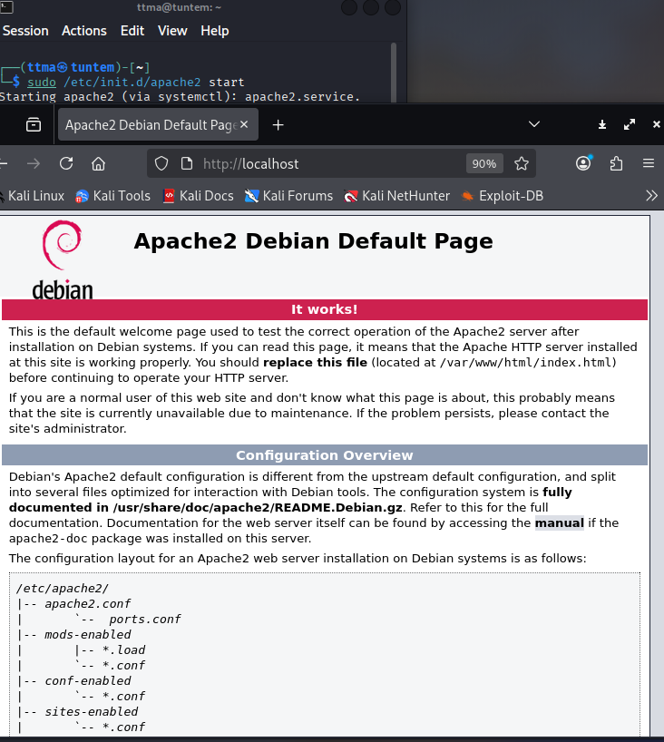

Lähdin tutkimaan apachen acces logeja `cat /var/log/apache2/acces.log`. Sieltä löytyi nettiselaukseni logit

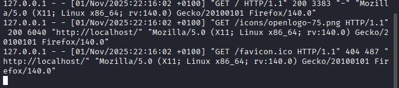

    127.0.0.1 - - [01/Nov/2025:22:16:02 +0100] "GET / HTTP/1.1" 200 3383 "-" "Mozilla/5.0 (X11; Linux x86_64; rv:140.0) Gecko/20100101 Firefox/140.0"
    127.0.0.1 - - [01/Nov/2025:22:16:02 +0100] "GET /icons/openlogo-75.png HTTP/1.1" 200 6040 "http://localhost/" "Mozilla/5.0 (X11; Linux x86_64; rv:140.0) Gecko/20100101 Firefox/140.0"
    127.0.0.1 - - [01/Nov/2025:22:16:02 +0100] "GET /favicon.ico HTTP/1.1" 404 487 "http://localhost/" "Mozilla/5.0 (X11; Linux x86_64; rv:140.0) Gecko/20100101 Firefox/140.0"

Lähdin analysoimaan ensimmäistä lokiriviä. Käytin tässä apuna Apachen dokumentaatiota (https://httpd.apache.org/docs/2.4/logs.html#accesslog). `127.0.0.1` kertoo kyseisen lokin käyttäjän IP-osoitteen. Tässä tapauksessa se on local ip. Tämän jälkeen lokissa näkyy aika, jolloin pyyntö on saapunut serverille. `GET / HTTP/1.1` on GET pyyntö, missä näkyy mitä käyttäjä pyysi palvelimelta sekä protokolla millä käyttäjä teki pyynnön. Tämä näkyy paremmin muissa logeissa, esim toisen rivin logissa tämä on `GET /icons/openlogo-75.png HTTP/1.1`. `200 3383` kertoo status coden "200", eli OK. `3383` kertoo datan suuruuden bitteina, mitä palvelin palautti käyttäjälle. Seuraava `-` kertoisi, mistä käyttäjä kertoo olleensa "referoitu". Tämä näkyy paremmin toisen rivin logissa `http://localhost/`. Viimeinen rimpsu `Mozilla/5.0 (X11; Linux x86_64; rv:140.0) Gecko/20100101 Firefox/140.0` kertoo käyttäjän User-Agentin. Esimerkiksi tästä voimme analysoida, että käyttäjä joka vieraili palvelimella käyttää Firefoxia Linuxilla.

### b)
> Nmapped. Porttiskannaa oma weppipalvelimesi käyttäen localhost-osoitetta ja 'nmap -A' päällä. Selitä tulokset. (Pelkkä http-portti 80/tcp riittää)

Aluksi testasin, että verkkoni poissa. Tällä ei ole sinänsä väliä, sillä IP-osoitteena on `localhost` ja typon aiheuttama tuho tässä olisi mitätön. Sueraavaksi skannasin oman virtuaalikoneeni portin 80, missä apache pyörii. Skannauksen tein sudona, sekä -A parametrilla.

    ping 8.8.8.8
    sudo nmap -A -p 80 localhost

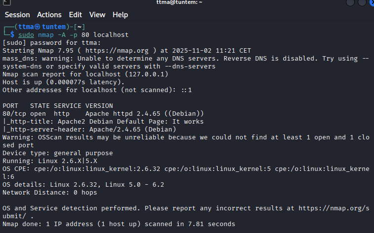

Tässä alhaalla vielä tekstinä itse tärkein osuus

    PORT   STATE SERVICE VERSION
    80/tcp open  http    Apache httpd 2.4.65 ((Debian))
    |_http-title: Apache2 Debian Default Page: It works
    |_http-server-header: Apache/2.4.65 (Debian)
    Warning: OSScan results may be unreliable because we could not find at least 1 open and 1 closed port
    Device type: general purpose
    Running: Linux 2.6.X|5.X
    OS CPE: cpe:/o:linux:linux_kernel:2.6.32 cpe:/o:linux:linux_kernel:5 cpe:/o:linux:linux_kernel:6
    OS details: Linux 2.6.32, Linux 5.0 - 6.2
    Network Distance: 0 hops

Skannauksesta näkyy, että skannattu portti 80 on auki, ja siinä pyörii Apache 2.4.65 (Debian). Siinä näkyy http-title, eli sivun otsikko. Sama näkyy myös esimerkiksi Developer Toolsista kun katselee sivua.

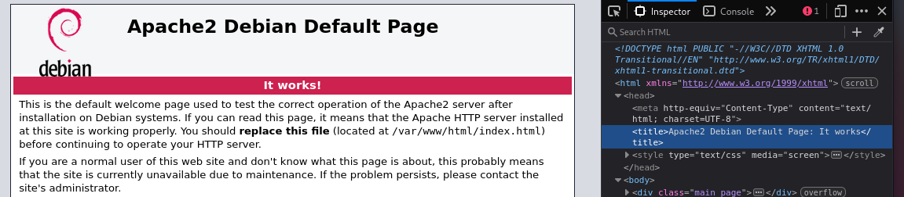

Seuraavaksi näkyy http-server-header, eli palvelimen versio. Developer toolsista Network välilehdeltä näkyy myös palvelimen versio.

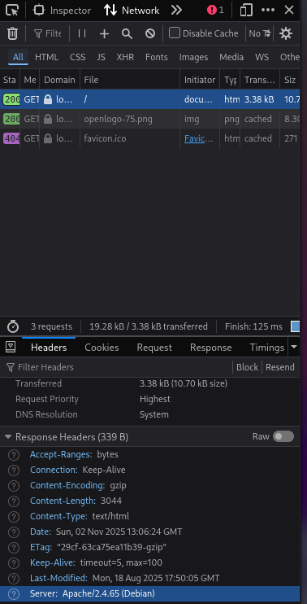

Lopussa nmapin skannaus kertoo käyttöjärjestelmän, jossa Apache pyörii. Koska skannasin localhostin, on network distance 0. 

### c)
> Skriptit. Mitkä skriptit olivat automaattisesti päällä, kun käytit "-A" parametria? (Näkyy avoimien porttinumeroiden alta, http-blah, http-blöh...).

Parametri -A tekee aika paljonkin eri skriptejä. Otin tämän pätkän suoraan h1 tehtävästäni Tunkeutumistestaus kurssille (https://github.com/MatPohj/PenetrationTesting25S/blob/17b0c16414e36e1b65e942d762da8889476158be/h1.md). Alunperin tiedot hankittu Nmapin dokumentaatiosta (https://nmap.org/book/man-misc-options.html)

  - -A = Agressiivinen skannaus. Ottaa käyttöön seuraavat parametrit
      - -o = Käyttöjärjestelmän havainnointi
      - -sV = Version skannaus, kertoo mikä versio esimerkiksi Apachesta on
      - -sC = Skriptien skannaus.
      - --traceroute = Näyttää minkä reitin kautta paketit kulkee hostille

### d)

> Jäljet lokissa. Etsi weppipalvelimen lokeista jäljet porttiskannauksesta (NSE eli Nmap Scripting Engine -skripteistä skannauksessa). Löydätkö sanan "nmap" isolla tai pienellä? Selitä osumat. Millaisilla hauilla tai säännöillä voisit tunnistaa porttiskannauksen jostain muusta lokista, jos se on niin laaja, että et pysty lukemaan itse kaikkia rivejä?

Lähdin tutkimaan Apachen acces logeja "raakana", eli ilman mitään greppausta jne `cat /var/log/apache2/acces.log`.

Nmap on lähettänyt paljon eri GET, sekä POST pyyntöjä. Lokista User agent kohdasta näkee helposti, että joku on käyttänyt Nmappia.

    "Mozilla/5.0 (compatible; Nmap Scripting Engine; https://nmap.org/book/nse.html)"

Jos lokitiedosto olisi yhtään isompi, voisi sieltä esimerkisi helposti grepata Nmap sanan, `grep -E 'nmap|Nmap' /var/log/apache2/access.log`

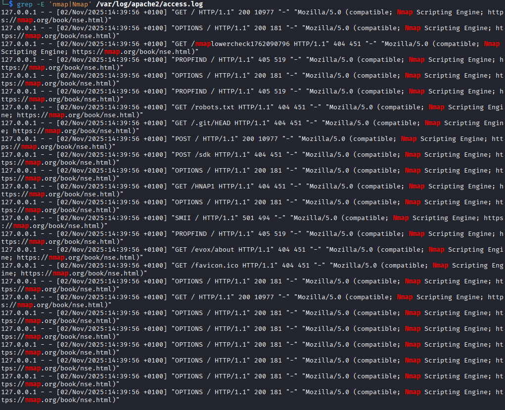

### e)
> Wire sharking. Sieppaa verkkoliikenne porttiskannatessa Wiresharkilla. Huomaa, että localhost käyttää "Loopback adapter" eli "lo". Tallenna pcap. Etsi kohdat, joilla on sana "nmap" ja kommentoi niitä. Jokaisen paketin jokaista kohtaa ei tarvitse analysoida, yleisempi tarkastelu riittää.

Avasin Wiresharkin, laitoin sieppauksen päälle ja porttiskannasin localhostin `sudo nmap -A -p 80 localhost`. ´Skannauksesta tuli noin 10 sekunnin sekä 377 paketin kaappaus. 

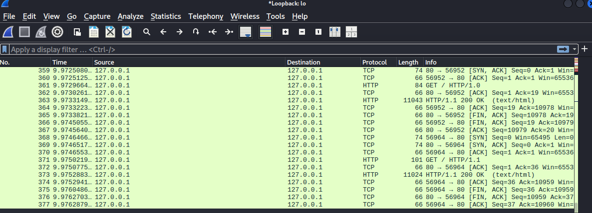

Seuraavaksi tallensin kaappauksen .pcap tiedostoksi.

Seuraavaksi lähdin etsimään Wiresharkista paketteja, joissa on "nmap tai Nmap". Huom tässä kohtaa kannattaa laittaa "Packet details" sekä ottaa "Case sensitive" pois käytöstä. 

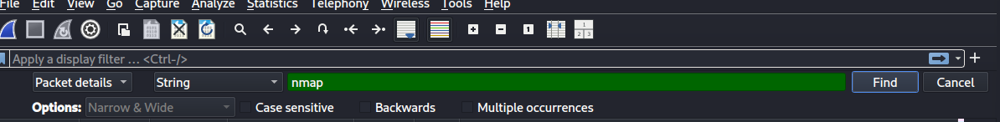

Ensimmäinen osuma tuli paketista 136. Siinä nmap oli lähettänyt GET  /robots.txt pyynnön serverille.

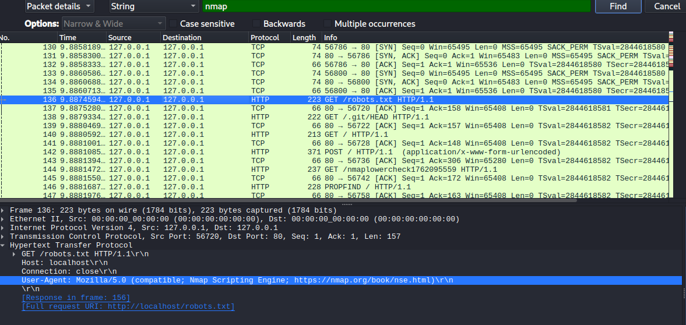

Seuraava osuma tuli paketista 138. Tämäkin oli GET pyyntö.

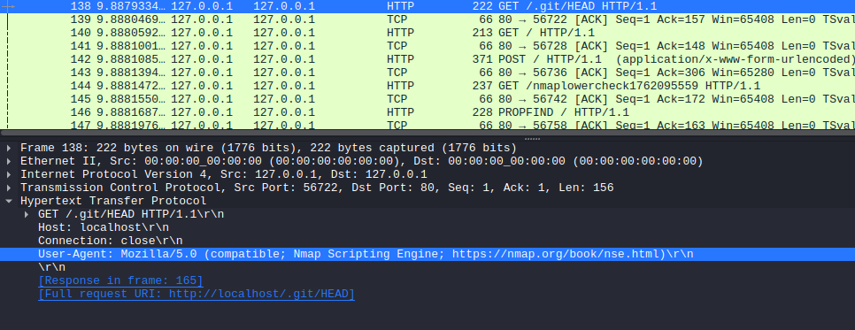

Nmap oli lähettänyt muitakin pyyntöjä, Post, PROFIND sekä OPTIONS.

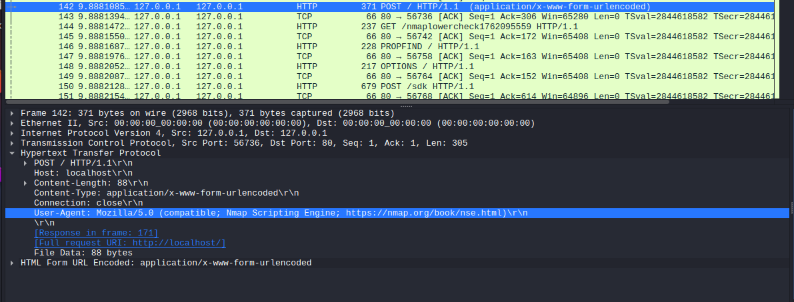

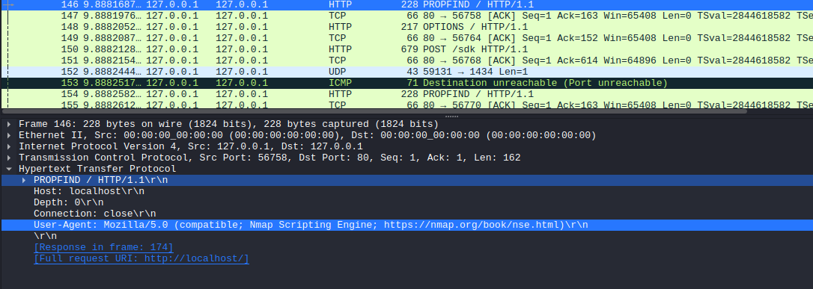

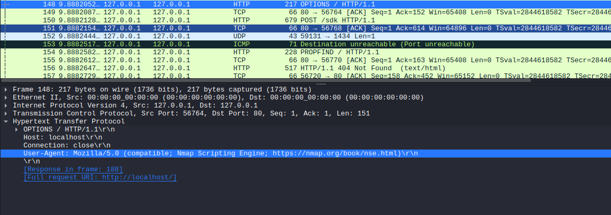

Kaikki nämä löytyivät aika helposti, sillä User-Agentissa nmapin skannaus kertoo aika selkeästi, että sitä on käytetty.

### f)
> Net grep. Sieppaa verkkoliikenne 'ngrep' komennolla ja näytä kohdat, joissa on sana "nmap".

Aluksi testasin toimiiko ngrep. Laitoin ngrepin päälle `sudo ngrep` jonka jälkeen skannasin localhostin `sudo nmap -A -p 80 localhost`

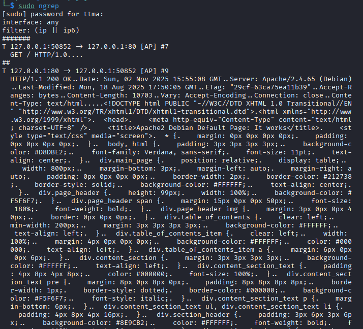

Ngrep toimi ja vastaus oli aika vaikea lukea paljain silmin. Lähdin etsimään apua ngrepin help sivulta `sudo ngrep -h`

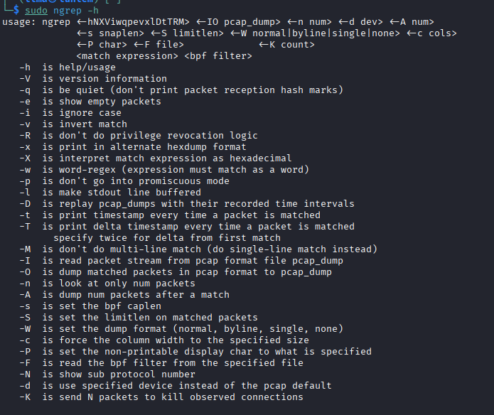

Lähdin seuraavaksi testamaan -w parametria.

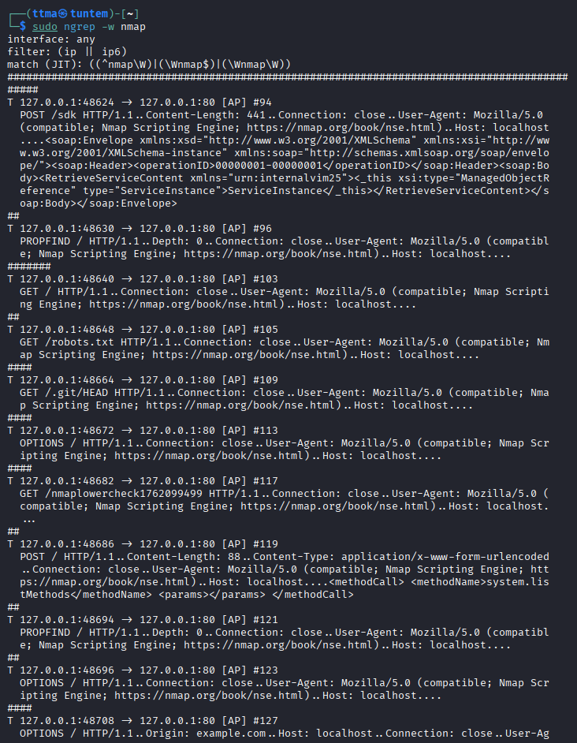

    ─$ sudo ngrep -w nmap
    interface: any
    filter: (ip || ip6)
    match (JIT): ((^nmap\W)|(\Wnmap$)|(\Wnmap\W))
    ##############################################################################################
    T 127.0.0.1:48624 -> 127.0.0.1:80 [AP] #94
    POST /sdk HTTP/1.1..Content-Length: 441..Connection: close..User-Agent: Mozilla/5.0 
    (compatible; Nmap Scripting Engine; https://nmap.org/book/nse.html)..Host: localhost
    ....<soap:Envelope xmlns:xsd="http://www.w3.org/2001/XMLSchema" xmlns:xsi="http://ww
    w.w3.org/2001/XMLSchema-instance" xmlns:soap="http://schemas.xmlsoap.org/soap/envelo
    pe/"><soap:Header><operationID>00000001-00000001</operationID></soap:Header><soap:Bo
    dy><RetrieveServiceContent xmlns="urn:internalvim25"><_this xsi:type="ManagedObjectR
    eference" type="ServiceInstance">ServiceInstance</_this></RetrieveServiceContent></s
    oap:Body></soap:Envelope>                                                           
    ##
    T 127.0.0.1:48630 -> 127.0.0.1:80 [AP] #96
    PROPFIND / HTTP/1.1..Depth: 0..Connection: close..User-Agent: Mozilla/5.0 (compatibl
    e; Nmap Scripting Engine; https://nmap.org/book/nse.html)..Host: localhost....      
    #######
    T 127.0.0.1:48640 -> 127.0.0.1:80 [AP] #103
    GET / HTTP/1.1..Connection: close..User-Agent: Mozilla/5.0 (compatible; Nmap Scripti
    ng Engine; https://nmap.org/book/nse.html)..Host: localhost....                     
    ##
    T 127.0.0.1:48648 -> 127.0.0.1:80 [AP] #105
    GET /robots.txt HTTP/1.1..Connection: close..User-Agent: Mozilla/5.0 (compatible; Nm
    ap Scripting Engine; https://nmap.org/book/nse.html)..Host: localhost....           
    ####
    T 127.0.0.1:48664 -> 127.0.0.1:80 [AP] #109
    GET /.git/HEAD HTTP/1.1..Connection: close..User-Agent: Mozilla/5.0 (compatible; Nma
    p Scripting Engine; https://nmap.org/book/nse.html)..Host: localhost....            
    ####
    T 127.0.0.1:48672 -> 127.0.0.1:80 [AP] #113
    OPTIONS / HTTP/1.1..Connection: close..User-Agent: Mozilla/5.0 (compatible; Nmap Scr
    ipting Engine; https://nmap.org/book/nse.html)..Host: localhost....                 
    ####
    T 127.0.0.1:48682 -> 127.0.0.1:80 [AP] #117
    GET /nmaplowercheck1762099499 HTTP/1.1..Connection: close..User-Agent: Mozilla/5.0 (
    compatible; Nmap Scripting Engine; https://nmap.org/book/nse.html)..Host: localhost.
    ...                                                                                 
    ##
    T 127.0.0.1:48686 -> 127.0.0.1:80 [AP] #119
    POST / HTTP/1.1..Content-Length: 88..Content-Type: application/x-www-form-urlencoded
    ..Connection: close..User-Agent: Mozilla/5.0 (compatible; Nmap Scripting Engine; htt
    ps://nmap.org/book/nse.html)..Host: localhost....<methodCall> <methodName>system.lis
    tMethods</methodName> <params></params> </methodCall>                               
    ##
    T 127.0.0.1:48694 -> 127.0.0.1:80 [AP] #121
    PROPFIND / HTTP/1.1..Depth: 0..Connection: close..User-Agent: Mozilla/5.0 (compatibl
    e; Nmap Scripting Engine; https://nmap.org/book/nse.html)..Host: localhost....      
    ##
    T 127.0.0.1:48696 -> 127.0.0.1:80 [AP] #123
    OPTIONS / HTTP/1.1..Connection: close..User-Agent: Mozilla/5.0 (compatible; Nmap Scr
    ipting Engine; https://nmap.org/book/nse.html)..Host: localhost....                 
    ####
    T 127.0.0.1:48708 -> 127.0.0.1:80 [AP] #127
    OPTIONS / HTTP/1.1..Origin: example.com..Host: localhost..Connection: close..User-Ag
    ent: Mozilla/5.0 (compatible; Nmap Scripting Engine; https://nmap.org/book/nse.html)
    ..Access-Control-Request-Method: HEAD....                                           
    #######################################################################
    T 127.0.0.1:48710 -> 127.0.0.1:80 [AP] #198
    PROPFIND / HTTP/1.1..Depth: 1..Content-Length: 0..Connection: close..User-Agent: Moz
    illa/5.0 (compatible; Nmap Scripting Engine; https://nmap.org/book/nse.html)..Host: 
    localhost....                                                                       
    ###########
    T 127.0.0.1:48726 -> 127.0.0.1:80 [AP] #209
    GET /HNAP1 HTTP/1.1..Connection: close..User-Agent: Mozilla/5.0 (compatible; Nmap Sc
    ripting Engine; https://nmap.org/book/nse.html)..Host: localhost....                
    ##
    T 127.0.0.1:48742 -> 127.0.0.1:80 [AP] #211
    FMCR / HTTP/1.1..Connection: close..User-Agent: Mozilla/5.0 (compatible; Nmap Script
    ing Engine; https://nmap.org/book/nse.html)..Host: localhost....                    
    ##
    T 127.0.0.1:48756 -> 127.0.0.1:80 [AP] #213
    OPTIONS / HTTP/1.1..Origin: example.com..Host: localhost..Connection: close..User-Ag
    ent: Mozilla/5.0 (compatible; Nmap Scripting Engine; https://nmap.org/book/nse.html)
    ..Access-Control-Request-Method: GET....                                            
    #############
    T 127.0.0.1:48766 -> 127.0.0.1:80 [AP] #226
    GET /evox/about HTTP/1.1..Connection: close..User-Agent: Mozilla/5.0 (compatible; Nm
    ap Scripting Engine; https://nmap.org/book/nse.html)..Host: localhost....           
    ##
    T 127.0.0.1:48776 -> 127.0.0.1:80 [AP] #228
    GET / HTTP/1.1..Connection: close..User-Agent: Mozilla/5.0 (compatible; Nmap Scripti
    ng Engine; https://nmap.org/book/nse.html)..Host: localhost....                     
    #####################
    T 127.0.0.1:48786 -> 127.0.0.1:80 [AP] #249
    OPTIONS / HTTP/1.1..Origin: example.com..Host: localhost..Connection: close..User-Ag
    ent: Mozilla/5.0 (compatible; Nmap Scripting Engine; https://nmap.org/book/nse.html)
    ..Access-Control-Request-Method: POST....                                           
    ##########
    T 127.0.0.1:48788 -> 127.0.0.1:80 [AP] #259
    OPTIONS / HTTP/1.1..Origin: example.com..Host: localhost..Connection: close..User-Ag
    ent: Mozilla/5.0 (compatible; Nmap Scripting Engine; https://nmap.org/book/nse.html)
    ..Access-Control-Request-Method: PUT....                                            
    #############
    T 127.0.0.1:48802 -> 127.0.0.1:80 [AP] #272
    GET /favicon.ico HTTP/1.1..Connection: close..User-Agent: Mozilla/5.0 (compatible; N
    map Scripting Engine; https://nmap.org/book/nse.html)..Host: localhost....          
    #####
    T 127.0.0.1:48812 -> 127.0.0.1:80 [AP] #277
    OPTIONS / HTTP/1.1..Origin: example.com..Host: localhost..Connection: close..User-Ag
    ent: Mozilla/5.0 (compatible; Nmap Scripting Engine; https://nmap.org/book/nse.html)
    ..Access-Control-Request-Method: DELETE....                                         
    ############
    T 127.0.0.1:48828 -> 127.0.0.1:80 [AP] #289
    OPTIONS / HTTP/1.1..Origin: example.com..Host: localhost..Connection: close..User-Ag
    ent: Mozilla/5.0 (compatible; Nmap Scripting Engine; https://nmap.org/book/nse.html)
    ..Access-Control-Request-Method: TRACE....                                          
    ##########
    T 127.0.0.1:48830 -> 127.0.0.1:80 [AP] #299
    OPTIONS / HTTP/1.1..Origin: example.com..Host: localhost..Connection: close..User-Ag
    ent: Mozilla/5.0 (compatible; Nmap Scripting Engine; https://nmap.org/book/nse.html)
    ..Access-Control-Request-Method: OPTIONS....                                        
    ##########
    T 127.0.0.1:48842 -> 127.0.0.1:80 [AP] #309
    OPTIONS / HTTP/1.1..Origin: example.com..Host: localhost..Connection: close..User-Ag
    ent: Mozilla/5.0 (compatible; Nmap Scripting Engine; https://nmap.org/book/nse.html)
    ..Access-Control-Request-Method: CONNECT....                                        
    ##########
    T 127.0.0.1:48850 -> 127.0.0.1:80 [AP] #319
    OPTIONS / HTTP/1.1..Origin: example.com..Host: localhost..Connection: close..User-Ag
    ent: Mozilla/5.0 (compatible; Nmap Scripting Engine; https://nmap.org/book/nse.html)
    ..Access-Control-Request-Method: PATCH....                                    
Parametri -w toimi ja sain helposti näkyviin kohdat, joissa on sana "nmap"

### g)
> Agentti. Vaihda nmap:n user-agent niin, että se näyttää tavalliselta weppiselaimelta.

Otin a) tehtävästä hankitun tavallisen selaimen user-agentin, `Mozilla/5.0 (X11; Linux x86_64; rv:140.0) Gecko/20100101 Firefox/140.0`. Katsoin teron vinkeistä, että user-agentin voisi mahdollisesti vaihtaa näin `--script-args http.useragent="BSD experimental on XBox350 alpha (emulated on Nokia 3110)"`. Seuraavaksi aloin "vahtimaan" acces.log tiedostoa, jotta näen livenä kun nmapin skannaus tapahtuu `sudo tail -F /var/log/apache2/acces.log`. Seuraavaksi skannasin localhostin tekaistulla user-agentilla, `sudo nmap --script-args http.useragent="Mozilla/5.0 (X11; Linux x86_64; rv:140.0) Gecko/20100101 Firefox/140.0" -A -p 80 localhost`. User-agentin muuttaminen onnistui.

Vaikka User-Agentti näyttää oikealta, on silti epälyttävää että normaali käyttäjä olisi lähettänyt näin monta eri pyyntöä yhden sekunnin sisällä.

### h) 
> Pienemmät jäljet. Porttiskannaa weppipalvelimesi uudelleen localhost-osoitteella. Tarkastele sekä Apachen lokia että siepattua verkkoliikennettä. Mikä on muuttunut, kun vaihdoit user-agent:n? Löytyykö lokista edelleen tekstijono "nmap"?

Katsoinkin jo viime kohdan lopussa uusia Apachen lokeja, mutta katsotaanpa nyt Wiresharkin paketit. Aloitin Wiresharkissa capturen ja skannasin localhostin uudestaan `sudo nmap --script-args http.useragent="Mozilla/5.0 (X11; Linux x86_64; rv:140.0) Gecko/20100101 Firefox/140.0" -A -p 80 localhost`

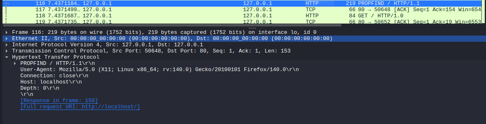

Kuten oletettu, wiresharkissakin user-agenttina näkyy Mozilla/5. Etsin nmappiin liittyviä tekstijonoja wiresharkista ja sieltä löytyi `GET /nmaplowercheck1762116651 HTTP/1.1\r\n`.

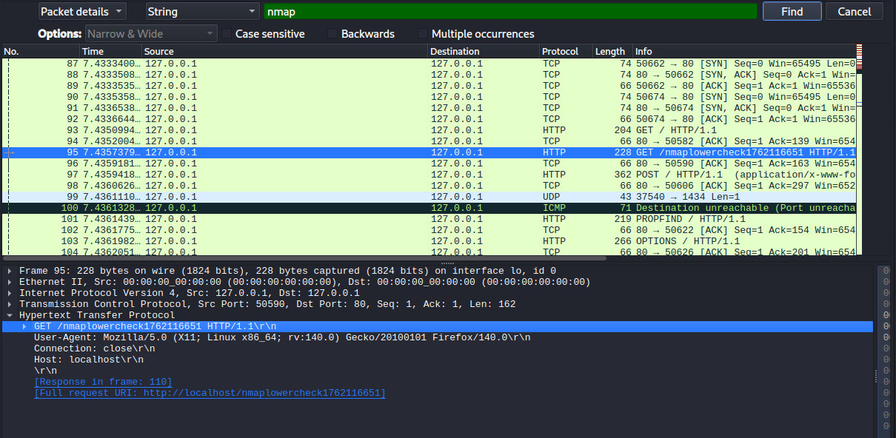

### i)
> Hieman vaikeampi: LoWeR ChEcK. Poista skritiskannauksesta viimeinenkin "nmap" -teksti. Etsi löytämääsi tekstiä /usr/share/nmap -hakemistosta ja korvaa se toisella. Tee porttiskannaus ja tarkista, että "nmap" ei näy isolla eikä pienellä kirjoitettuna Apachen lokissa eikä siepatussa verkkoliikenteessä. (Tässä tehtävässä voit muokata suoraan lua-skriptejä /usr/share/nmap alta, 'sudoedit'. Muokatun version paketoiminen siis rajataan ulos tehtävästä.)

Katsoin Teron vinkeistä apua, ja sieltä löysin vinkin tietyn sanan etsimiseen alahakemistoista, `grep -ir`. Tiedosto löytyi, `/usr/share/nmap/nselib/http.lua`.

Lähdin muokkaamaan tiedostoa, `sudo nano uselib/http.lua`. 

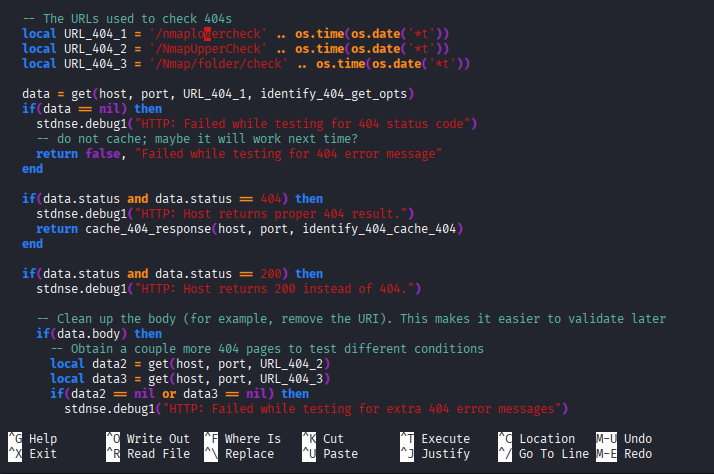

Muokkasin ne nyt aluksi tällaiseksi

Tietenkin jos tarkoituksena olisi piiloitua, keksisin paremmat nimet (joku varmasti joskus keksinyt hyvät nimet piiloutumiselle). Tallensin tiedoston jonka jälkeen lähdin tekemään samaa tuttua rutiinia, eli localhostin skannaus ja wireshark sekä logien tail auki. 

Logit näyttävät nyt keksimääni merkkijonoa "testi". 

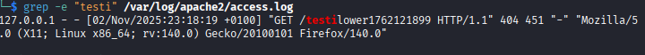

Nmappiin liittyviä tekstejä ei löydy enään Wiresharkista. Apachen lokeista ei löytynyt myöskään nmappiin liittyviä tekstejä, mutta  grepatessa lokitiedostoa näkyy aikaisemmat nmapin tekemät lokit joten tästä en laittanut kuvaa.

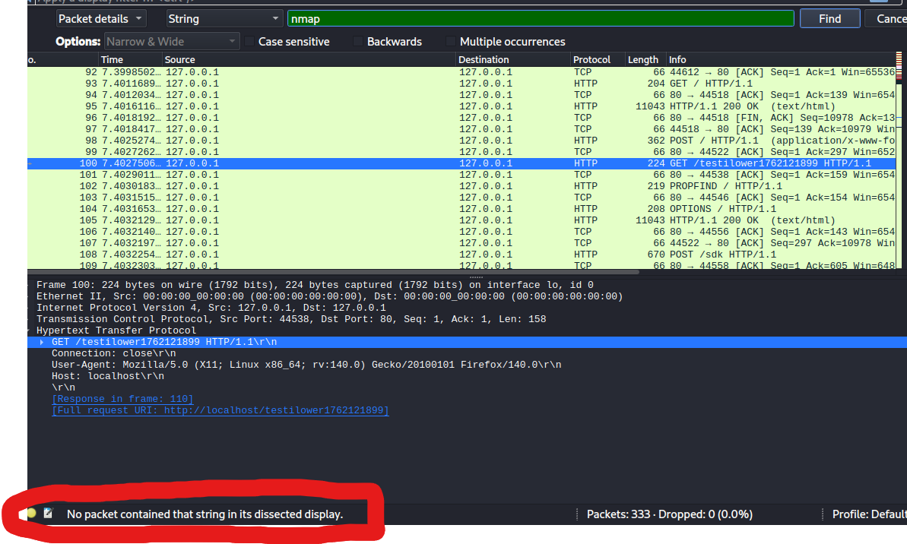

#### Skriptin parantaminen sekä apache login katsominen

Nollasin acces.log tiedoston `sudo truncate -s 0 /var/log/apache2/acces.log`. Seuraavaksi lähdin parantamaan piiloitumista skriptistä.

Poistin numerojonon GET pyynnön lopusta. Laitoin tähän myös vain / eli lokeista nopeasti katsottuna näyttäisi siltä, että tämä on vain GET pyyntö serverin/sivuston kotisivulle.

Nyt vain uusi nmap skannaus `sudo nmap --script-args http.useragent="Mozilla/5.0 (X11; Linux x86_64; rv:140.0) Gecko/20100101 Firefox/140.0" -A -p 80 localhost`.

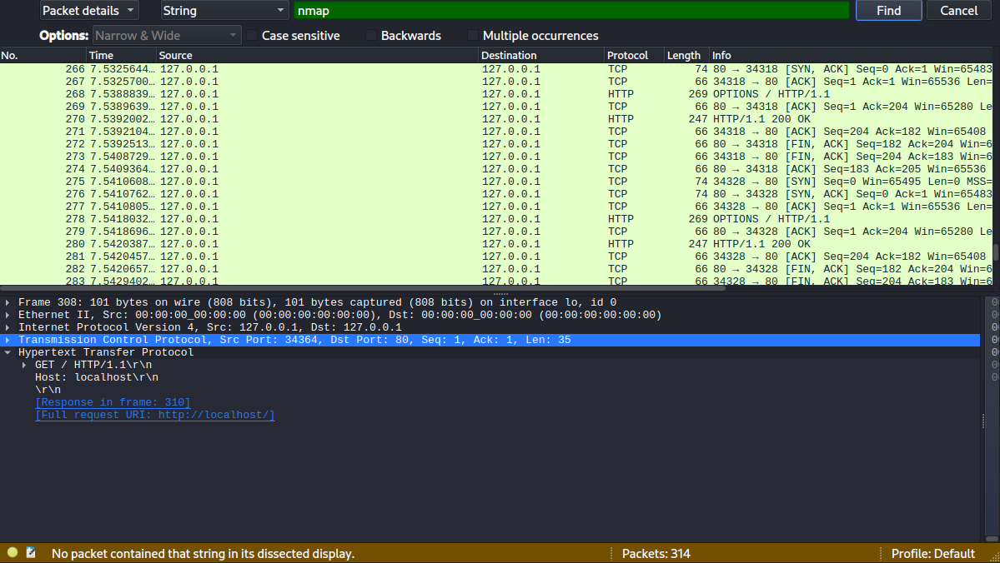

Kuten yllä olevista kuvista näkyy, ei lokeista löydy enään mitään viittausta nmappiin (Paitsi se, että palvelimelle lähetetty x osoitteesta sekunnin sisään erittäin monta eri pyyntöä).

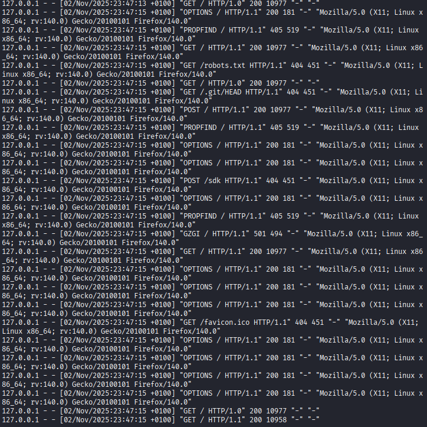

# Lähteet
- Kurssisivu, https://terokarvinen.com/verkkoon-tunkeutuminen-ja-tiedustelu/
-  Bianco 2013: Pyramid of Pain http://detect-respond.blogspot.com/2013/03/the-pyramid-of-pain.html
- Caltagirone et al 2013: https://www.threatintel.academy/wp-content/uploads/2020/07/diamond-model.pdf
- Apache logs documentation https://httpd.apache.org/docs/2.4/logs.html#accesslog
- Oma aikaisempi raportti Tunkeutumistestaus kurssille https://github.com/MatPohj/PenetrationTesting25S/blob/17b0c16414e36e1b65e942d762da8889476158be/h1.md
- Nmap documentation for Miscellaneous options https://nmap.org/book/man-misc-options.html

