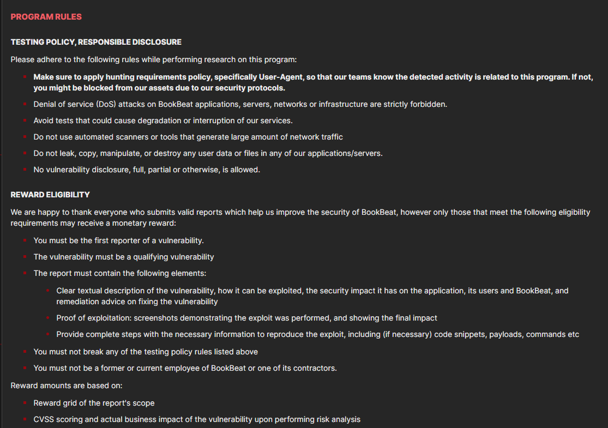
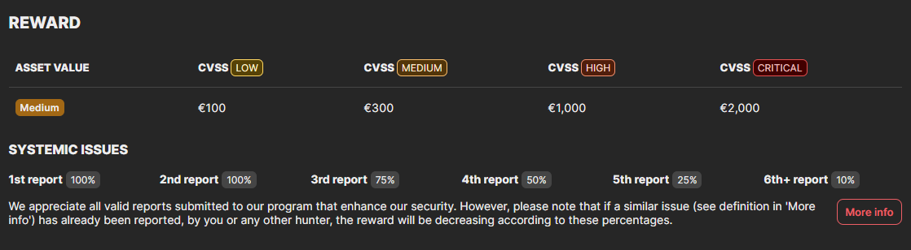
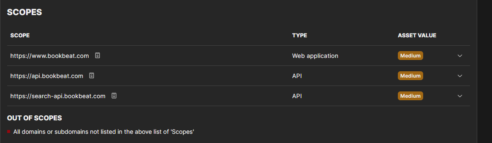
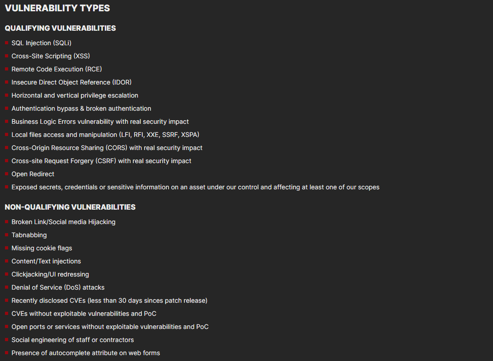

# h3 Messuilla
Kotitehtävä h3 Messuilla: violetti Tero Karvisen Verkkoon tunkeutuminen ja tiedustelu - 2025 syksy kurssille. [Linkki kurssisivulle](https://terokarvinen.com/verkkoon-tunkeutuminen-ja-tiedustelu/)
Jokaisessa kohdassa on alla olevalla "quote" tyylillä kerrottu tehtävänanto.
>Liirum laarum laa...

## Tehtävä

> [Osallistu Cyber Security Nordic](https://cybersecuritynordic.messukeskus.com/) -tapahtumaan.
x) Läksyksi tästä tapahtumasta teidän tulee tehdä lyhyt raportti siitä, mitä yrityksiä tapasitte, mitä mielenkiintoisia palveluita / tuotteita (max 3kpl) löysitte. (Tässä alakohdassa ei tarvitse tehdä testejä koneella.)
Suosittelen osallistumaan messuille. Mikäli et missään tapauksessa halua osallistua messuille, voit vaihtoehtotehtävänä laatia tiivistelmän täyspitkästä hakkeritapahtuman esityksestä verkosta löytämästäsi videosta (esim. Disobey, Black Hat...).

### YesWeHack

Yksi yritys jonka pisteellä kävin oli YesWeHack. YesWeHack on Ranskassa perustettu yritys, joka keskittyy pentestaukseen. Heillä on myös Bug Bounty palvelu, joka muistuttaa monia muita samankaltaisia palveluita, esimerkiksi hackerone. 

Bug bounty palvelussa X yritys ensiksi päättää, haluaako se osallistua Yksityis vai yleiseen bug bounty "ohjelmaan". Yleisessä kuka tahansa pääsee testaamaan ja raportoimaan bugeja. Heillä on myös yksityis ohjelma, johon pääsee vain tietyt ihmiset. Nämä ihmiset ovat usein tehneet jo monia yleisiä bug bounteja, jolla ovat näyttäneet taitonsa ja luotettavuutensa. 

Otetaan esimerkkinä YesWeHacking sivustolla olevan Bookbeatin bug bounty ohjelma https://yeswehack.com/programs/bookbeat. 

Tässä Bookbeat antaa hieman tietoa siitä, mitä saa ja ei saa tehdä. TLDR älä ddossaa tai riko palvelua. Huom tässä Bookbeat muistuttaa käyttämään muutettua User-Agenttia. 

Tässä kerrotaan miten paljon saa rahaa tietyn kriittisyyden haavoittuvuudesta

Seuraavaksi kerrotaan laajuus, mihin domaineihin testauksia saa kohdistaa.

Sitten kerrotaan mitä haavoittovuuksia hyväksytään ja mitä ei.   Lista jatkuu vielä alaspäin. Jos kiinnostaa enemmän kannataa mennä tsekkaamaan itse tarkemmin. Esimerkiksi social engineering on kieletty.

YesWeHack:lla on myös tämmöinen learning platform nimeltä YesWeHack dojo, https://dojo-yeswehack.com/. Täällä pääsee harjoittelemaan haavoittuvuuksien etsimistä, exploittaamista ja raportoimista CTF tyylisessä sandbox alustassa. Joka kuukausi tulee uusi kuukausittainen dojo. Tekemällä aktiivisesti ja hyvin näitä voi saada kutsuja näihin suljettuihin bug bounty ohjelmiin. Dojo näyttää ainaskin pikaisesti erittäin mielenkiintoiselta ja tulen itse varmasti tutustumaan tähän paremmin.

