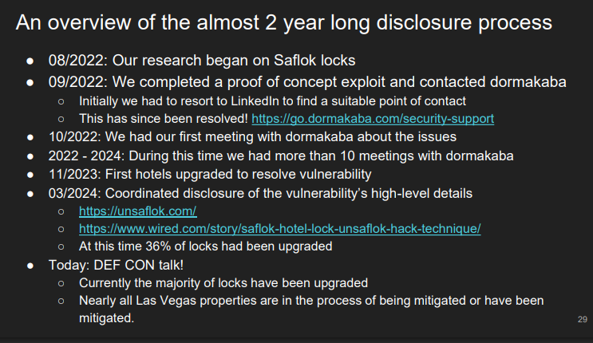

# h4 NFC ja RFID
Kotitehtävä h4 NFC ja RFID Tero Karvisen sekä Verkkoon tunkeutuminen ja tiedustelu - 2025 syksy kurssille. [Linkki kurssisivulle](https://terokarvinen.com/verkkoon-tunkeutuminen-ja-tiedustelu/)
Jokaisessa kohdassa on alla olevalla "quote" tyylillä kerrottu tehtävänanto.
>Liirum laarum laa...

## Tehtävät

### a
> Tarkastele käytössäsi olevia RFID tuotteita, mieti miten hyvin olet suojautunut RFID urkinnalta?

Hetken mietittyäni en ole suojautunut ollenkaan RFID urkinnalle. Ehkä tärkein tällainen suojaus, joka minun pitäisi hankkia olisi lompakko. Tällä hetkellä käytän "perus" lompakkoa, missä ei ole mitään suojausta RFID urkinnalle. En tiedä kategorisoituuko sellainen uhkakuva tämän alle, jossa esimerkiksi pahalla tekijällä x on korttimaksuskannerri, jota vilauttaisi huomaamattomasti taskuni lähellä jossa pidän lompakkoa ja maksu tapahtuu. Tällä hetkellä ainut suojaukseni tätä päässä kehittelemääni skenaariota vastaan on se, että minulla on niin monta NFC korttia vierekkäin, että niiden lukeminen ei olisi todennäköisesti mahdollista. Sama skenaario saatta olla joillekkin tuttu, jos on vahingossa laittanut esimerkiksi kaksi korttia samaan aikaan lähimaksupäätteelle, jolloin maksupääte  ei pysty lukemaan korttia/kortteja. Oikea tapa suojautua tällaiselle olisi hankkia RFID suojattu lompakko. Toinen tapa, joka hoitaa saman homman mutta noh, ei ole ehkä se kaikista siistein tapa olisi kieriä NFC kortit yhden alumii siivun sisälle. Alumiini toimisi tämmöisenä DIY faradayn häkkinä. Ainut miinus tässä tavassa on se, että todennäköisesti saat hieman outoja katseita kun kaivat kaupan kassalla foliosta maksukortteja.   

Toinen urkinta mille olen altis on kotiavaimeni. Talonyhtiössä jossa asun, on käytössä sähköiset abloy avaimet. Nämä onneksi toimivat kuin normaalit abloy lukot, lisäyksenä vain se, että kun avaimen laittaa lukkopesään se varmistaa avaimen aitouden RFID:lla joka on avaimen sisällä (tämä ainaskin oma käsitys siitä miten tämä toimii). Tämä urkinta ei loppujen lopuksi ole kovin vaarallista, sillä pahan tekijän pitäisi myös saada avaimen muotti hyödyntääkseen RFID urkinnalla saatua tietoa. 

Kolmas urkinta jolle olen hieman altis on puhelimeni. Minulla on aina NFC päällä puhelimessani, koska käytännöllisyys maksaessa puhelilla kaupassa (ei tarvitse painaa kahta nappia laittaa se päälle). Puhelimen NFC:ta ei voi kuitenkaan käyttää jos se on kiinni, mitä puhelimeni on aina kun se ei ole kädessäni. Tästä syystä oma näkemykseni RFID urkinnan riskille on pieni, mutta silti mahdollinen. Tästä eteenpäin kyllä otan NFC pois päältä ja laitan sen takaisin päälle silloin kun sitä tarvitsen. 

### b
> b) Tutustu APDU komentojen rakenteeseen (voit käyttää tekoälyä tutustumiseen)

Käytin tässä apuna ChatGPT-5 Tekoälyä Search option päällä. Promptina käytin "Can you explain APDU to me as simple as possible?". Tarkistin lähteet sekä katsoin myös itse lisää informaatiota esimerkiksi Cardlogix nimiseltä sivulta, https://www.cardlogix.com/glossary/apdu-application-protocol-data-unit-smart-card/

APDU on lyhenne sanoista Application Protocol Data unit, jonka kommunikaatio protokollaa käytetään RFID korteissa ja sen lukijassa. Tässä lukija aluksi lähettää kortille Command APDU, eli C-APDU. Tämän jälkeen kortti lähettää takaisin vastauksen, eli Response APDU (R-APDU). 

Alla Cardlogixin sivuilta hankittu lista komennoista:

- SELECT FILE — `0x00A4`
- READ BINARY — `0x00B0`
- UPDATE BINARY — `0x00D6`
- READ RECORDS — `0x00B2`
- UPDATE RECORDS — `0x00DC`
- APPEND RECORD — `0x00E2`
- VERIFY — `0x0020`
- CHANGE REFERENCE DATA — `0x0024`
- RESET RETRY COUNTER — `0x002C`
- GET CHALLENGE — `0x0084`
- INTERNAL AUTHENTICATE — `0x0088`
- EXTERNAL AUTHENTICATE — `0x0082`
- TERMINATE CARD USAGE — `0x826E`
- ERASE BINARY — `0x00DA`
- ERASE RECORDS — `0x00DC`

Komentoja löytyy lisää, esimerkiksi Cardlogixin linkkaamasta linkistä. Tässä on isompi lista APDU komennoista https://gist.github.com/hemantvallabh/d24d71a933e7319727cd3daa50ad9f2c
### c
> Tutki ja kerro minkä mielenkiintoisen RFID hakkerointi uutiset löysit. (Vinkki, useimmat liittyvät henkilökortteihin)

Lähdin etsimään googlesta jotain uutta ja hauskaa uutista. Löysinkin uuden uutisen liittyen hotellien RFID korttien turvallisuudelle (https://www.convergentds.com/industry-news/hotel-keys-under-hacking-risk-how-convergentds-enhances-rfid-security). Kyseessä oli kahden kaveruksen jo vuonna 2022 löydetty haavoittovuus, mutta vasta vuonna 2024 julkiseksi tullut löydös NDA:n takia. Haavoittovuus liittyi Dormakaba yhtiön Saflok brandin moneen eri RFID korttiin. Tästä tuli kaverusten idea nimetä projekti Unsaflok. Haavoittuvuuden avulla yhden kortin lukeminen hotellissa antoi avaimet avata kaikki ovet, jotka käyttivät samaa teknologiaa, eli käytännössä kaikkien huoneiden ovet. Tutkiessani aihetta artikkelia pidemmälle löysin Unsaflokin Defcon puheen, sekä siihen liittyvät Slidet, (https://www.youtube.com/watch?v=4cx0RUV7i0s, https://unsaflok.com/videos/slides.pdf). Nämä menevät aika syvälle asiaan ja ovat hyvin tehty, varmasti kannattaa katsoa jos yhtään kiinnostaa. 

Oli myös virkistävä nähdä kuinka Dormakaba otti opikseen kyseisestä haavoittovuudesta. Aluksi Unsaflok otti yhteyttä LinkedIn:n kautta, koska ei ollut muuta tapaa. Nyt Dormakava on tehnyt tätä varten erillisen sivun jonka kautta ottaa yhteyttä. Yhtiö myös toimi yhteistyössä Unsaflokin kanssa löytääkseen korjauksen lukkoihin. Yhtiö myös antoi luvan kertoa haavoittovuudesta eteenpäin, tietenkin vasta sen jälkeen kun haavoittovuus oli korjattu ja suurin osa lukoista päivitetty.

Alla vielä Unsaflokin slideistä otettu näyttökuva aikajanasta, (https://unsaflok.com/videos/slides.pdf)

# Lähteet

CardLogix APDU https://www.cardlogix.com/glossary/apdu-application-protocol-data-unit-smart-card/

ChatGPT-5, Search on https://chatgpt.com/

Kurssisivu: https://terokarvinen.com/verkkoon-tunkeutuminen-ja-tiedustelu/

RFID artikkeli: https://www.convergentds.com/industry-news/hotel-keys-under-hacking-risk-how-convergentds-enhances-rfid-security

RFID artikkeli (maksumuuri): https://www.wired.com/story/saflok-hotel-lock-unsaflok-hack-technique/

Unsaflok Slides from Defcon https://unsaflok.com/videos/slides.pdf

Unsaflok video from Defcon https://www.youtube.com/watch?v=4cx0RUV7i0s

Isompi lista APDU komennoista https://gist.github.com/hemantvallabh/d24d71a933e7319727cd3daa50ad9f2c

