# h5 Laboratorio- ja simulaatioympäristöt hyökkäyksissä
Kotitehtävä h5 Laboratorio- ja simulaatioympäristöt hyökkäyksissä Tero Karvisen Verkkoon tunkeutuminen ja tiedustelu - 2025 syksy kurssille. [Linkki kurssisivulle](https://terokarvinen.com/verkkoon-tunkeutuminen-ja-tiedustelu/)
Jokaisessa kohdassa on alla olevalla "quote" tyylillä kerrottu tehtävänanto.
>Liirum laarum laa...

## a)
> Tutustu seuraavaan työkaluun https://github.com/kgretzky/evilginx2 . Vastaa seuraaviin kysymyksiin

> Asensitko työkalun, jos asensit niin kirjoita miten sen teit.

Lähdin etsimään tietoa asentamisesta evilginx:n nettisivuilta ja löysinkin oikean sivun, "Getting Started" https://help.evilginx.com/community/getting-started/building. 

Tässä vielä näyttökuva sivusta

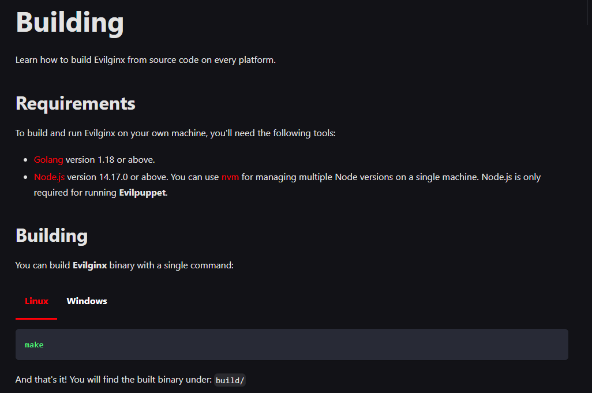

Seuraavaksi katsoin oliko minulla Golang asennettuna, ei ollut joten asensin sen `sudo apt install golang-go`

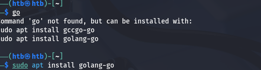

Asennuksen jälkeen tarkistin vielä onnistuiko asennus

Sitten vain kloonasin ja buildasin binäärin evilginx2 github reposta https://github.com/kgretzky/evilginx2.

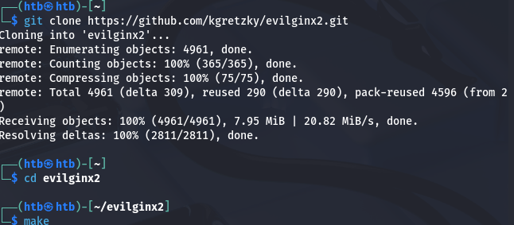

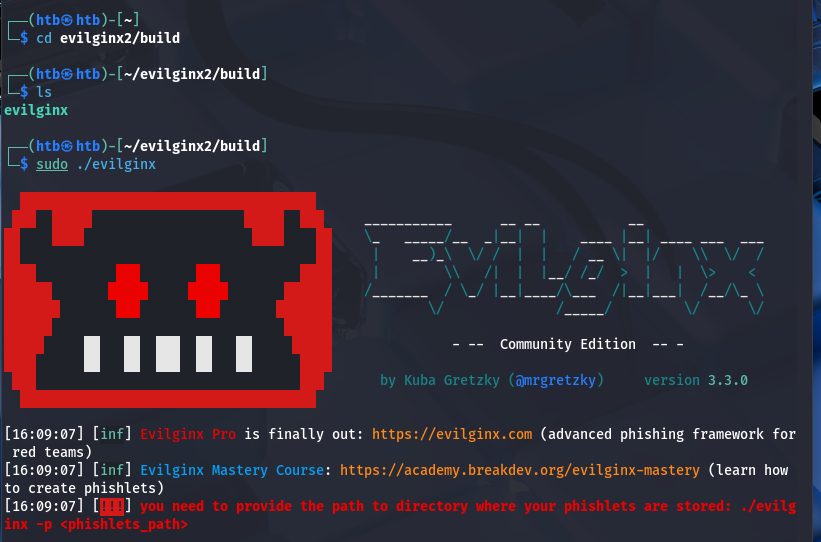

Nyt ainakin näyttää siltä, että asennus onnistui joten lähdin jatkamaan tehtävää.

> Mitä teit työkalun kanssa?

Jatkoin ohjeiden lukemista ja tein seuraavan kohdan

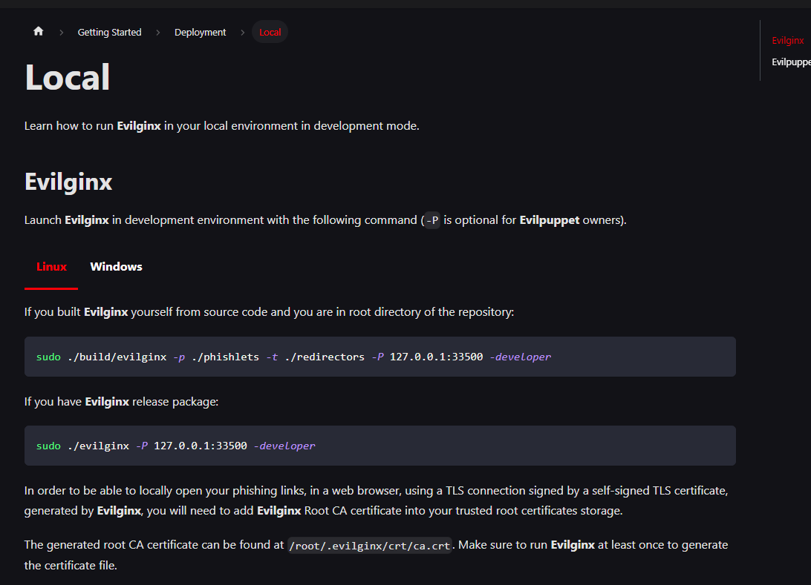

Aluksi evilginx valitti -P parametrista, joten otin sen pois.

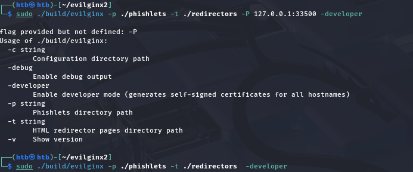

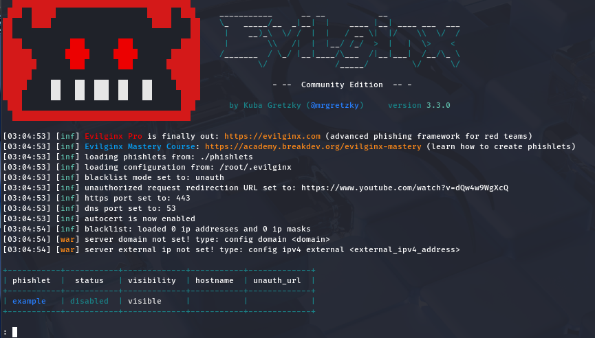

Tämän local kohdan lopuksi lisäsin eviginx:n tekemän CA sertifikaatin koneeni sertifikaatteihin.

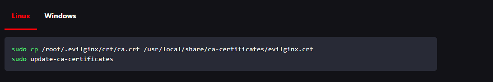

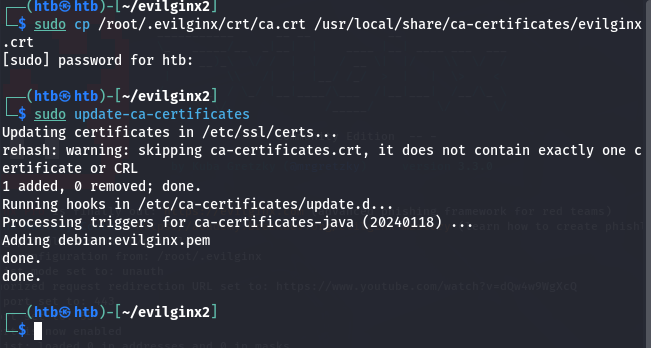

Seuraavaksi lähdin seuraamaan Quistart Guidea, https://help.evilginx.com/community/getting-started/quickstart

Aluksi piti configuroida domain sekä ip osoite.

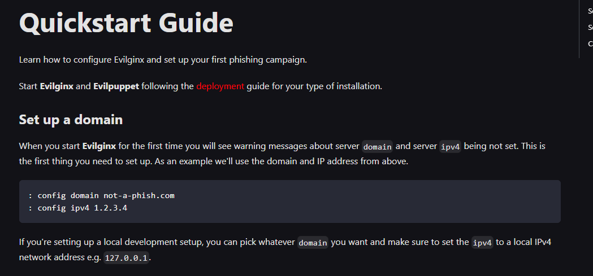

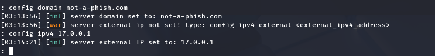

Seuraavaksi piti antaa ohjelmalle phishlet. Phishletit ovat pieniä config tiedostoja, joilla configuroidaan evilginx:n käyttötarkoitus https://help.evilginx.com/community/guides/phishlets.

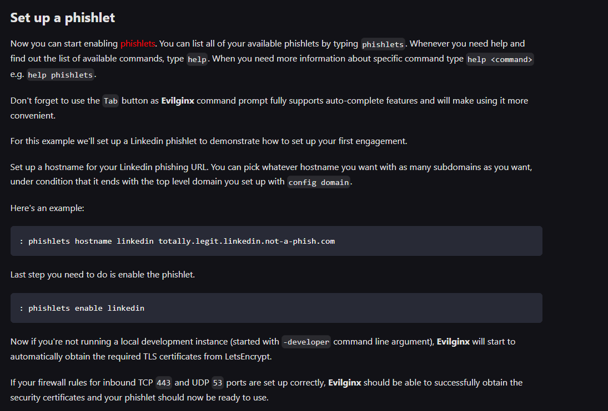

Suoritin komennon phishlets ja minulla oli vain example phishlet.

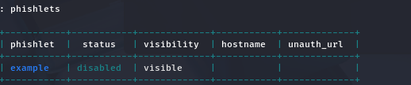

Yritin jatkaa ohjeita, mutta tuli errori

Katsoin apua help komennolla. Itse tulin siihen johtopäätökseen, että minun pitäisi ensiksi tehdä phishlet, jonka jälkeen voisin antaa sille alidomainin etc. Menin katsomaan esimerkki phishletin `cat phishlets/example.yaml`.

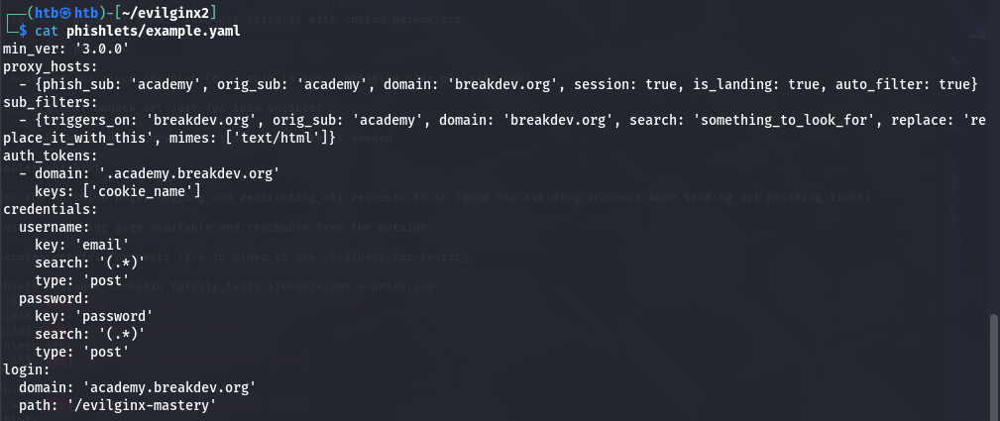

Tästä etenpäin en tiennyt miten edetä. Mahdollisuus olisi jotenkin saada tämä toimimaan lokaalisti, mutta melkein jokainen ohje netissä haluaisi että vuokraisin palvelimen jne.

## b) (Tehty myöhemmin)
>Sinulla on käytössäsi mininet ympäristö. Luo ympäristö, jossa voit tehdä TCP SYN-Flood hyökkäyksen. Kirjoita miten loit mininet ympäristön ja miten toteutit hyökkäyksen.

Lähdin suorittamaan mininet tehtävää Larin antamilla ohjeilla

`ryu-manager ryu.app.simple_switch_13`
`sudo mn --topo single,3 --mac --switch ovsk --controller remote`

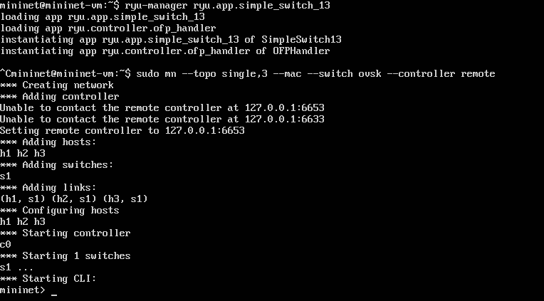

Näyttää siltä, että pingit eivät mene läpi.

Veikkaan että tämä johtui aikaisemmasta `ryu-manager ryu.app.simple_switch_13`komennosta, joka jäi umiin ja lopetin sen painamalla ctrl+c. Minun pitäisi jättää tämä päälle jotta mininet ympäristö toimisi.

Avasin kalin ja yhdistin ssh:lla mininettiin `ssh mininet@192.168.101.113`. Laitoin ruy-manager komennon mininetin virtuaalikoneessa ja jatkoin muuten tehtävän suorittamista ssh yhteydellä.

Testasin nyt pingausta ja se toimi.

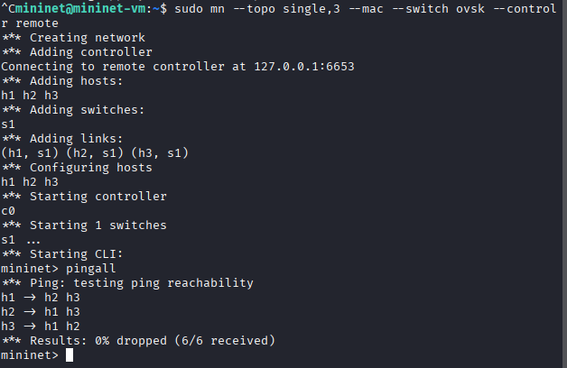

Seuraavaksi koitin `xterm h1` komentoa, mutta tuli errori "Cannot connect to display". Katsoin Larin ohjeista vinkkiä mutta sekään ei auttanut.

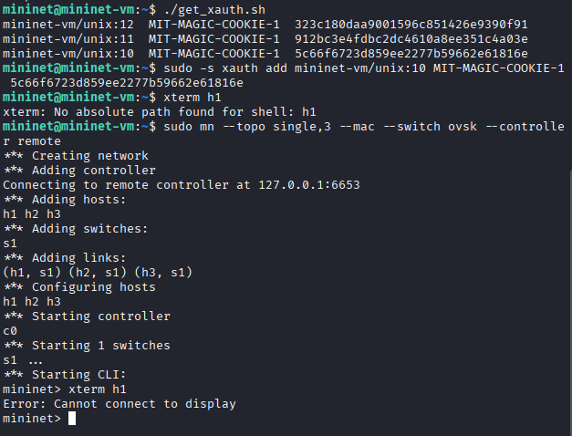

Koitin vielä kysyä apua ChatGPT:lta, mutta se antoi tosi ympäripyöreitä vastauksia ja osaan ei voinut vastata eettisistä syistä.

# Lähteet
- Kurssisivu https://terokarvinen.com/verkkoon-tunkeutuminen-ja-tiedustelu/
- Evilginx dokumentaatio https://help.evilginx.com/community/getting-started/building
- Evilginx dokumentaatio https://help.evilginx.com/community/guides/phishlets
- Evilginx dokumentaatio https://help.evilginx.com/community/getting-started/quickstart
- Evilginx Github repository https://github.com/kgretzky/evilginx2
- ChatGPT5 Web search On, Thinking Off

