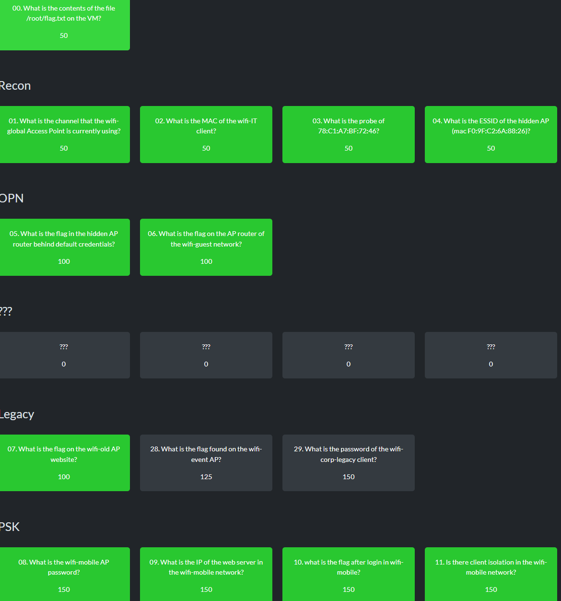

# h6 WiFI
Kotitehtävä h6 WiFi Tero Karvisen Verkkoon tunkeutuminen ja tiedustelu - 2025 syksy kurssille. [Linkki kurssisivulle](https://terokarvinen.com/verkkoon-tunkeutuminen-ja-tiedustelu/)
Jokaisessa kohdassa on alla olevalla "quote" tyylillä kerrottu tehtävänanto.
>Liirum laarum laa...

## Tehtävät

### a)
> Tutustu [wifi challenge lab 2.1 ](https://lab.wifichallenge.com/)harjoitus ympäristöön ja käytä tarvittaessa hyväksesi jo olemassa olevia ohjeita.

Kirjauduin sivulle ja latasin tarvittavan virtuaalikoneen. Lataus onnistui ja pääsin vaivatta tekemään tehtäviä. Osa tehtävistä onnistui aikaisemmalla osaamisella, osa Youtube-tutoriaalien avulla, osa googletuksella sekä osaan käytin ihan sivuilta saatavaa step-by-step walktrough dokumentaatiota.

Tein hieman alle puolet sivustolla olevista tehtävistä

### b)
> Kirjoita raportti siitä mitä opit ja mitkä asia yllättivät sinut kun tutustuit harjoitukseen.

Tehtävissä opin käyttämään aircrack-ng työkalua. Tähän sisältyi esimerkiksi: airmon-ng, airodump-ng, aircrack-ng, airdecap-ng sekä besside-ng. Ensiksi tehtävissä tiedusteltiin lähellä olevia WiFi verkkoja. Tässä vaiheessa oli mahdollista nähdä paljon erilaista tietoa WiFi verkosta kuten: Channel, ESSID, BSSID, PWR (Eli kuinka kaukana wifi) sekä Encryption. Tiedustelussa oli myös mahdollista nähdä mitä laitteita on yhdistettynä tiettyyn WiFi verkkoon. Yhdessä tehtävässä myös brute-forcettiin WiFi verkon nimi käyttämällä mdk4 työkalua sekä muokattua rockyou sanalistaa, missä jokaisen sanan alkuun lisätään "wifi-". Yhdessä tehtävässä myös murrettiin WEP verkko, joka oli erittäin helppoa. Tein myös yhden tehtävän, jossa päästiin WiFi verkon admin paneliin nappaamalla keksi. Oma tekeminen jäi tällä kertaa evil-twin hyökkäykseen hostapd-mana työkalulla, josta en saanut onnistuneesti .hccapx tiedostoa.

### c)
> Miten suhtautumisesi WLanin turvallisuuteen muuttui sen jälkeen kun teit harjoitukset?

Olin jo ennen tehtävää hieman skeptinen WiFi verkkojen turvallisuudesta, mutta nyt olen vielä enemmän skeptinen. Vanhemmat protokollat, kuten esimerkiksi WEP ovat erittäin helppo murtaa ja näiden käyttäminen on sama asia, kuin verkko olisi avoin. Myös avointen verkkojen turvallisuus käyttäjänä ei ole kovin hyvä. 

Sitten se, miten lähtisin parantamaan omaa koti WiFia, jos en olisi jo niin tehnyt. Kuten aina, kannattaa WiFi:n admin paneelin oletusarvot vaihtaa. Myös WiFi:n oletussalasana kannattaa vaihtaa. Mahdollinen hyökkääjä voi helposti saada tiedon, että mikä teleoperaattori hoitaa esimerkiksi tietyn kerrostalon netin. Tämän tiedon avulla hyökkääjä voi katsoa, mitä reitittimiä tämä teleoperaattori tarjoaa. Tämä siksi, että useimmat ostavat reitittimen suoraan teleoperaattorilta ja näitä malleja ei ole usein kovin montaa. Usein näissä reitittimissä on samantyylinen oletussalasana, esim 8 kirjainta, kaikki isolla. Joissain vanhemmissa voi mahdollisesti jopa olla kahdeksan numeron salasana. On myös mahdollista, että etenkin vanhemmissa malleissa voi löytyä tietoturva-aukkoja. En nyt tunkeudu tässä tähän POC:n sen enempää, mutta jokainen varmaan näkee mihin tämä olisi menossa. Käyttäisin myös WPA2/3 salausta. Näissäkin on huonot puolensa, mutta eivät ole niin huonoja kun muut vaihtoehdot. Paras vaihtoehto olisi vain olla käyttämättä WiFia. Piilottaisin myös WiFi verkon SSID, jotta hyökkääminen tähän olisi hitusen vaikeampaa. Ottaisin myös jokaisesta laitteesta auto-reconnectin pois, jotta hyökkääjän on vaikeampi saada handshakea. 

# Lähteet
https://terokarvinen.com/verkkoon-tunkeutuminen-ja-tiedustelu/
https://lab.wifichallenge.com/
