# h7 Aaltoja harjaamassa
Kotitehtävä h7 Aaltoja harjaamassa Tero Karvisen Verkkoon tunkeutuminen ja tiedustelu - 2025 syksy kurssille. [Linkki kurssisivulle](https://terokarvinen.com/verkkoon-tunkeutuminen-ja-tiedustelu/)
Jokaisessa kohdassa on alla olevalla "quote" tyylillä kerrottu tehtävänanto.
>Liirum laarum laa...

## x)
> x) Lue ja tiivistä. (Tässä x-alakohdassa ei tarvitse tehdä testejä tietokoneella, vain lukeminen tai kuunteleminen ja tiivistelmä riittää. Tiivistämiseen riittää muutama ranskalainen viiva.)

> Hubacek 2019: [Universal Radio Hacker SDR Tutorial on 433 MHz radio plugs](https://youtu.be/sbqMqb6FVMY?t=199) (Video, alkaen 3:19 ja päättyen 7:40. Yhteensä noin 4 min.)

- Universal Radio Hackerin (URH) avulla saadaan helposti kaapattua radioaaltoja.
- URH avulla nähdään helposti esimerkiksi millä taajuudella kaukosäädin toimii.

> Cornelius 2022: [Decode 433.92 MHz weather station data](https://www.onetransistor.eu/2022/01/decode-433mhz-ask-signal.html)

- Artikkelin tekijä oli ostanut simppelin sääaseman jonka mukana tuli yksi ulos sijoitettava sensori. Sensori oli rikki joka sai artikkelin tekijän katsomaan voisiko hän itse tehdä samanlaisen tai kaapata siihen kuuluvaa liikennettä. 
- Artikkelin tekijä käytti aluksi apunaan rtl-433 työkalua.
- Tämän jälkeen hän otti käyttöön Universal Radio Hackerin (URH). Tämän työkalun avulla voidaan nauhoittaa, analysoida, muokata sekä uudelleenlähettää signaaleja. 

Vapaaehtoinen, vaikeahko: Lohner 2019: [Decoding ASK/OOK_PPM Signals with URH and rtl_433](https://github.karllohner.com/SDR/Decoding/Example_2019-01-24/)

## a) 
> WebSDR. Etäkäytä WebSDR-ohjelmaradiota, joka on kaukana sinusta ja kuuntele radioliikennettä. Radioliikenne tulee siepata niin, että radiovastaanotin on joko eri maassa tai vähintään 400 km paikasta, jossa teet tätä tehtävää. Käytä esimerkkinä julkista, suurelle yleisölle tarkoitettua viestiä, esimerkiksi yleisradiolähetystä. Kerro löytämäsi taajuus, aallonpituus ja modulaatio. Kuvaile askeleet ja ota ruutukaappaus. (Tehtävässä ei saa ilmaista sellaisen viestin sisältöä tai olemassaoloa, joka ei ole tarkoitettu julkiseksi. Voit sen sijaan kuvailla, miten sait julkisen radiolähetyksen kuulumaan kaiuttimistasi. Julkisten, esimerkiksi yleisradiolähetysten sisältöä saa tietysti kuvailla.)

Menin WebSDR sivuille (websdr.org) ja menin ensimmäiseen sijaintiin joka sijaitsi Alankomaissa

Aluksi kuului vain epämääräistä kohinaa. Lähdin kelailemaan taajuuksia ja aluksi päädyin jollekkin Kiinalaiselle radiokanaville (noin 9400-9500Khz). Jatkoin kelaamista taaksepäin, missä näkyi liikennettä.

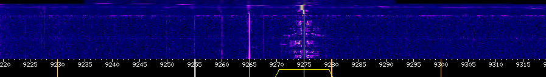

Aloin kuulemaan englantia. Tarkensin yhteyttä siten, että sain paremman kuuluvuuden. Sain vahingossa klikattua "band" kohtaa sivulta josta sain asemat näkyviin. 

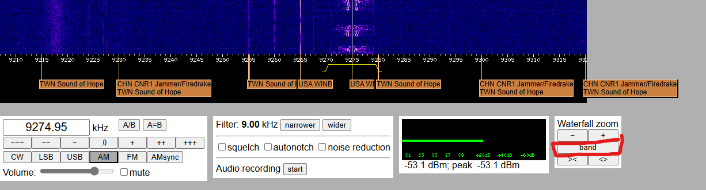

Asema jolle olin päätynyt oli USA WMLK Bethel, PA. Radiokanava toimi kyseisellä hetkellä 9275Khz taajudella ja modulaatio oli AM. Mies puhui ties mistä, 9/11 salaliitoista, jotain Israelista, jotain jostain Yahweh sekä siihen liittyvästä messeijasta. Selkeästi kyseessä oli jonkinlainen uskonnollinen radio. Lähdinkin googlettamaan WMLK radio ja löysin Wikipedia sivun liittyen kyseiseen radioasemaan. Kyseessä oli "Assemblies of Yahweh" omistama radioasema joka levitti Yahwen sanomaa. Päädyinkin tekemään pientä wikipedia selailua ja tämä Yahweh oli jokin antiikin ajan sodan, tulen ja sään Jumala.

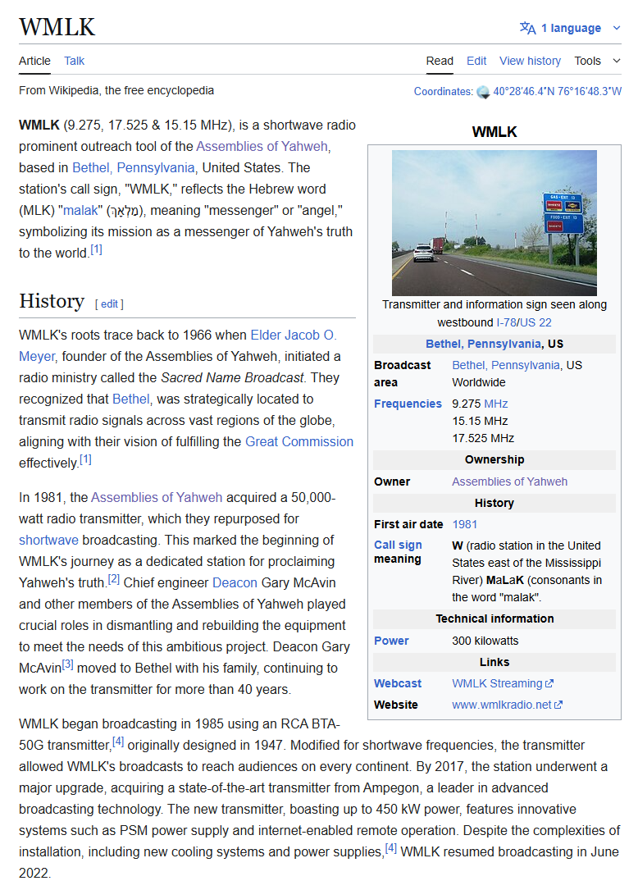

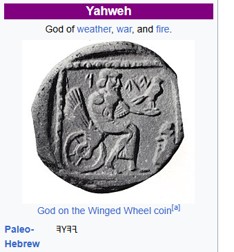

## b)
> rtl_433. Asenna rtl_433 automaattista analyysia varten. Kokeile, että voit ajaa sitä. './rtl_433' vastaa "rtl_433 version 25.02 branch..."

Asensin rtl_433 komennolla `sudo apt install rtl-433`. Tämän jälkeen testasin komennolla ``rtl_433`` onnistuiko asennus.

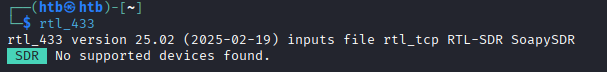

Asennus onnistui

## c)
> Automaattinen analyysi. Mitä tässä näytteessä tapahtuu? Mitä tunnisteita (id yms) löydät? Converted_433.92M_2000k.cs8. Analysoi näyte 'rtl_433' ohjelmalla.

Katsoin komennolla ``rtl_433 filename`` miltä tiedosto näyttää.

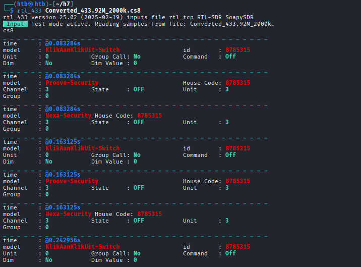

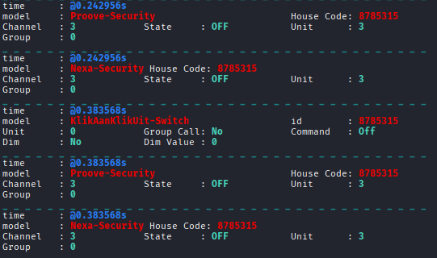

Tiedostosta löytyi kolme eri signaalia: KlikAanKlikUit-Switch, Proove-Security sekä Nexa Security. Tiedostossa jokaisen signaalin tallenus on samanlainen.  Helpottaakseni analysointia, otin jokaisen signaalin ensimmäisen sieppauksen analysointiin.

    _ _ _ _ _ _ _ _ _ _ _ _ _ _ _ _ _ _ _ _ _ _ _ _ _ _ _ _ _ _ _ _ _ _ _ _ _ _ _ _ _ _ _ _ _ _ _ _ _ _ _ _ _ _ _
    time      : @0.083284s
    model     : KlikAanKlikUit-Switch                  id        : 8785315
    Unit      : 0            Group Call: No            Command   : Off           Dim       : No
    Dim Value : 0
    _ _ _ _ _ _ _ _ _ _ _ _ _ _ _ _ _ _ _ _ _ _ _ _ _ _ _ _ _ _ _ _ _ _ _ _ _ _ _ _ _ _ _ _ _ _ _ _ _ _ _ _ _ _ _
    time      : @0.083284s
    model     : Proove-Security                        House Code: 8785315
    Channel   : 3            State     : OFF           Unit      : 3             Group     : 0
    _ _ _ _ _ _ _ _ _ _ _ _ _ _ _ _ _ _ _ _ _ _ _ _ _ _ _ _ _ _ _ _ _ _ _ _ _ _ _ _ _ _ _ _ _ _ _ _ _ _ _ _ _ _ _
    time      : @0.083284s
    model     : Nexa-Security House Code: 8785315
    Channel   : 3            State     : OFF           Unit      : 3             Group     : 0

KlikAanKlikUit-Switch
- Time : 0.083284s | Aikaleima milloin tapahtuma tapahtunut nauhoituksen alusta
- Model : KlikAanKlikUit-Switch | rtl-433 tunnistama malli laitteelle
- id : 8785315 | Laitteen id
- Unit : 0 | Mille laitteelle lähetetty
- Group Call : No | Onko signaali lähetetty monelle laitteelle
- Command : Off | Komento mikä annettu, eli tässä tapauksessa pois päältä
- Dim : No | Ei himmennystä
- Dim Value : 0 | Dimmauksen arvo

Proove-Security 
- Time : 0.083284s | Aikaleima milloin tapahtuma tapahtunut nauhoituksen alusta 
- Model : Proove-Security | rtl-433 tunnistama malli laitteelle
- House Code : 8785315 | Laitteen id
- Channel : 3 | Kanava mitä laite käyttää
- State : OFF | Laitteen tila 
- Unit : 3 | Mihin laitteeseen kohdistettu
- Group : 0 | Mihin ryhmään kohdistettu

Nexa-Security ( Samat kuin Proove-Security:ssa)
- Time : 0.083284s
- Model : Nexa Security
- House Code : 8785315
- Channel : 3
- State : OFF
- Unit : 3
- Group : 0 

## d) 
> Olet nauhoittanut näytteen 'urh' -ohjelmalla .complex16s-muodossa. Muunna näyte rtl_433-yhteensopivaan muotoon ja analysoi se. Näyte Recorded-HackRF-20250411_183354-433_92MHz-2MSps-2MHz.complex16s

Koitin muokata tiedoston nimeä Teron vinkeistä saadulla vikillä, ei onnistunut. 

`mv Recorded-HackRF-20250411_183354-433_92MHz-2MSps-2MHz.complex16s foo_433.92M_1000k.cs8`

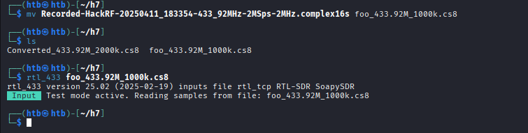

Katsoin tarkemmin vihjettä `Tiedoston nimessä pitää olla oikea taajuus (center frequency) ja näytteenottotaajuus (sample rate)` sekä linkatusta rtl-433 dokumentaation "File Name meta data" kohdasta (https://github.com/merbanan/rtl_433/blob/ac1e4a8c5a36fb90e3b06c0f01cef00bb3b2614d/docs/IQ_FORMATS.md#file-name-meta-data).

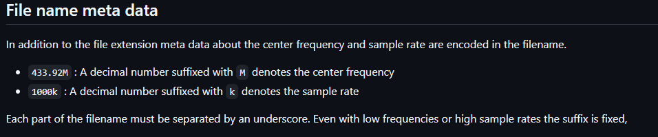

Virhe aikaisemmassa komennossa oli se, että alkuperäinen tiedosto oli tallennettu 2Mhz taajuudella `Recorded-HackRF-20250411_183354-433_92MHz-2MSps-2MHz.complex16s` ja tiedoston nimeä muuttaessa olin laittanut sen 1Mhz (1000Kz) taajuuteen. Muutin tiedoston nimestä 1000k > 2000k `mv foo_433.92M_1000k.cs8 foo_433.92M_2000k.cs8`. Testasin lukea tiedoston rtl_433 avulla ja nyt se toimi.

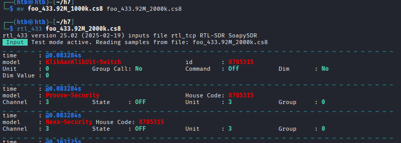

## e)
> Ultimate. Asenna URH, the Ultimate Radio Hacker

Lähdin tekemään tätä Teron vinkkien avulla, mutta minulle tuli errori. Testasin vielä suorittaa komentoa sudona, mutta silläkään ei onnistunut.

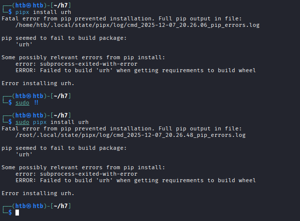

Lähdin katsomaan error logia

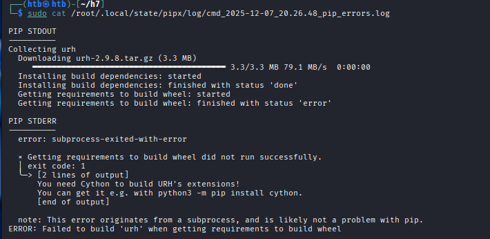

Cython puuttui. Katsoin jos löytyisi helpompi tapa, ja katsoinkin URH:n ohjeista kohdan "Installing from source".

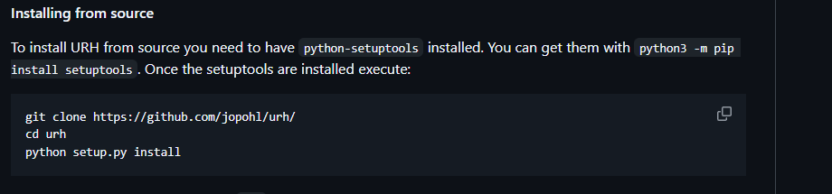

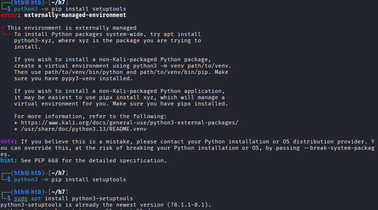

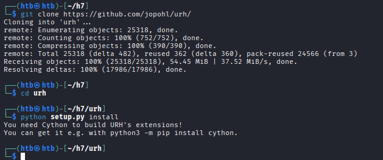

Noh näköjään tämä on nyt pakollinen ongelma, joka pitää selvittää. Seuraavaksi koitin asentaa cythonin `python3 -m pip install cython` ja minulle tuli errori liittyen venv ja miten pythonin packaget asennetaan. Errorin lopussa ohjeistettiin asentamaan nämä esimerkiksi pipx avulla.

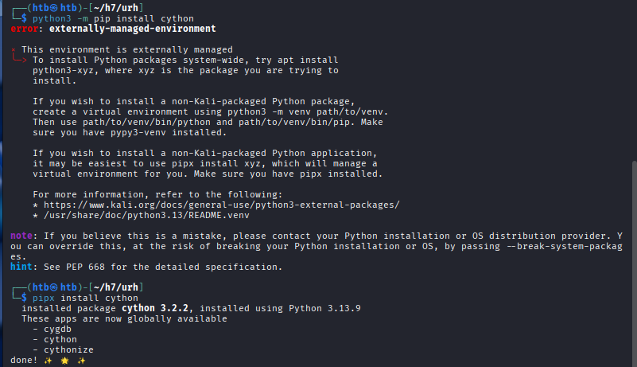

Tämän jälkeen koitin asentaa URH uudestaan, mutta tuli sama errori.

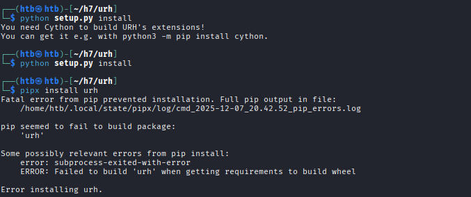

Kysyin ChatGPT:lta apua ja se antoi tällaiset ohjeet:

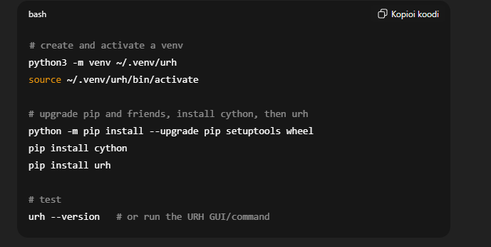

Tämä onnistui siihen asti, kunnes minun piti taas asentaa urh.

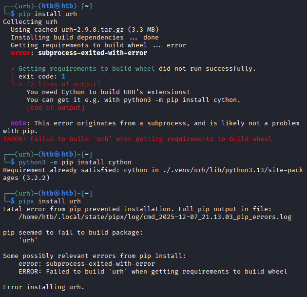

Ainaskin oman ymmärrykseni mukaan cython on ladattuna urh:n venv:n, joten en tiedä mikä tässä on vikana. 

Testasin vielä komennot, millä Tero sai toimimaan tämän tunnilla,

        tmux
        mkdir urh1
        virtualenv --system-site-packages env
        source env/bin/activate
        git clone https://github.com/jopohl/urh/
        pip install urh

Tämä taas alkoi valittaa Cythonista, joten testasin pipx asentaa cythonia ja se näytti ainaskin onnistuvan.

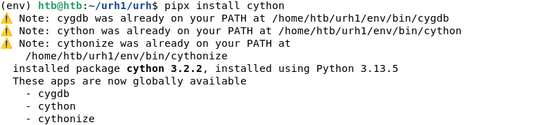

Testasin uudestaan asentaa urh, mutta ilman onnistumista

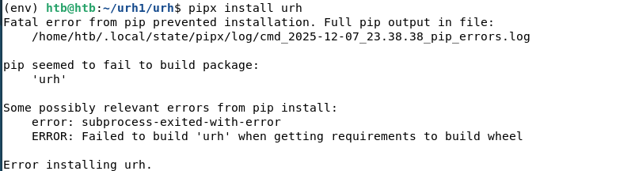

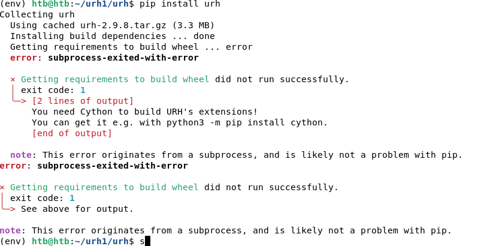

Sama errori kuin aikaisemmin. 

Tässä vaiheessa otin vain käyttöön joskus asentamani Windows 11 virtuaalikoneen ja asensin sekä latasin suoraan URH.exe tiedoston URH githubista. Nyt sain ainaskin avattua URH:n. Saa nähdä toimiiko seuraavassa tehtävässä.

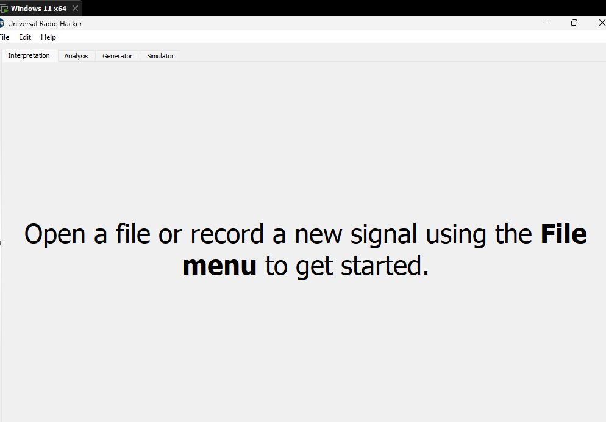

## f & g

> Tarkastele näytettä 1-on-on-on-HackRF-20250412_113805-433_912MHz-2MSps-2MHz.complex16s. Siinä Nexan pistorasian kaukosäätimen valon 1 ON -nappia on painettu kolmesti. Käytä Ultimate Radio Hacker 'urh' -ohjelmaa.

## f)
> Yleiskuva. Kuvaile näytettä yleisesti: kuinka pitkä, millä taajuudella, milloin nauhoitettu? Miltä näyte silmämääräisesti näyttää?

Maalasin koko ruudun ja sain seuraavat tiedot näytölle

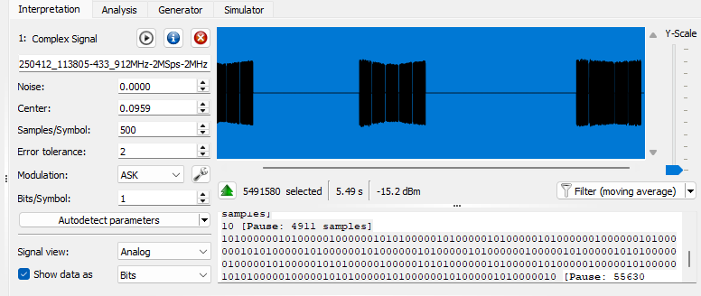

Tästä näkyy, että kesto on noin 5,49 sekunttia. Tiedoston nimestä näkyy milloin tallenne on tehty (4.12.2025) sekä taajuus 433,912 MHz. Selkeästi näkyy kolme isoa mustaa palkkia, jotka viittaavat jo tehtäväannossa mainittuun asiaan, eli kaukosäädin on lähettänyt kolme kertaa signaalin.

## g)
> Bittistä. Demoduloi signaali niin, että saat raakabittejä. Mikä on oikea modulaatio? Miten pitkä yksi raakabitti on ajassa? Kuvaile tätä aikaa vertaamalla sitä johonkin. (Monissa singaaleissa on line encoding, eli lopullisia bittejä varten näitä "raakabittejä" on vielä käsiteltävä)

Aloitin demoduloimisen painamalla "Autodetect parameters".

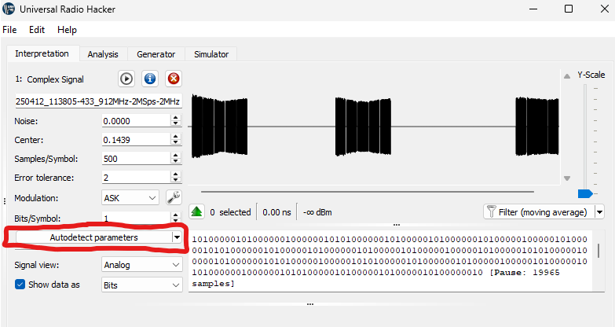

Noise : 0
Center  : 0,1439
Samples (Eli bit length) : 500
Error tolerance : 2

Valitsin ensimmäisen bitin ja zoomasin niin lähelle kuin pystyy.

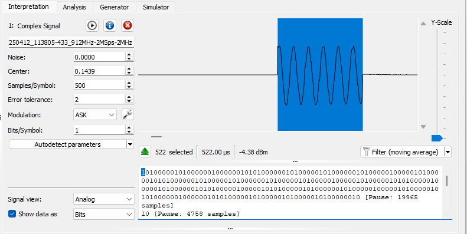

Vaihdoin vielä Signal view: Demodulated:

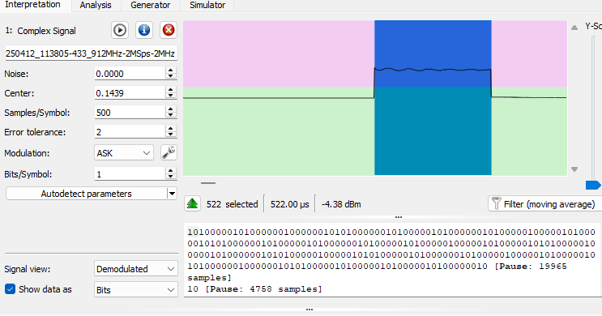

Yksi bitti on noin 522 µs, eli 0,000522 sekunttia.

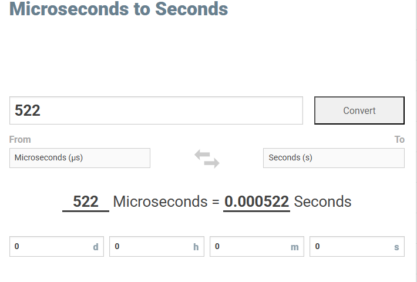

Esimerkiksi keskiverto ihmisen reaktioaika on noin 0,250 sekunttia. Raakabittejä ehdittäisiin siis lähettää noin 479 siinä ajassa mitä keskiverto ihminen reagoi johonkin asiaan.

# Lähteet

- rtl-433 dokumentaatio IQ_FORMATS.md https://github.com/merbanan/rtl_433/blob/ac1e4a8c5a36fb90e3b06c0f01cef00bb3b2614d/docs/IQ_FORMATS.md#file-name-meta-data
- URH dokumentaatio https://github.com/jopohl/urh
- ChatGPT 5 Thinking: On
- Kurssisivu: https://terokarvinen.com/verkkoon-tunkeutuminen-ja-tiedustelu/
- Hubacek 2019 : [Universal Radio Hacker SDR Tutorial on 433 MHz radio plugs](https://youtu.be/sbqMqb6FVMY?t=199)
- Cornelius 2022:[ Decode 433.92 MHz weather station data](https://www.onetransistor.eu/2022/01/decode-433mhz-ask-signal.html)
- Microseconds converter: https://convertlive.com/u/convert/microseconds/to/seconds#522
- WebSDR radio: http://websdr.ewi.utwente.nl:8901/
- WML Radioasema wikipedia: https://en.wikipedia.org/wiki/WMLK